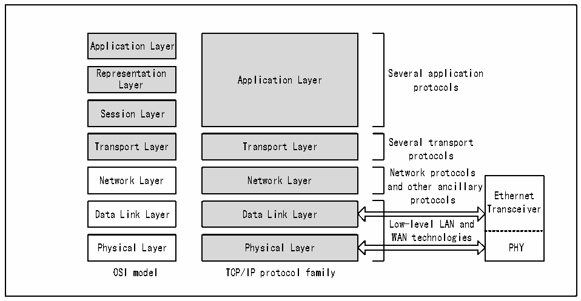
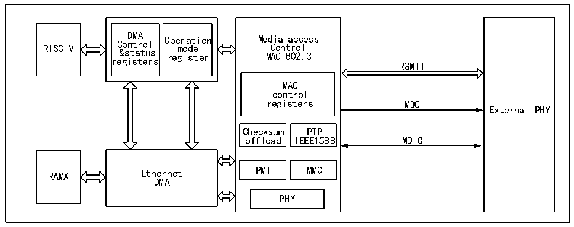

<!-- source-page: 540 -->

[← p.539](0539.md) · [index](../README.md) · [PDF p.540](https://ch32-riscv-ug.github.io/CH32H417/datasheet_zh/CH32H417RM.PDF#page=540) · [p.541 →](0541.md)

<!-- header: CH32H417系列应用手册 https://wch.cn -->

图31-1 以太网收发器在OSI模型和TCP/IP模型中的位置  
 <!-- rendered from the PDF; verify at https://ch32-riscv-ug.github.io/CH32H417/datasheet_zh/CH32H417RM.PDF#page=540 -->

🖼 Text parsed from the figure above

Application Layer  
Representation Several application  
Application Layer  
Layer protocols  
Session Layer  
Several transport  
Transport Layer Transport Layer  
protocols  
Network protocols  
Network Layer Network Layer  
and other ancillary  
Ethernet  
protocols  
Transceiver  
Data Link Layer Data Link Layer  
Low-level LAN and  
WAN technologies  
Physical Layer Physical Layer PHY  
OSI model TCP/IP protocol family  

以太网收发器的MAC按照IEEE802.3协议的规范设计，搭配256位宽的DMA，保证数据能快速地  
从网线上转发到微控制器的内存中。以太网收发器拥有强大完整的DMA控制寄存器、MAC控制寄存器  
和模式控制寄存器，微控制器的 CPU 通过 HB 总线操作以太网收发器的寄存器。以太网收发器通过  
RGMII 接口和千兆以太网物理层连接。以太网收发器的 RGMII 接口的管脚是复用的，具体参看 31.3  
节。以太网收发器通过 SMI 接口管理以太网物理层。使用以太网收发器时，HB 总线的时钟不能低于  
50MHz。  

图31-2 以太网收发器的结构框图  
 <!-- rendered from the PDF; verify at https://ch32-riscv-ug.github.io/CH32H417/datasheet_zh/CH32H417RM.PDF#page=540 -->

🖼 Text parsed from the figure above

DMA Operation Media access  
RISC-V Control mode Control  
&amp;status register MAC 802.3  
registers  
RGMII  
MAC  
control  
registers MDC  
External PHY  
Checksum PTP  
offload IEEE1588 MDIO  
RAMX Ethernet PMT MMC  
DMA  
PHY  

此外，以太网收发器还支持IEEE1588精确时间协议（PTP），为微控制器系统或片外提供精确的  
时间数据。  

## 31.3 以太网收发器使用引脚的分布和配置

微控制器支持 RGMII 接口。RGMII 接口可用于十兆、百兆和千兆以太网。下表显示了标准 RGMII  
接口及内部物理层在封装引脚上的分布。  
<!-- image: p540-draw-image-00001 bbox=[504.72, 786.24, 525.24, 796.68] -->
<!-- footer: V1.7 536 -->
