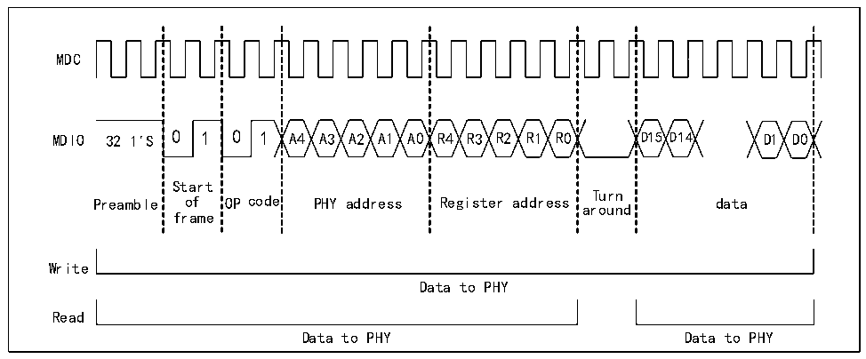

<!-- source-page: 542 -->

[← p.541](0541.md) · [index](../README.md) · [PDF p.542](https://ch32-riscv-ug.github.io/CH32H417/datasheet_zh/CH32H417RM.PDF#page=542) · [p.543 →](0543.md)

<!-- header: CH32H417系列应用手册 https://wch.cn -->
5） REG ADR：寄存器地址，5位；  
6） T：转换符，两位，用来切换MAC和PHY对MDIO线的控制权。在读操作时，MAC保持对MDIO线的  
高阻，PHY对第一位保持高阻，对第二位下拉，并获取MDIO的控制权；在写操作时，MAC对MDIO  
线先置高再下拉，PHY对MDIO保持高阻状态，MAC保持对MDIO的控制权；  
7） DATA：数据域，16位，MAC对PHY读写的数据，MSB在前；  
8） P：MAC和PHY都对MDIO保持高阻状态，但PHY的上拉电阻会把MDIO拉高。  

#### 31.4.1.2 读写时序

写PHY寄存器操作如下：  
当用户设置了MII写位（R32_ETH_MACMIIAR：MW）和忙位（R32_ETH_MACMIIAR：MB），SMI接口  
会向PHY发送PHY地址和寄存器地址，然后发送数据（R32_ETH_MACMIIDR）。在SMI接口发送数据的  
过程中，不能修改MII地址寄存器和MII数据寄存器的值；在此过程中，忙位保持为高，对MII地址  
寄存器或MII数据寄存器的写操作将被忽视，并且不对整个传输造成影响。当完成写操作时，SMI接  
口将清除忙位，用户可以根据忙位判断写操作结束。如图31-3的写部分。  
读PHY寄存器操作如下：  
当用户把以太网MAC的MII地址寄存器（R32_ETH_MACMIIAR）的MII忙位置位，而保持MII写位  
复位时，SMI接口则发送PHY地址和寄存器地址，执行读PHY寄存器的操作。在整个传输过程中，用  
户不能修改MII地址寄存器和MII数据寄存器的内容。在传输过程中，忙位保持为高，对MII地址寄  
存器或 MII 数据寄存器的写操作将被忽视，并且不影响整个传输的正确完成。在读操作完成后，SMI  
接口将清除忙位，并把从PHY读回的数据写入MII数据寄存器。如图31-3的读部分。  

图31-3 SMI接口读写时速图  
 <!-- rendered from the PDF; verify at https://ch32-riscv-ug.github.io/CH32H417/datasheet_zh/CH32H417RM.PDF#page=542 -->

🖼 Text parsed from the figure above

MDC  
MDIO 32 1&#x27;S 0 1 0 1 A4 A3 A2 A1 A0 R4 R3 R2 R1 R0 D15 D14 D1 D0  
Start  
Turn  
Preamble of OP code PHY address Register address around data  
frame  
Write  
Data to PHY  
Read  
Data to PHY Data to PHY  

#### 31.4.1.3 SMI时钟

一般来说SMI时钟需要保持在一个固定的范围，以保证实际上SMI的时钟需要被PHY接收。具体  
参考用户选用的PHY芯片的手册。  
SMI时钟频率通过MII地址寄存器（R32_ETH_MACMIIAR）的CR域从HB时钟分频得到。下表显示  
和SMI时钟和HB时钟的分频关系。默认选择42分频。  

<!-- p542-table-001 (table-31-3@1) pages 542-543 -->
<table><caption>表31-3 SMI时钟和HB时钟的分频关系</caption><tr><th></th><th>适合搭配的HB时钟的范围</th><th>SMI时钟</th></tr><tr><td>0000b</td><td>60MHz以上</td><td>HB时钟/42</td></tr><tr><td>0010b</td><td>20-35MHz</td><td>HB时钟/16</td></tr><tr><td>0011b</td><td>35-60MHz</td><td>HB时钟/26</td></tr><tr><td>其它值</td><td colspan="2">无意义</td></tr></table>

<!-- image: p542-draw-image-00001 bbox=[504.72, 786.24, 525.24, 796.68] -->
<!-- footer: V1.7 538 -->
