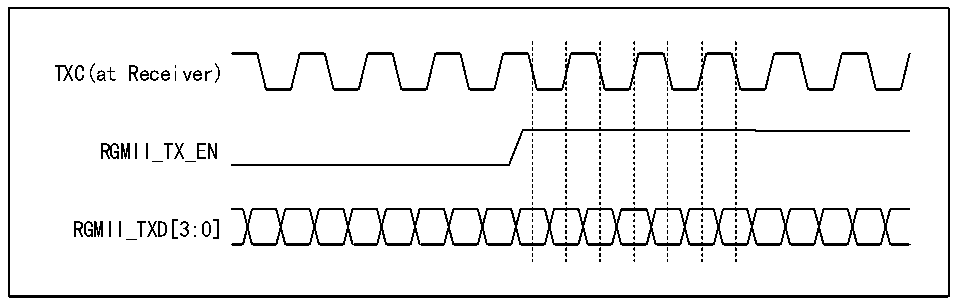

<!-- source-page: 543 -->

[← p.542](0542.md) · [index](../README.md) · [PDF p.543](https://ch32-riscv-ug.github.io/CH32H417/datasheet_zh/CH32H417RM.PDF#page=543) · [p.544 →](0544.md)

<!-- header: CH32H417系列应用手册 https://wch.cn -->

> ⬆ **Table continued** — rendered in full at [page 542](0542.md). <!-- p543-table-001 -->

### 31.4.2 RGMII接口

#### 31.4.2.1 引脚

RGMII的引脚和功能如下表  

<!-- p543-table-002 (table-31-4@1) -->
<table><caption>表31-4 RGMII的引脚和功能</caption><tr><th>引脚</th><th>功能</th></tr><tr><td>GTXC</td><td>发送时钟</td></tr><tr><td>TXCTL</td><td>发送数据控制</td></tr><tr><td>TXD0</td><td rowspan="4">发送数据线[0:3]</td></tr><tr><td>TXD1</td></tr><tr><td>TXD2</td></tr><tr><td>TXD3</td></tr><tr><td>GRXC</td><td>接收时钟</td></tr><tr><td>RXCTL</td><td>接收数据控制</td></tr><tr><td>RXD0</td><td rowspan="4">接收数据线[0:3]</td></tr><tr><td>RXD1</td></tr><tr><td>RXD2</td></tr><tr><td>RXD3</td></tr></table>

注：（1）TXCTL/RXCTL在本微控制器的以太网收发器中用作收发数据有效信号来使用；  
（2）RGMII有独立的SMI接口。  

#### 31.4.2.2 时序

RGMII工作在十兆和百兆速率的模式下，时序和MII类似；工作在千兆时，RGMII的时钟为125MHz，  
采用双边沿采样的方式。RGMII不支持半双工。  
由于 RGMII 使用双边沿采样且工作在 125MHz 的时钟频率下，因此电路设计人员应注意信号完整  
性问题。  
RGMII的接收方接收到的时钟应相对数据滞后90°以保证正确采样。以太网收发器设计了发送时  
钟延迟输出和相位翻转的功能。  

图31-4 RGMII的时序示意图  
 <!-- rendered from the PDF; verify at https://ch32-riscv-ug.github.io/CH32H417/datasheet_zh/CH32H417RM.PDF#page=543 -->

🖼 Text parsed from the figure above

TXC(at Receiver)  
RGMII_TX_EN  
RGMII_TXD[3:0]  

<!-- image: p543-draw-image-00001 bbox=[504.72, 786.24, 525.24, 796.68] -->
<!-- footer: V1.7 539 -->
