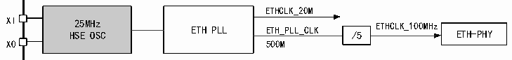

<!-- source-page: 544 -->

[← p.543](0543.md) · [index](../README.md) · [PDF p.544](https://ch32-riscv-ug.github.io/CH32H417/datasheet_zh/CH32H417RM.PDF#page=544) · [p.545 →](0545.md)

<!-- header: CH32H417系列应用手册 https://wch.cn -->

### 31.4.3 外设时钟源配置

图31-5 以太网外设时钟树  
 <!-- rendered from the PDF; verify at https://ch32-riscv-ug.github.io/CH32H417/datasheet_zh/CH32H417RM.PDF#page=544 -->

🖼 Text parsed from the figure above

ETHCLK_20M  
XI HS 25 E M H O z SC ETH PLL ETH_PLL_CLK /5 ETHCLK_100MHz ETH-PHY  
XO 500M  

> ⚠ Table extraction recorded 1 issue(s) (overlapping merged cells); verify against [the PDF, p.544](https://ch32-riscv-ug.github.io/CH32H417/datasheet_zh/CH32H417RM.PDF#page=544).

<!-- p544-table-001 (table-31-4@1) -->
<table><tr><th rowspan="2" colspan="2" style="text-align:left">GTXC to Ethernet MACRGMIIONGRXCETH_PLL_CLK/4SERDES_PLL_CLK/8ETHCLK_125MPLL_CLKUSBSS_PLL_CLK ETH1GSRC RGMII interface</th><th>to Ethernet MAC</th></tr><tr></tr></table>

GTXC  
GRXC  
在使用RGMII时，需将RCC_CFGR0[21]置1，以使能RGMII模式，同时设置RCC_CFG2[31:30]选择  
合适的125MHz时钟源提供给MAC。RGMII的发送时钟GTXC由MAC产生，接收时钟GRXC由PHY产生。  
详见官网EVT例程。  

## 31.5 IEEE802.3 和 IEEE1588

IEEE802.3协议及其补充协议组成目前以太网的官方标准，它详细定义了目前使用的以太网的方  
方面面。我们可以认为以太网处于OSI模型中的物理层和数据链路层的一部分。本节在应用的角度上  
讨论IEEE802.3协议中用户需要用到的部分，即帧格式和MAC地址相关的内容。同时，微控制器的以  
太网收发器还支持IEEE1588精确时间协议，本文还将讨论IEEE1588的部分内容。  
IEEE802.3协议构建的以太网模型中，数据传输单元是以太网帧。以太网帧在不同的介质上以不  
同的速率传输时有不同的编码形式，接收后经过物理层解码，通过 MII 接口发给 MAC，MAC 校验和过  
滤通过后，由TCP/IP协议栈提取出应用信息发给不同的应用进程。  

### 31.5.1 帧格式

以太网帧的帧格式如表31-7所示。  

<!-- p544-table-002 (table-31-7@1) -->
<table><caption>表31-7 普通以太网帧格式</caption><tr><th>前同步码</th><th>SFD</th><th>目标地址</th><th>源地址</th><th>长度或类型</th><th>数据域</th><th>CRC</th></tr><tr><td>7Bytes</td><td>1Byte</td><td>6Bytes</td><td>6Bytes</td><td>2Bytes</td><td style="text-align:left">46-1500Bytes</td><td>4Bytes</td></tr><tr><td colspan="7">总长度：64至1518字节加上8字节的物理层首部（前同步码和SFD）</td></tr></table>

前同步码：56位（7字节）交替的低电平和高电平跳跃，值固定，用十六进制表示即为0xAA-0xAA-  
0xAA-0xAA-0xAA-0xAA-0xAA。此域用来进行时钟同步。该域由硬件自动添加/去除，用户不需要理会。  
SFD：帧首定界符，8 位（1 字节），值为 10101011b，SFD 用来提醒接收方这是最后一次进行时  
钟同步的机会，其后为目标地址。该字节由硬件自动添加/去除，用户不需要理会。  
<!-- image: p544-draw-image-00001 bbox=[504.72, 786.24, 525.24, 796.68] -->
<!-- footer: V1.7 540 -->
