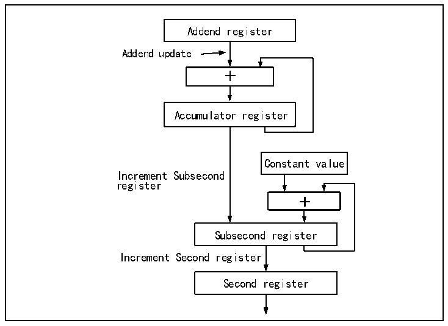

<!-- source-page: 549 -->

[← p.548](0548.md) · [index](../README.md) · [PDF p.549](https://ch32-riscv-ug.github.io/CH32H417/datasheet_zh/CH32H417RM.PDF#page=549) · [p.550 →](0550.md)

<!-- header: CH32H417系列应用手册 https://wch.cn -->
● 主机向从机发送follow_up消息，包含主机发送syn消息时的主机时间t1；  
● 从机向主机发送delay_req消息，从机记录下发送时间t3；  
● 主机向从机发送delay_resq消息，包含delay_req消息的接收时间t4；  
实际使用中，主机是每隔两秒对外发一次syn消息的，而每隔一个syn消息都可以认为是上个  
syn消息的follow_up消息，他们都会附带上一次syn消息的发送时间。从机经过这个过程可以得  
知主机网络到从机网络延迟时间Tdelay，然后算出主机时间和从机时间的时间偏移。  
（t2-t1） + （t4-t3）  
Tdelay=  
2  
任一主机发出的时间减去偏移即是主机的时间。  
PTP 的同步流程一般通过 UDP 协议实现，当然用户也可以自定协议实现。PTP 高度依赖内网的延  
迟稳定性。  

#### 31.5.7.2 本地时间更新与校正

为了实现PTP的主机，设备本地是需要有一个高精度的时间计数器的，起码要精确到纳秒级。微  
控制器的千兆以太网计数器的PTP模块拥有一个32位以秒为单位的计数器，和一个31位的亚秒计数  
器，当亚秒计数器溢出时会引起秒计数器自增，因此本地时间的分辨率可以做到0.46纳秒左右。  
本地时间的更新方式分为两种，即粗调和精调。粗调方式的更新时机是由外部决定的，在需要进  
行时间更新时，将时间戳控制寄存器的时间更新位（PTPTSCR:TSSTU）置位，微控制器的 PTP 模块会  
将秒计数器和亚秒计数器减去或加上时间戳更新寄存器（TSHUR、TSLUR）的值。粗调是一种较为简单  
且方便的时间更新机制，但是精确较差。  
精调的时间更新方式是更常用的。其更新流程如下：  

图31-7 使用精调方式更新时间的流程  
 <!-- rendered from the PDF; verify at https://ch32-riscv-ug.github.io/CH32H417/datasheet_zh/CH32H417RM.PDF#page=549 -->

🖼 Text parsed from the figure above

Addend register  
Addend update  
+  
Accumulator register  
Constant value  
Increment Subsecond  
register  
+  
Subsecond register  
Increment Second register  
Second register  

使用精调模式的方式需要对系统主频和精调的流程有较清晰的了解。与粗调方式不同，精调方式  
更新事件的时机是累加器（32位，寄存器列表中未列出。图中的Accumlator register）溢出，累加  
器在每个系统主频时钟周期都会自增加数寄存器（PTPTSAR，图中的Addend register）的值，一旦溢  
出就会产生时间更新事件，即亚秒自增寄存器（PTPSSIR，图中的Constant Value）的值会加到亚秒  
计数器（Subsecond register），完成时间更新。在亚秒计数器溢出时，秒计数器会自增。而实际上，  
亚秒计数器自增一位的时间为1/（2^31）=0.46566128730…纳秒，用户需要自行保证累加器溢出花费  
<!-- image: p549-draw-image-00001 bbox=[504.72, 786.24, 525.24, 796.68] -->
<!-- footer: V1.7 545 -->
