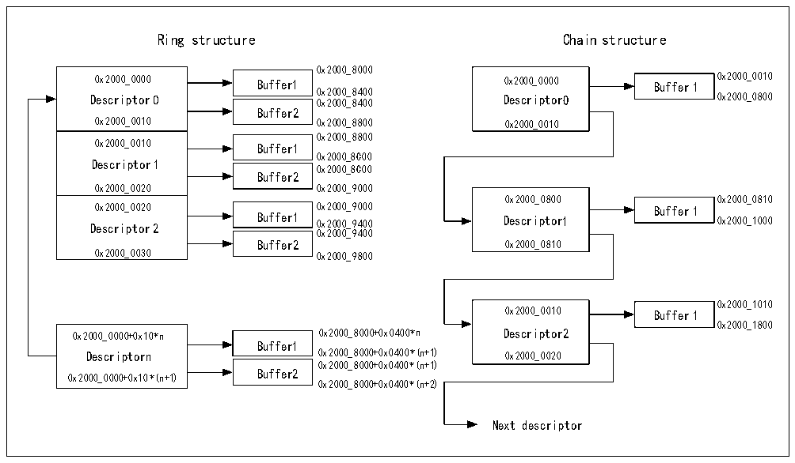

<!-- source-page: 551 -->

[← p.550](0550.md) · [index](../README.md) · [PDF p.551](https://ch32-riscv-ug.github.io/CH32H417/datasheet_zh/CH32H417RM.PDF#page=551) · [p.552 →](0552.md)

<!-- header: CH32H417系列应用手册 https://wch.cn -->

图31-8 环式结构和链式结构的缓冲区分配方案  
 <!-- rendered from the PDF; verify at https://ch32-riscv-ug.github.io/CH32H417/datasheet_zh/CH32H417RM.PDF#page=551 -->

🖼 Text parsed from the figure above

Ring structure Chain structure  
0x2000_8000  
0x2000_0000 Descriptor 00x2000_0010  0x2000_0010 Descriptor 10x2000_0020  0x2000_0020 Descriptor 20x2000_0030  
Buffer1  Buffer2  
0x2000_0000 Buffer1 0x2000_0000 Buffer 1 0x2000_0010  
Descriptor 0 0 0 x x 2 2 0 0 0 0 0 0 _ _ 8 8 4 4 0 0 0 0 Descriptor0 0x2000_0800  
0x2000_0010 0x2000_8800 0x2000_0010  
0x2000_8800  
Buffer1  Buffer2  
0x2000_0010 Buffer1  
0x2000_8C00  
0x2000_8C00  
0x2000_0020 0x2000_9000  
0x2000_0800 0x2000_0810  
Buffer1  Buffer2  
0x2000_0020 0x2000_9000 Buffer 1  
Descriptor 2 Buffer1 0x2000_9400 Descriptor1 0x2000_1000  
0x2000_9400  
Buffer2 0x2000_0810  
0x2000_1010  
0x2000_0010 Buffer 1  
0x2000_1800  
0x2000_0000+0x10*n 0x2000_8000+0x0400*n Descriptor2  
Buffer1  Buffer2  
Descriptorn 0x2000_8000+0x0400*(n+1) 0x2000_0020  
0x2000_8000+0x0400*(n+1)  
0x2000_0000+0x10*(n+1)  
0x2000_8000+0x0400*(n+2)  
Next descriptor  

#### 31.6.2.1 发送DMA描述符

表31-11、31-12表明了发送描述符的结构。  
31 0  

<!-- p551-table-006 (table-31-11@1) -->
<table><caption>表31-11 常规发送描述符的结构</caption><tr><th style="text-align:left">OWM （31）</th><th colspan="2" style="text-align:left">CTRL （30:26）</th><th style="text-align:left">TTSE （25）</th><th style="text-align:left">保留</th><th colspan="2" style="text-align:left">控制 （23:20）</th><th colspan="2" style="text-align:left">保留 （19:18）</th><th style="text-align:left">TTSS （17）</th><th style="text-align:left">状态 （16:0）</th></tr><tr><td colspan="2" style="text-align:left">保留 （31:29）</td><td colspan="4" style="text-align:left">缓冲区2字节计数 （28:16）</td><td colspan="2" style="text-align:left">保留 （15:13）</td><td colspan="3" style="text-align:left">缓冲区1字节计数 （12:0）</td></tr><tr><td colspan="11">缓冲区1地址</td></tr><tr><td colspan="11">缓冲区2地址/下一个描述符的地址</td></tr></table>

TDes0  
TDes1  
31 0  

<!-- p551-table-007 (table-31-12@1) pages 551-552 -->
<table><caption>表31-12 增强的发送描述符的结构</caption><tr><th style="text-align:left">OWM （31）</th><th colspan="2" style="text-align:left">CTRL （30:26）</th><th style="text-align:left">TTSE （25）</th><th style="text-align:left">保留</th><th colspan="2" style="text-align:left">控制 （23:20）</th><th colspan="2" style="text-align:left">保留 （19:18）</th><th style="text-align:left">TTSS （17）</th><th colspan="2" style="text-align:left">状态 （16:0）</th></tr><tr><td colspan="2" style="text-align:left">保留 （31:29）</td><td colspan="4" style="text-align:left">缓冲区2字节计数 （28:16）</td><td colspan="2" style="text-align:left">保留 （15:13）</td><td colspan="4" style="text-align:left">缓冲区1字节计数 （12:0）</td></tr><tr><td colspan="12">缓冲区1地址</td></tr><tr><td colspan="12">缓冲区2地址/下一个描述符的地址</td></tr><tr><td colspan="12">保留</td></tr><tr><td colspan="11">保留</td><td></td></tr><tr><td colspan="11">时间戳低位</td><td></td></tr><tr><td colspan="11">时间戳高位</td><td></td></tr></table>

TDes0  
TDes1  
<!-- image: p551-draw-image-00001 bbox=[504.72, 786.24, 525.24, 796.68] -->
<!-- footer: V1.7 547 -->
