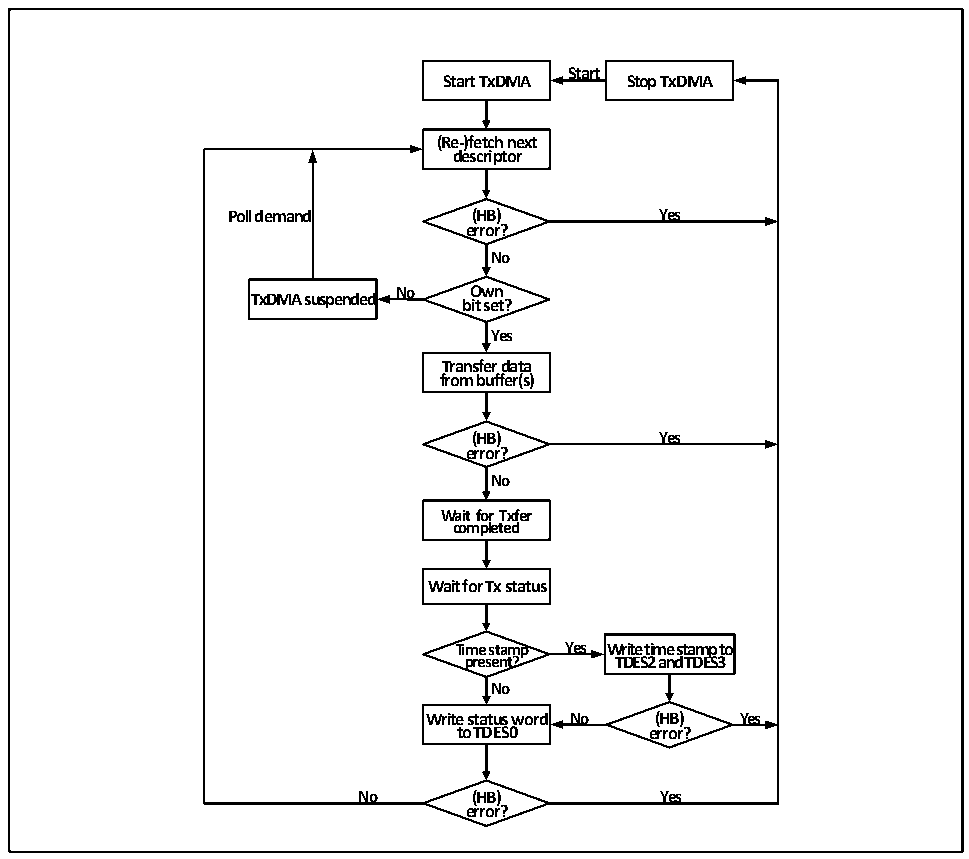

<!-- source-page: 560 -->

[← p.559](0559.md) · [index](../README.md) · [PDF p.560](https://ch32-riscv-ug.github.io/CH32H417/datasheet_zh/CH32H417RM.PDF#page=560) · [p.561 →](0561.md)

<!-- header: CH32H417系列应用手册 https://wch.cn -->

图31-9发送流程  
 <!-- rendered from the PDF; verify at https://ch32-riscv-ug.github.io/CH32H417/datasheet_zh/CH32H417RM.PDF#page=560 -->

🖼 Text parsed from the figure above

<strong>Start</strong>  
<strong>Start TxDMA Stop TxDMA</strong>  
<strong>(Re-)fetch next</strong>  
<strong>descriptor</strong>  
<strong>Poll demand (HB) Yes</strong>  
<strong>error?</strong>  
<strong>No</strong>  
<strong>TxDMA suspended No b O it w se n t ?</strong>  
<strong>Yes</strong>  
<strong>Transfer data</strong>  
<strong>from buffer(s)</strong>  
<strong>(HB) Yes</strong>  
<strong>error?</strong>  
<strong>No</strong>  
<strong>Wait for Txfer</strong>  
<strong>completed</strong>  
<strong>Wait for Tx status</strong>  
<strong>Time stamp Yes Write time stamp to</strong>  
<strong>present? TDES2 and TDES3</strong>  
<strong>No</strong>  
<strong>Write status word No (HB) Yes</strong>  
<strong>to TDES0 error?</strong>  
<strong>No (HB) Yes</strong>  
<strong>error?</strong>  

#### 31.6.4.2 接收DMA配置

建立DMA接收流转机制的步骤如下：  
1） 设置发送缓冲区队列和描述符队列，设置好接收描述符的各个域各个位；将描述符初始地址注册  
到DMARDLAR寄存器中；置位OWN位，将描述符使用权限交给DMA控制器；  
2） 置位SR位，开始接收流程；  
3） 在接收流转机制运行时，DMA控制器获取下一个描述符，检查接收描述符配置，在FIFO接收到下  
一帧时，对帧内容进行过滤和识别等多项检查，将帧数据转发描述符指定的缓冲区中，写描述符  
状态域并获取下一个接收描述符，报接收完成中断。如果帧未通过过滤会被标记或丢弃，如果帧  
存在检验和错误、CRC错误或帧过短将会被标记，如果帧过长可能会被掐断或报接收看门狗超时  
错误。DMA控制器遇到接收描述符不可用等致命错误将会停止接收流程，用户需要特别留意；  
4） 用户至少需要使能一个接收完成中断，在以太网中断函数中将使用过的接收描述符恢复到待命状  
态，以保证接收流程可以不间断地运行下去。用户可以在中断函数中将待处理的数据缓冲区地址  
传递出来，或处理一些打断接收流程的异常事件。  
5） 如果MAC开启了IEEE1588 PTP模式并使能增强描述符，在DMA控制器转存数据，写描述符状态  
域时，同时也会将当前的时间戳写进描述符的后两个字。  
下图展示了默认接收流转机制：  
<!-- image: p560-draw-image-00001 bbox=[504.72, 786.24, 525.24, 796.68] -->
<!-- footer: V1.7 556 -->
