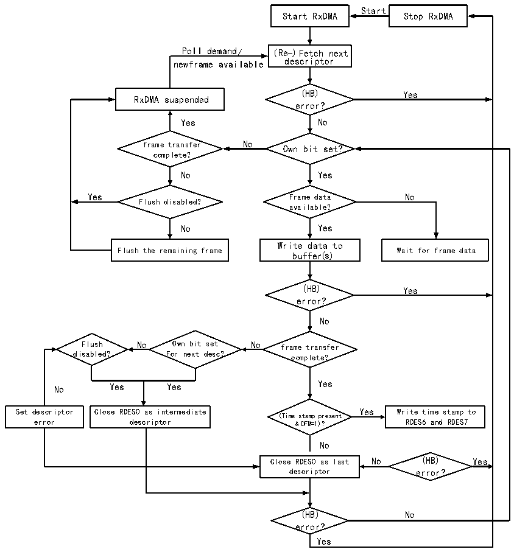

<!-- source-page: 561 -->

[← p.560](0560.md) · [index](../README.md) · [PDF p.561](https://ch32-riscv-ug.github.io/CH32H417/datasheet_zh/CH32H417RM.PDF#page=561) · [p.562 →](0562.md)

<!-- header: CH32H417系列应用手册 https://wch.cn -->

图31-10 接收流程  
 <!-- rendered from the PDF; verify at https://ch32-riscv-ug.github.io/CH32H417/datasheet_zh/CH32H417RM.PDF#page=561 -->

🖼 Text parsed from the figure above

Start  
Start RxDMA Stop RxDMA  
Poll demand/ (Re-)Fetch next  
newframe available descriptor  
(HB) Yes  
RxDMA suspended  
error?  
Yes No  
frame transfer No Own bit set?  
complete?  
No Yes  
Yes Frame data No  
Flush disabled?  
available?  
No Yes  
Write data to  
Flush the remaining frame Wait for frame data  
buffer(s)  
(HB) Yes  
error?  
No  
Flush No Own bit set No frame transfer  
disabled? For next desc? complete?  
No Yes Yes Yes  
Set descriptor Close RDES0 as intermediate Yes Write time stamp to  
(Time stamp present  
error descriptor &amp; DFM=1)? RDES6 and RDES7  
No  
Close RDES0 as last No (HB) Yes  
descriptor error?  
(HB) No  
error?  
Yes  

## 31.7 中断

以太网收发器拥有两个中断向量，一个是以太网唤醒事件，另一个是普通的收发事件。当检测到  
唤醒帧或魔法帧的时候，会触发以太网唤醒事件。普通的以太网收发中断事件包括DMA中断和ETH中  
断。  

### 31.7.1 DMA中断

DMA中断大致可以分为两组，即正常的中断（NIS）和异常的中断（AIS），异常的中断一般意味  
着数据收发的异常，需要特别注意。用户在处理中断时需要检索所有的中断标志位，并将已经产生的  
中断源全部处理掉。下图是以太网收发器的中断示意图。  
<!-- image: p561-draw-image-00001 bbox=[504.72, 786.24, 525.24, 796.68] -->
<!-- footer: V1.7 557 -->
