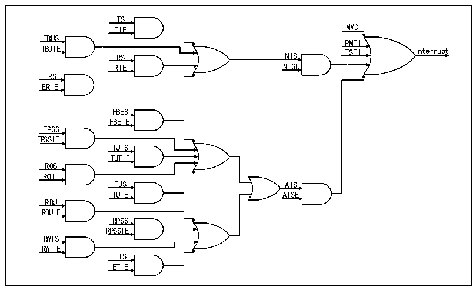

<!-- source-page: 562 -->

[← p.561](0561.md) · [index](../README.md) · [PDF p.562](https://ch32-riscv-ug.github.io/CH32H417/datasheet_zh/CH32H417RM.PDF#page=562) · [p.563 →](0563.md)

<!-- header: CH32H417系列应用手册 https://wch.cn -->

图31-11 中断示意图  
 <!-- rendered from the PDF; verify at https://ch32-riscv-ug.github.io/CH32H417/datasheet_zh/CH32H417RM.PDF#page=562 -->

🖼 Text parsed from the figure above

TS  
TIE MMCI  
TBUS  
PMTI  
TBUIE TSTI Interrupt  
RS NIS  
RIE NISE  
ERS  
ERIE  
FBES  
FBEIE  
TPSS  
TPSSIE  
TJTS  
TJTIE  
ROS  
ROIE  
TUS AIS  
TUIE AISE  
RBU  
RBUIE  
RPSS  
RPSSIE  
RWTS  
RWTIE  
ETS  
ETIE  

DMA中断是以太网收发器中最重要的中断，一般的用户逻辑中都需要依靠中断接收帧，确认帧发  
送出去，或是及时处理被打断的收发逻辑。  

### 31.7.2 ETH中断

ETH中断主要包括PTP的时间闹钟触发，收发计数到了MMC寄存器的某种设定值，以及PMT。ETH  
的用处主要是功能性的，相对 DMA 中断而言并不十分复杂和重要。用户可以使用 PTP 中断实现闹钟，  
使用MMC中断实现测速，或使用PMT中断实现远程唤醒。另外，ETH还支持当内置物理层连接状态发  
生改变时产生中断。  

### 31.7.3 PMT中断

将PMT中断单独提出来重述一遍的原因是这个中断拥有独立的中断向量，使用时需注意。  

## 31.8 寄存器描述

MAC控制相关寄存器地址映射  

<!-- p562-table-001 (table-31-24@1) pages 562-563 -->
<table><caption>表31-24 以太网相关寄存器列表</caption><tr><th>名称</th><th>访问地址</th><th>描述</th><th>复位值</th></tr><tr><td>R32_ETH_MACCR</td><td>0x40028000</td><td>MAC控制寄存器</td><td>0x00000000</td></tr><tr><td>R32_ETH_MACFFR</td><td>0x40028004</td><td>帧过滤寄存器</td><td>0x00000000</td></tr><tr><td>R32_ETH_MACHTHR</td><td>0x40028008</td><td>哈希值列表寄存器高位</td><td>0x00000000</td></tr><tr><td>R32_ETH_MACHTLR</td><td>0x4002800C</td><td>哈希值列表寄存器低位</td><td>0x00000000</td></tr><tr><td>R32_ETH_MACMIIAR</td><td>0x40028010</td><td>MII地址寄存器</td><td>0x00000000</td></tr><tr><td>R32_ETH_MACMIIDR</td><td>0x40028014</td><td>MII数据寄存器</td><td>0x00000000</td></tr><tr><td>R32_ETH_MACFCR</td><td>0x40028018</td><td>MAC流控寄存器</td><td>0x00000000</td></tr><tr><td>R32_ETH_MACVLAN</td><td>0x4002801C</td><td>VLAN标签寄存器</td><td>0x00000000</td></tr><tr><td>R32_ETH_MACRWUFFR</td><td>0x40028028</td><td>唤醒帧过滤器寄存器</td><td>0x00000000</td></tr><tr><td>R32_ETH_MACPMTCSR</td><td>0x4002802C</td><td>PMT控制和状态寄存器</td><td>0x00000000</td></tr><tr><td>R32_ETH_MACSR</td><td>0x40028038</td><td>MAC中断状态寄存器</td><td>0x00000000</td></tr><tr><td>R32_ETH_MACIMR</td><td>0x4002803C</td><td>MAC中断屏蔽寄存器</td><td>0x00000000</td></tr><tr><td>R32_ETH_MACA0HR</td><td>0x40028040</td><td>MAC地址寄存器0高32位</td><td>0x8000FFFF</td></tr><tr><td>R32_ETH_MACA0LR</td><td>0x40028044</td><td>MAC地址寄存器0低32位</td><td>0xFFFFFFFF</td></tr><tr><td>R32_ETH_MACA1HR</td><td>0x40028048</td><td>MAC地址寄存器1高32位</td><td>0x0000FFFF</td></tr><tr><td>R32_ETH_MACA1LR</td><td>0x4002804C</td><td>MAC地址寄存器1低32位</td><td>0xFFFFFFFF</td></tr><tr><td>R32_ETH_MACA2HR</td><td>0x40028050</td><td>MAC地址寄存器2高32位</td><td>0x0000FFFF</td></tr><tr><td>R32_ETH_MACA2LR</td><td>0x40028054</td><td>MAC地址寄存器2低32位</td><td>0xFFFFFFFF</td></tr><tr><td>R32_ETH_MACA3HR</td><td>0x40028058</td><td>MAC地址寄存器3高32位</td><td>0x0000FFFF</td></tr><tr><td>R32_ETH_MACA3LR</td><td>0x4002805C</td><td>MAC地址寄存器3低32位</td><td>0xFFFFFFFF</td></tr><tr><td>R32_ETH_PHY_CFGR</td><td>0x40028080</td><td>MAC_PHY配置寄存器</td><td>0x40000001</td></tr></table>

<!-- image: p562-draw-image-00001 bbox=[504.72, 786.24, 525.24, 796.68] -->
<!-- footer: V1.7 558 -->
