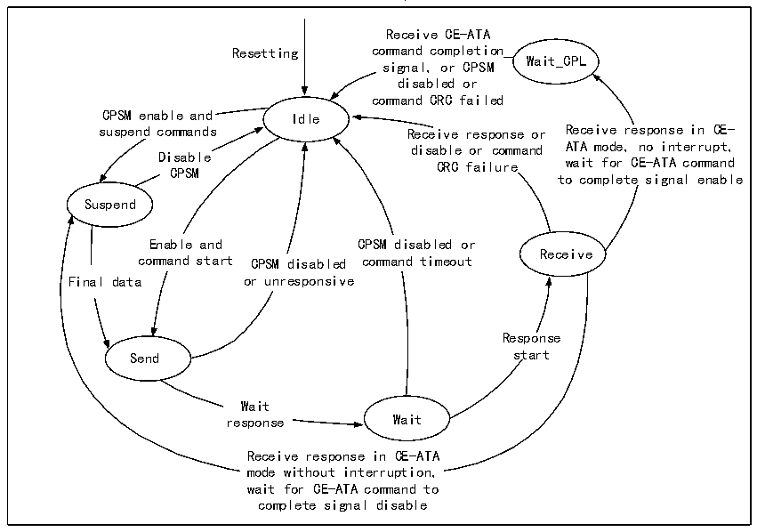
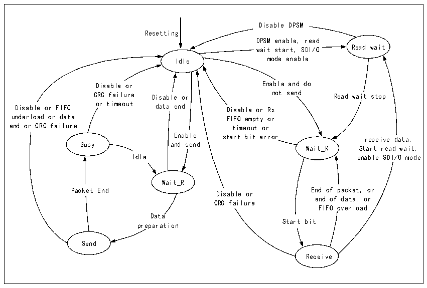

<!-- source-page: 598 -->

[← p.597](0597.md) · [index](../README.md) · [PDF p.598](https://ch32-riscv-ug.github.io/CH32H417/datasheet_zh/CH32H417RM.PDF#page=598) · [p.599 →](0599.md)

<!-- header: CH32H417系列应用手册 https://wch.cn -->

### 32.2.4 命令状态机

SDIO的命令工作流程遵循如下图的状态机。  

图32-2 命令状态机  
 <!-- rendered from the PDF; verify at https://ch32-riscv-ug.github.io/CH32H417/datasheet_zh/CH32H417RM.PDF#page=598 -->

🖼 Text parsed from the figure above

Receive CE-ATA  
Resetting command completion  
Wait_CPL  
signal, or CPSM  
disabled or  
command CRC failed  
CPSM enable and Idle  
suspend commands Receive response or Receive response in CE-  
disable or command ATA mode, no interrupt,  
Disable  
CRC failure wait for CE-ATA command  
CPSM  
to complete signal enable  
Suspend  
Enable and CPSM disabled or  
Receive  
command start CPSM disabled command timeout  
Final data or unresponsive  
Response  
Send start  
Wait  
response Wait  
Receive response in CE-ATA  
mode without interruption,  
wait for CE-ATA command to  
complete signal disable  

### 32.2.5 数据状态机

SDIO的数据工作流程遵循如下图的状态机。  

图32-3 数据状态机  
 <!-- rendered from the PDF; verify at https://ch32-riscv-ug.github.io/CH32H417/datasheet_zh/CH32H417RM.PDF#page=598 -->

🖼 Text parsed from the figure above

Disable DPSM  
Resetting  
DPSM enable, read  
wait start, SDI/O Read wait  
Idle mode enable  
Disable or Enable and do  
CRC failure Disable or not send Read wait stop  
Disable or FIFO or timeout data end Disable or Rx  
underload or data FIFO empty or  
end or CRC failure timeout or  
Enable start bit error receive data,  
Busy and send  
Wait_R Start read wait,  
Idle enable SDI/O mode  
Wait_R  
End of packet, end of data, FIFO overloa  Start bi  
Packet End End of packet, or  
Disable or  
CRC failure  
Data  
preparation  
Send  
Receive  

<!-- image: p598-draw-image-00001 bbox=[504.72, 786.24, 525.24, 796.68] -->
<!-- footer: V1.7 594 -->
