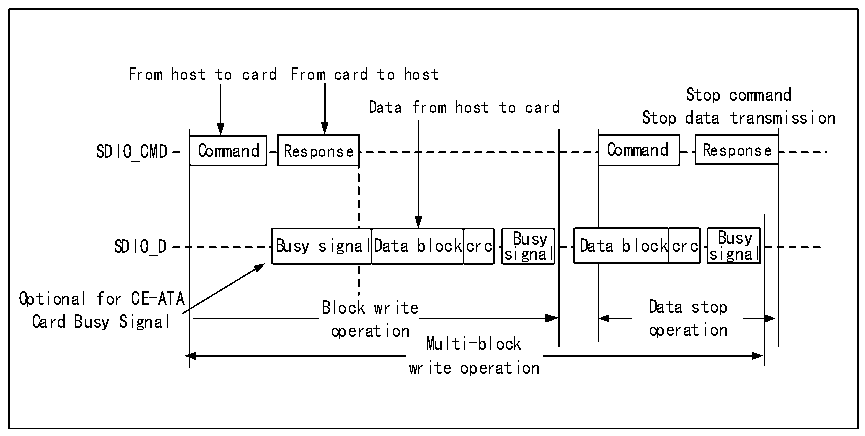
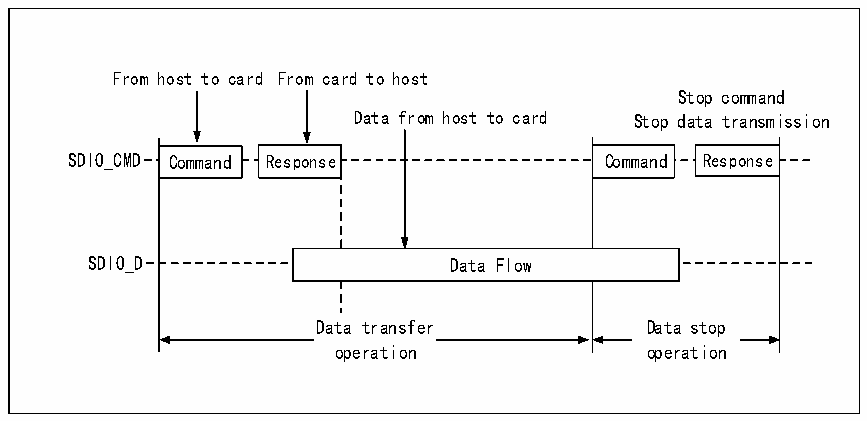
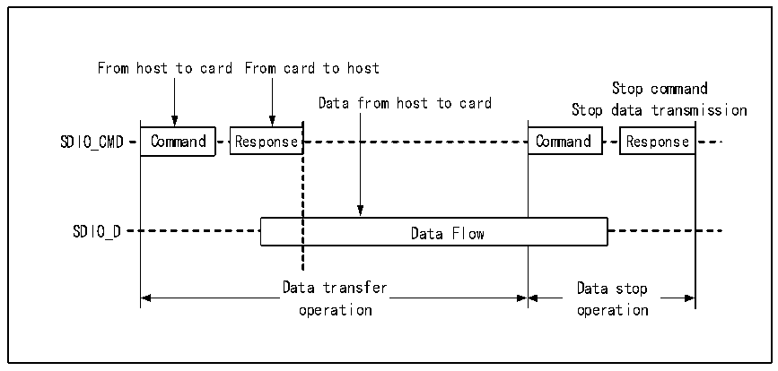

<!-- source-page: 600 -->

[← p.599](0599.md) · [index](../README.md) · [PDF p.600](https://ch32-riscv-ug.github.io/CH32H417/datasheet_zh/CH32H417RM.PDF#page=600) · [p.601 →](0601.md)

<!-- header: CH32H417系列应用手册 https://wch.cn -->

图32-6 SDIO的多块写时序（以SD卡为例）  
 <!-- rendered from the PDF; verify at https://ch32-riscv-ug.github.io/CH32H417/datasheet_zh/CH32H417RM.PDF#page=600 -->

🖼 Text parsed from the figure above

From host to card From card to host  
Stop command  
Data from host to card  
Stop data transmission  
Command  Response  Command  Response  
Command  Da l  Command  Busy signal  Da  ata blockc  crc  siBugnsayl  Da  ata blockc  crc  
Response  Response  
SDIO_CMD Command Response Command Response  
Busy signal  lData block  crc  Busy signa  al  lData block  crc  
Optional for CE-ATA  
Block write Data stop  
Block write  operation  
Data stop  operation  
Card Busy Signal  
operation operation  
Multi-block  write operation  

图32-7 SDIO的数据流读时序（以SDIO卡为例）  
 <!-- rendered from the PDF; verify at https://ch32-riscv-ug.github.io/CH32H417/datasheet_zh/CH32H417RM.PDF#page=600 -->

🖼 Text parsed from the figure above

From host to card From card to host  
Stop command  
Data from host to card Stop data transmission  
Command  Command  
Response  Response  
Command  Command  
Response  Response  
SDIO_CMD Command Response Command Response  
Data Flow  Data Flow  
Data transfer  operation  
Data stop  operation  
Data transfer Data stop  
operation operation  

图32-8 SDIO的数据流写时序（以SDIO卡为例）  
 <!-- rendered from the PDF; verify at https://ch32-riscv-ug.github.io/CH32H417/datasheet_zh/CH32H417RM.PDF#page=600 -->

🖼 Text parsed from the figure above

From host to card From card to host  
Stop command  
Data from host to card  
Stop data transmission  
Command  Command  
Response  Command  Response  Command  Data Flow  Data Flow  
Response  Response  
Data transfer Data stop  
Data transfer  operation  
Data stop  operation  
operation operation  

<!-- image: p600-draw-image-00001 bbox=[504.72, 786.24, 525.24, 796.68] -->
<!-- footer: V1.7 596 -->
