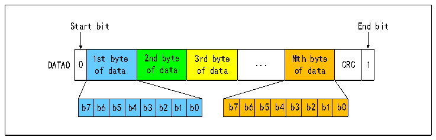

<!-- source-page: 604 -->

[← p.603](0603.md) · [index](../README.md) · [PDF p.604](https://ch32-riscv-ug.github.io/CH32H417/datasheet_zh/CH32H417RM.PDF#page=604) · [p.605 →](0605.md)

<!-- header: CH32H417系列应用手册 https://wch.cn -->

#### 32.3.3.6 R5响应

应对CMD5的专用响应，总长48位，有CRC7校验。R5应用在SDIO卡中，格式如下表。  

<!-- p604-table-001 (table-32-11@1) -->
<table><caption>表32-11 R5的格式</caption><tr><th>位/域的名称</th><th>起始位</th><th>传输位</th><th>命令索引</th><th>填充位</th><th>响应格式</th><th>读写数据</th><th>CRC7</th><th>结束位</th></tr><tr><td>位次</td><td>47</td><td>46</td><td>[45:40]</td><td>[39:24]</td><td>[23:16]</td><td>[15:8]</td><td>[7:1]</td><td>0</td></tr><tr><td>宽度</td><td>1</td><td>1</td><td>6</td><td>16</td><td>8</td><td>8</td><td>7</td><td>1</td></tr><tr><td>值</td><td>0b</td><td>0b</td><td>110100b</td><td>0000h</td><td>X</td><td>X</td><td>X</td><td>1b</td></tr></table>

注：MMC卡R5的格式和SDIO卡不同。  

#### 32.3.3.7 R6响应

回复RCA的专用响应，总长48位，有CRC7校验，格式如下表。  

<!-- p604-table-002 (table-32-12@1) -->
<table><caption>表32-12 R6的格式</caption><tr><th>位/域的名称</th><th>起始位</th><th>传输位</th><th>命令索引</th><th>卡的RCA</th><th>卡状态位</th><th>CRC7</th><th>结束位</th></tr><tr><td>位次</td><td>47</td><td>46</td><td>[45:40]</td><td>[39:24]</td><td>[23:8]</td><td>[7:1]</td><td>0</td></tr><tr><td>宽度</td><td>1</td><td>1</td><td>6</td><td>16</td><td>16</td><td>7</td><td>1</td></tr><tr><td>值</td><td>0b</td><td>0b</td><td>000011b</td><td>X</td><td>X</td><td>X</td><td>1b</td></tr></table>

#### 32.3.3.8 R7响应

应对CMD8的专用响应，表明支持的电压的信息，总长48位，有CRC7校验，格式如下表。  

<!-- p604-table-003 (table-32-13@1) -->
<table><caption>表32-13 R7的格式</caption><tr><th>位/域的</th><th>起始</th><th rowspan="2" style="text-align:left">传输位</th><th rowspan="2" style="text-align:left">命令索引</th><th rowspan="2">保留位</th><th rowspan="2" style="text-align:left">PCIe 1V2支持</th><th>PCIe响</th><th rowspan="2" style="text-align:left">接受的电压</th><th rowspan="2" style="text-align:left">检查回馈</th><th rowspan="2">CRC7</th><th>结束</th></tr><tr><td>名称</td><td>位</td><td>应</td><td>位</td></tr><tr><td>位次</td><td>47</td><td>46</td><td>[45:40]</td><td>[39:22]</td><td>21</td><td>20</td><td>[19:16]</td><td>[15:8]</td><td>[7:1]</td><td>0</td></tr><tr><td>宽度</td><td>1</td><td>1</td><td>6</td><td>18</td><td>1</td><td>1</td><td>4</td><td>8</td><td>7</td><td>1</td></tr><tr><td>值</td><td>0b</td><td>0b</td><td>001000b</td><td>00000h</td><td>X</td><td>X</td><td>X</td><td>X</td><td>X</td><td>1b</td></tr></table>

### 32.3.4 数据传输

数据传输在数据线 SDIO_D 上进行，有 1/4/8 位三种宽度，数据传输时一般是一个时钟的起始位  
在最前面，每个字节的高位在前，低位在后。对于 SD 卡仅仅支持的块传输模式，每个块的数据传输  
结束后还跟着CRC校验。  
开启RANDOM_LEN_EN位，配置DBLOCKSIZE2表示的字节长度，配置R32_SDIO_DLEN表示的传输数  
据总长度，使能 DTEN 位，填写数据至 R32_SDIO_FIFO，即可完成任意字节长度且带 CRC 校验的块传  
输。  
MMC卡还支持数据流传输模式，此时不附带CRC。下图为数据传输的格式。  

图32-9 SD卡单总线数据传输字节的格式  
 <!-- rendered from the PDF; verify at https://ch32-riscv-ug.github.io/CH32H417/datasheet_zh/CH32H417RM.PDF#page=604 -->

🖼 Text parsed from the figure above

Start bit End bit  
0  1st byte of data  2nd byte of data  3rd byte of data  ...  Nth byte of data  CRC 1  b7  b6  b5  b4  b3  b2  b1  b0  b7  b6  b5  b4  b3  b2  b1  b0  

<!-- image: p604-draw-image-00001 bbox=[504.72, 786.24, 525.24, 796.68] -->
<!-- footer: V1.7 600 -->
