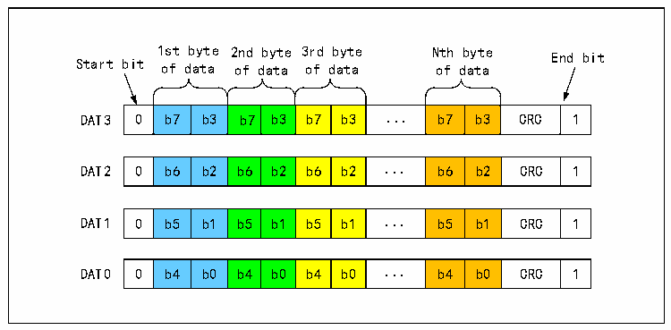
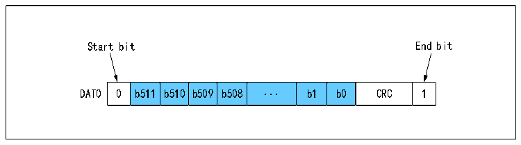
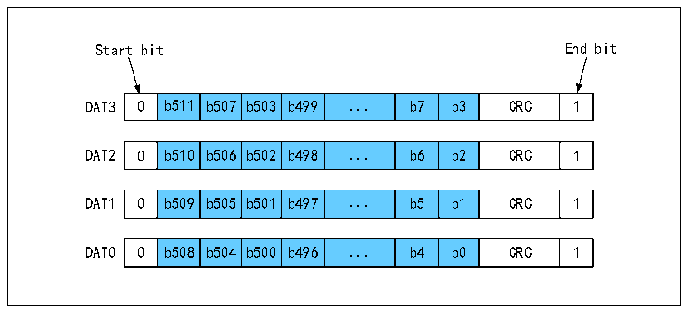

<!-- source-page: 605 -->

[← p.604](0604.md) · [index](../README.md) · [PDF p.605](https://ch32-riscv-ug.github.io/CH32H417/datasheet_zh/CH32H417RM.PDF#page=605) · [p.606 →](0606.md)

<!-- header: CH32H417系列应用手册 https://wch.cn -->

图32-10 SD卡4总线数据传输字节的格式  
 <!-- rendered from the PDF; verify at https://ch32-riscv-ug.github.io/CH32H417/datasheet_zh/CH32H417RM.PDF#page=605 -->

🖼 Text parsed from the figure above

1st byte 2nd byte 3rd byte Nth byte End bit  
Start bit of data of data of data of data  
0  b7  b3  b7  b3  b7  b3  ...  b7  b3  CRC  1  
0  b6  b2  b6  b2  b6  b2  ...  b6  b2  CRC  1  
0  b5  b1  b5  b1  b5  b1  ...  b5  b1  CRC  1  
0  b4  b0  b4  b0  b4  b0  ...  b4  b0  CRC  1  

图32-11 SD卡单总线数据传输一个512位字的格式  
 <!-- rendered from the PDF; verify at https://ch32-riscv-ug.github.io/CH32H417/datasheet_zh/CH32H417RM.PDF#page=605 -->

🖼 Text parsed from the figure above

Start bit End bit  
0  b511  b510  b509  b508  ...  b1  b0  CRC  1  

图32-12 SD卡4总线数据传输一个512位字的格式  
 <!-- rendered from the PDF; verify at https://ch32-riscv-ug.github.io/CH32H417/datasheet_zh/CH32H417RM.PDF#page=605 -->

🖼 Text parsed from the figure above

Start bit End bit  
0  b511  b507  b503  b499  ...  b7  b3  CRC  1  
0  b510  b506  b502  b498  ...  b6  b2  CRC  1  
0  b509  b505  b501  b497  ...  b5  b1  CRC  1  
0  b508  b504  b500  b496  ...  b4  b0  CRC  1  

### 32.3.5 从模式

开启SLV_MODE位，即处于等待主机命令的状态，接收到的命令参数会放在RESP1，接收到的命令  
索引会放在RESP2，同时自动向主机应答R1类型的应答，应答参数为CMDARG的值。  
从模式下的数据收发参考主模式，但从机可以使用SLV_FORCE_ERR位强制数据块CRC错，从而表  
示不期望的数据读写。  
注：从机只支持R1类型的应答，主从通信所用的命令索引和参数含义均由软件定义。  

## 32.4 应用

### 32.4.1 设备初始化和设备寄存器

#### 32.4.1.1 OCR寄存器

<!-- image: p605-draw-image-00001 bbox=[504.72, 786.24, 525.24, 796.68] -->
<!-- footer: V1.7 601 -->
