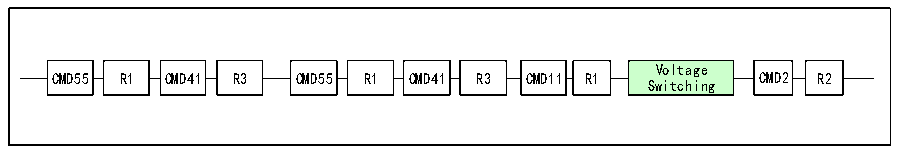

<!-- source-page: 608 -->

[← p.607](0607.md) · [index](../README.md) · [PDF p.608](https://ch32-riscv-ug.github.io/CH32H417/datasheet_zh/CH32H417RM.PDF#page=608) · [p.609 →](0609.md)

<!-- header: CH32H417系列应用手册 https://wch.cn -->

> ⬆ **Table continued** — rendered in full at [page 607](0607.md). <!-- p608-table-001 -->

#### 32.4.1.4 RCA寄存器

相对卡地址寄存器存储了卡的地址，为16位，默认值为0。  

### 32.4.2 电压切换

在SD卡初始化后期，需要进行接口电平切换，将SD卡的时钟线数据线和命令线的IO电平切换  
到1.8V水平。对于压摆率不是足够优秀的器件，使用更低的电平标准有助于提升频率。但是SD的供  
电电压并不一定变化，只在较新版本的协议才出现了低电压供电的SD卡。  
切换电压的步骤如下图。  

图32-13 电压切换序列  
 <!-- rendered from the PDF; verify at https://ch32-riscv-ug.github.io/CH32H417/datasheet_zh/CH32H417RM.PDF#page=608 -->

🖼 Text parsed from the figure above

CMD55  R1  
Voltage  
CMD55 R1 CMD41 R3 CMD55 R1 CMD41 R3 CMD11 R1 CMD2 R2  
Switching  

### 32.4.3 时钟切换

初始化时 SD 卡的时钟只有 400kHz，在电压完成切换之后可以将时钟提升至较高的水平，例如  
SDHC卡UHS-I模式第一档速度，总线时钟可以达到80MHz，鉴于微控制器的IO输出能力，应将时钟  
限制在50MHz之内。  

## 32.5 中断

### 32.5.1 SDIO 中断

SDIO支持多种中断源，如中断使能寄存器（R32_SDIO_IER）所示的有24种情况都可以触发中断，  
用户可酌情自行开启。  

### 32.5.2 SDIO 设备中断

需要注意的是不光SDIO外设可以向CPU报中断，外接SDIO卡和MMC卡也能向SDIO外设报中断。  
在4位总线模式下，中断线是D1，在8位总线模式下，中断线是D7，低电平有效。如果在空闲状态  
下SDIO检测到D1或D7为低电平，应读取SDIO设备的状态寄存器或中断标志寄存器及时响应中断。  
CPU通过R32_SDIO_STA寄存器的SDIOIT位可以得到SDIO主机是否收到中断。  

## 32.6 寄存器描述

<!-- p608-table-003 (table-32-17@1) pages 608-609 -->
<table><caption>表32-17 SDIO相关寄存器列表</caption><tr><th>名称</th><th>访问地址</th><th>描述</th><th>复位值</th></tr><tr><td>R32_SDIO_POWER</td><td>0x40018000</td><td>电源寄存器</td><td>0x00000000</td></tr><tr><td>R32_SDIO_CLKCR</td><td>0x40018004</td><td>时钟寄存器</td><td>0x00000000</td></tr><tr><td>R32_SDIO_ARG</td><td>0x40018008</td><td>命令参数寄存器</td><td>0x00000000</td></tr><tr><td>R32_SDIO_CMD</td><td>0x4001800C</td><td>命令寄存器</td><td>0x00000000</td></tr><tr><td>R32_SDIO_RESPCMD</td><td>0x40018010</td><td>响应寄存器</td><td>0x00000000</td></tr><tr><td>R128_SDIO_RESPX</td><td>0x40018014</td><td>响应参数寄存器</td><td>0x00000000</td></tr><tr><td>R32_SDIO_DTIMER</td><td>0x40018024</td><td>数据定时寄存器</td><td>0x00000000</td></tr><tr><td>R32_SDIO_DLEN</td><td>0x40018028</td><td>传输长度寄存器</td><td>0x00000000</td></tr><tr><td>R32_SDIO_DCTLR</td><td>0x4001802C</td><td>数据控制寄存器</td><td>0x00000000</td></tr><tr><td>R32_SDIO_DCOUNT</td><td>0x40018030</td><td>传输计数寄存器</td><td>0x00000000</td></tr><tr><td>R32_SDIO_STA</td><td>0x40018034</td><td>状态寄存器</td><td>0x00000000</td></tr><tr><td>R32_SDIO_ICR</td><td>0x40018038</td><td>中断清除寄存器</td><td>0x00000000</td></tr><tr><td>R32_SDIO_MASK</td><td>0x4001803C</td><td>中断使能寄存器</td><td>0x00000000</td></tr><tr><td>R32_SDIO_FIFOCNT</td><td>0x40018048</td><td>FIFO计数器</td><td>0x00000000</td></tr><tr><td>R32_SDIO_DCTRL2</td><td>0x40018060</td><td>数据控制寄存器2</td><td>0x00000000</td></tr><tr><td>R32_SDIO_FIFO</td><td>0x40018080</td><td>FIFO寄存器</td><td>0x00000000</td></tr></table>

<!-- image: p608-draw-image-00001 bbox=[504.72, 786.24, 525.24, 796.68] -->
<!-- footer: V1.7 604 -->
