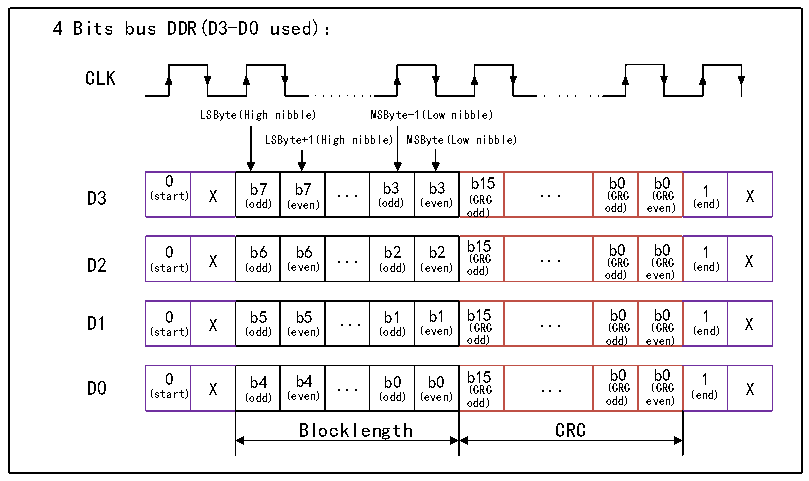

<!-- source-page: 622 -->

[← p.621](0621.md) · [index](../README.md) · [PDF p.622](https://ch32-riscv-ug.github.io/CH32H417/datasheet_zh/CH32H417RM.PDF#page=622) · [p.623 →](0623.md)

<!-- header: CH32H417系列应用手册 https://wch.cn -->
从机错误处理  
从机会对所有主机的命令进行R1类型的应答，响应参数为从机ARGUMENT寄存器的值，从机可能  
因为接收命令时出现CRC错误不响应主机的应答，则主机应该重试当前命令。  
如果从机在收发过程中出现内部 FIFO 溢出，硬件会自动强制本次收发的数据块为 CRC 错误，以  
此通知主机传输有问题；软件也可以设置RB_SLV_FORCE_ERR来强制传输错误的CRC块。  
从机硬件会解析一个特殊的命令CMD63，用来简化从机软件在传输出错时的处理。若主机收发过  
程中出现 CRC 错误，则主机立刻发送 CMD63，从机在收到 CMD63 时，软件需要去复位掉数据状态机，  
硬件会自动将DMA地址指向上一个错误包的起始地址，这样等主从协商好可以继续传输时，对于读操  
作，从机软件只用设置R32_EMMC_BLOCK_CFG中的块数，对于写操作，软件设置完R32_EMMC_BLOCK_CFG  
块数并且写RESPONSE3寄存器，即可完成重传并继续传输。  
双缓冲模式  
如果从机使用双缓冲模式，若主机读取buf0的最后一块数据时发生错误，则主机会在buf1的第  
一块数据期间发送CMD63以指示上一包CRC错误，因此从机应该在buf1的第一个块成功传输后，才  
更新掉buf0的数据，新增的中断位RB_SIF_SLV_BUF_RELEASE即在新buf的第一个扇区成功传输时产  
生。  
1 block | 更新buf1缓冲区  
buf0 ----------------------------------------------------------------  
1 block | 更新buf0缓冲区  
buf1 ----------------------------------------------------------------  
DDR模式  
支持4线和8线下的DDR模式。  
1）4线DDR模式：  
即通过时钟的上升沿和下降沿，输出和采样数据，提高数据传输速率，应用时，应使能4线模式  
寄存器和DDR模式寄存器；  

图33-1 4线的DDR模式  
 <!-- rendered from the PDF; verify at https://ch32-riscv-ug.github.io/CH32H417/datasheet_zh/CH32H417RM.PDF#page=622 -->

🖼 Text parsed from the figure above

4 Bits bus DDR(D3-D0 used)：  
CLK  
LSByte(High nibble) MSByte-1(Low nibble)  
LSByte+1(High nibble) MSByte(Low nibble)  
0 (start)  X  b7 (odd)  b7 (even)  ...  b3 (odd)  b3 (even)  b15 (CRC odd)  ...  b0 (CRC odd)  b0 (CRC even)  1 (end)  X  
0 (start)  X )  b6 (odd)  b6 (even)  ...  b2 (odd)  b2 (even)  b15 (CRC odd)  ...  b0 (CRC odd)  b0 (CRC even)  1 (end)  X  
0 (start)  X )  b5 (odd)  b5 (even)  ...  b1 (odd)  b1 (even)  b15 (CRC odd)  ...  b0 (CRC odd)  b0 (CRC even)  1 (end)  X  
0 (start)  X )  b4 (odd)  b4 (even)  ...  b0 (odd)  b0 (even)  b15 (CRC odd)  ...  b0 (CRC odd)  b0 (CRC even)  1 (end)  X  
Blocklength CRC  

2）8线的DDR模式：  
即通过时钟的上升沿和下降沿，输出和采样数据，提高数据传输速率，应用时，应使能8线模式  
<!-- image: p622-draw-image-00001 bbox=[504.72, 786.24, 525.24, 796.68] -->
<!-- footer: V1.7 618 -->
