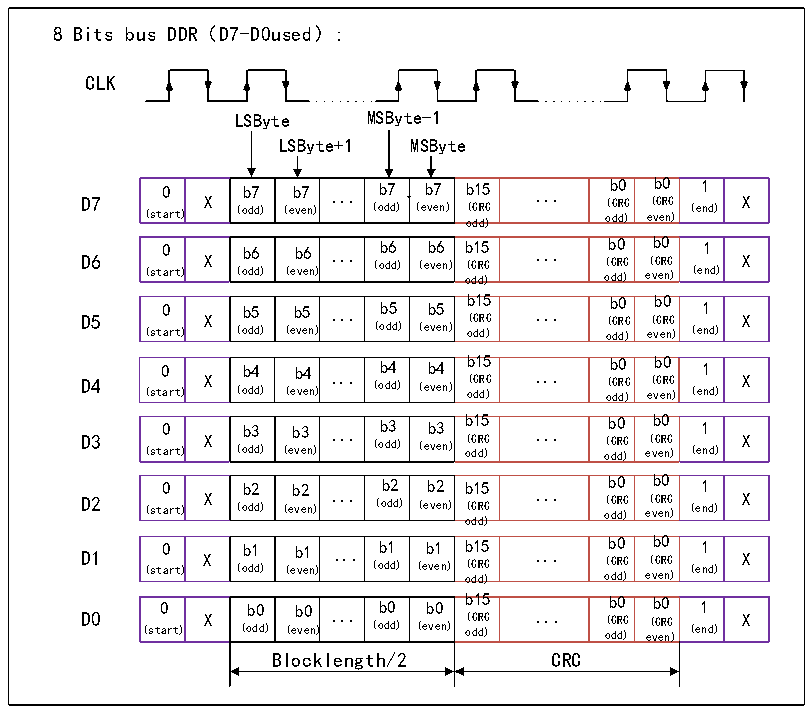

<!-- source-page: 623 -->

[← p.622](0622.md) · [index](../README.md) · [PDF p.623](https://ch32-riscv-ug.github.io/CH32H417/datasheet_zh/CH32H417RM.PDF#page=623) · [p.624 →](0624.md)

<!-- header: CH32H417系列应用手册 https://wch.cn -->
寄存器和DDR模式寄存器；  

图33-2 8线的DDR模式  
 <!-- rendered from the PDF; verify at https://ch32-riscv-ug.github.io/CH32H417/datasheet_zh/CH32H417RM.PDF#page=623 -->

🖼 Text parsed from the figure above

8 Bits bus DDR（D7-D0used）:  
CLK  
LSByte MSByte-1  
LSByte+1 MSByte  
0 (start)  X )  b7 (odd)  b7 (even)  ...  b7 (odd)  b7 (even)  b15 (CRC odd)  ...  b0 (CRC odd)  b0 (CRC even)  1 (end)  X  
0 (start)  X )  b6 (odd)  b6 (even)  ...  b6 (odd)  b6 (even)  b15 ) (CRC odd)  ...  b0 (CRC odd)  b0 (CRC even)  1 (end)  X  
0 (start)  X )  b5 (odd)  b5 (even)  ...  b5 (odd)  b5 (even)  b15 (CRC ) odd)  ...  b0 (CRC odd)  b0 (CRC even)  1 (end)  X  
0 (start)  X )  b4 (odd)  b4 (even)  ...  b4 (odd)  b4 (even)  b15 (CRC odd)  ...  b0 (CRC odd)  b0 (CRC even)  1 (end)  X  
0 (start)  X )  b3 (odd)  b3 (even)  ...  b3 (odd)  b3 (even)  b15 (CRC odd)  ...  b0 (CRC odd)  b0 (CRC even)  1 (end)  X  
0 (start)  X )  b2 (odd)  b2 (even)  ...  b2 (odd)  b2 (even)  b15 (CRC odd)  ...  b0 (CRC odd)  b0 (CRC even)  1 (end)  X  
0 (start)  X )  b1 (odd)  b1 (even)  ...  b1 (odd)  b1 (even)  b15 (CRC odd)  ...  b0 (CRC odd)  b0 (CRC even)  1 (end)  X  
0 (start)  X )  b0 (odd)  b0 (even)  ...  b0 (odd)  b0 (even)  b15 (CRC odd)  ...  b0 (CRC odd)  b0 (CRC even)  1 (end)  X  
Blocklength/2 CRC  

## 33.3 寄存器描述

<!-- p623-table-009 (table-33-1@1) pages 623-624 -->
<table><caption>表33-1 EMMC相关寄存器列表</caption><tr><th>名称</th><th>访问地址</th><th>描述</th><th>复位值</th></tr><tr><td>R32_EMMC_ARGUMENT</td><td>0x40024000</td><td>命令参数寄存器</td><td>0x00000000</td></tr><tr><td>R16_EMMC_CMD_SET</td><td>0x40024004</td><td>命令设置寄存器</td><td>0x0000</td></tr><tr><td>R32_EMMC_RESPONSE0</td><td>0x40024008</td><td>应答参数寄存器0</td><td>0x00000000</td></tr><tr><td>R32_EMMC_RESPONSE1</td><td>0x4002400C</td><td>应答参数寄存器1</td><td>0x00000000</td></tr><tr><td>R32_EMMC_RESPONSE2</td><td>0x40024010</td><td>应答参数寄存器2</td><td>0x00000000</td></tr><tr><td>R32_EMMC_RESPONSE3</td><td>0x40024014</td><td>应答参数寄存器3</td><td>0x00000000</td></tr><tr><td>R32_EMMC_WRITE_CONT</td><td>0x40024014</td><td>继续写启动寄存器</td><td>0x00000000</td></tr><tr><td>R16_EMMC_CONTROL</td><td>0x40024018</td><td>控制寄存器</td><td>0x0015</td></tr><tr><td>R8_EMMC_TIMEOUT</td><td>0x4002401C</td><td>超时计数寄存器</td><td>0x0C</td></tr><tr><td>R32_EMMC_STATUS</td><td>0x40024020</td><td>状态寄存器</td><td>0x00000000</td></tr><tr><td>R16_EMMC_INT_FG</td><td>0x40024024</td><td>中断标志寄存器</td><td>0x0000</td></tr><tr><td>R16_EMMC_INT_EN</td><td>0x40024028</td><td>中断使能寄存器</td><td>0x0000</td></tr><tr><td>R32_EMMC_DMA_BEG1</td><td>0x4002402C</td><td>DMA起始地址1寄存器</td><td>0x0000XXXX</td></tr><tr><td>R32_EMMC_BLOCK_CFG</td><td>0x40024030</td><td>传输块配置寄存器</td><td>0x00000000</td></tr><tr><td>R32_EMMC_TRAN_MODE</td><td>0x40024034</td><td>传输模式寄存器</td><td>0x00001040</td></tr><tr><td>R16_EMMC_CLK_DIV</td><td>0x40024038</td><td>时钟配置寄存器</td><td>0x0213</td></tr><tr><td>R32_EMMC_DMA_BEG2</td><td>0x4002403C</td><td>DMA起始地址2寄存器</td><td>0x00000000</td></tr><tr><td>R32_EMMC_TUNE_DATO</td><td>0x40024040</td><td>数据输出延迟寄存器</td><td>0x00000000</td></tr><tr><td>R32_EMMC_TUNE_DATI</td><td>0x40024044</td><td>数据输入延迟寄存器</td><td>0x00000000</td></tr><tr><td>R32_EMMC_TUNE_CLK_CMD</td><td>0x40024048</td><td>时钟和命令延迟寄存器</td><td>0x00000000</td></tr></table>

<!-- image: p623-draw-image-00001 bbox=[504.72, 786.24, 525.24, 796.68] -->
<!-- footer: V1.7 619 -->
