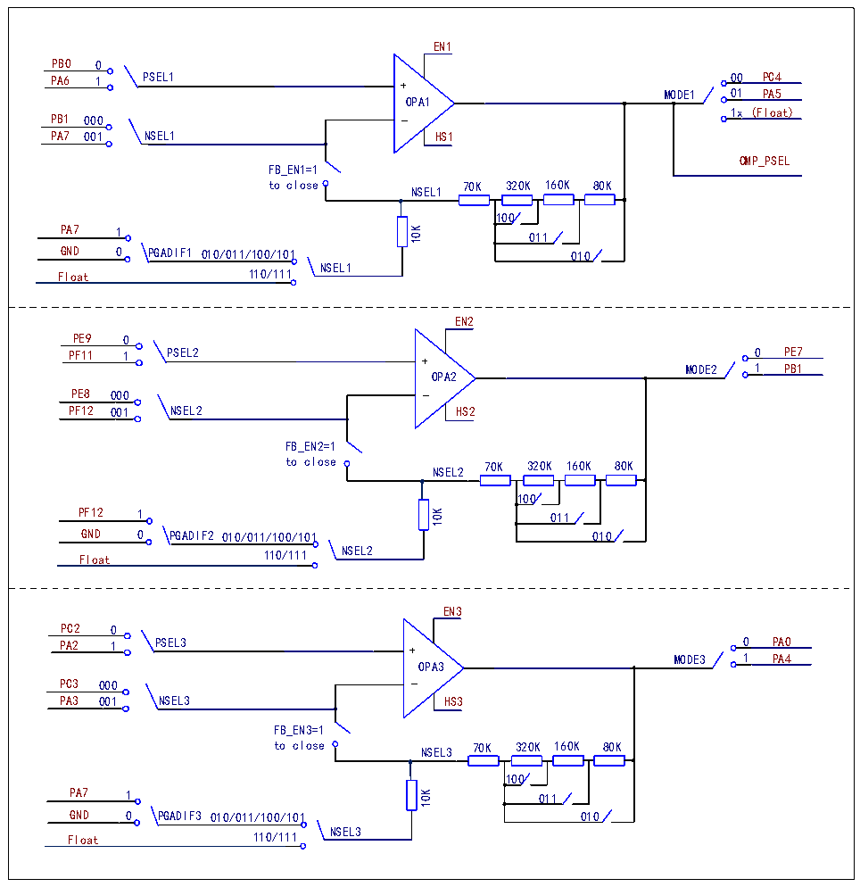

<!-- source-page: 643 -->

[← p.642](0642.md) · [index](../README.md) · [PDF p.643](https://ch32-riscv-ug.github.io/CH32H417/datasheet_zh/CH32H417RM.PDF#page=643) · [p.644 →](0644.md)

<!-- header: CH32H417系列应用手册 https://wch.cn -->

图35-1 OPA1/OPA2/OPA3的结构图  
 <!-- rendered from the PDF; verify at https://ch32-riscv-ug.github.io/CH32H417/datasheet_zh/CH32H417RM.PDF#page=643 -->

🖼 Text parsed from the figure above

EN1 PB0 0 PA6 1 PSEL1 + 00 MODE1 01OPA1 PB1 000 _ 1x (Float) PA7 001 NSEL1FB_EN1=1 to close NSEL1 PA7 1 0 PGADIF1K01PC4PA5HS1CMP_PSEL 70K 320K 160K 80K100011 GND 010/011/100/101 010 Float 110/111 NSEL1  EN2 PE9 0 PF11 1 PSEL2 + 0 MODE2 1OPA2 PE8 000 _ PF12 001 NSEL2FB_EN2=1 to close NSEL2 PF12 1 0 PGADIF2K01PE7PB1HS2 70K 320K 160K 80K100011 GND 010/011/100/101 010 Float 110/111 NSEL2  EN3 PC2 0 PA2 1 PSEL3 + 0 MODE3 1OPA3 PC3 000 _ PA3 001 NSEL3FB_EN3=1 to close NSEL3 PA7 1 0 PGADIF3K01PA0PA4HS3 70K 320K 160K 80K100011 GND 010/011/100/101 010 Float 110/111 NSEL3  
10K  
10K  
10K  

### 35.2.2 比较器（CMP）

CMP支持可选迟滞特性，支持输出端数字滤波功能，且输出滤波可选，结构图如图35-2所示。  
在R32_CMP_CTLR寄存器中：配置EN位，可使能CMP模块；配置PSEL[1:0]位，可选择P端通道  
由GPIO输入或者在芯片内部与OPA运放连接；配置NSEL[1:0]位，可选择N端通道由GPIO输入或者  
在芯片内部与 DAC 输出连接或者可选的内部自偏置电压；配置 HYPSEL 位，可选择比较器迟滞电压；  
配置VREF位，可选择CMP内部偏置电压大小；配置FILT_EN位，使能CMP输出数字滤波功能；配置  
FILT_CFG[8:0]位，可选择 CMP 输出数字滤波采样间隔，采样间隔设置要大于噪声宽度，小于两倍噪  
声宽度；配置FILT_BASE[2:0]位，可配置CMP输出数字滤波采样的时间基准；配置MODE[3:0]位，可  
选择CMP2输出内部连接至IO或输出连接到定时器刹车输入端/定时器内部采样通道。  
在R32_CMP_STATR寄存器中：通过OUT_FILT位，可读取CMP滤波功能关闭/开启的输出结果。  
<!-- image: p643-draw-image-00001 bbox=[504.72, 786.24, 525.24, 796.68] -->
<!-- footer: V1.7 639 -->
