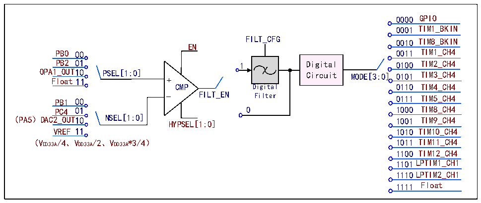

<!-- source-page: 644 -->

[← p.643](0643.md) · [index](../README.md) · [PDF p.644](https://ch32-riscv-ug.github.io/CH32H417/datasheet_zh/CH32H417RM.PDF#page=644) · [p.645 →](0645.md)

<!-- header: CH32H417系列应用手册 https://wch.cn -->

图35-2 CMP结构图  
 <!-- rendered from the PDF; verify at https://ch32-riscv-ug.github.io/CH32H417/datasheet_zh/CH32H417RM.PDF#page=644 -->

🖼 Text parsed from the figure above

0000 GPIO  
0001 TIM1_BKIN  
FILT_CFG 0010 TIM8_BKIN  
EN  
PB0 00 0011 TIM1_CH4  
PB2 01 1 Digital 0100 TIM2_CH4  
OPA1_OUT10 PSEL[1:0] Circuit MODE[3:0] 0101 TIM3_CH4  
Float11 +  
CMP Digital 0110 TIM4_CH4  
PB1 00 _ FILT_EN Filter 0111 TIM5_CH4  
PC4 01 0 1000 TIM8_CH4  
（PA5）DAC2_OUT10 NSEL[1:0] HYPSEL[1:0] 1001 TIM9_CH4  
VREF 11 1010 TIM10_CH4  
（VDD33A/4、VDD33A/2、VDD33A*3/4） 1011 TIM11_CH4  
1100 TIM12_CH4  
1101LPTIM1_CH1  
1110LPTIM2_CH1  
1111 Float  

## 35.3 寄存器描述

<!-- p644-table-001 (table-35-4@1) -->
<table><caption>表35-4 OPA相关寄存器列表</caption><tr><th>名称</th><th>访问地址</th><th>描述</th><th>复位值</th></tr><tr><td>R32_OPA_CTLR1</td><td>0x40017800</td><td>OPA控制寄存器1</td><td>0x00000076</td></tr><tr><td>R32_OPA_CTLR2</td><td>0x40017804</td><td>OPA控制寄存器2</td><td>0x00000070</td></tr><tr><td>R32_OPA_CTLR3</td><td>0x40017808</td><td>OPA控制寄存器3</td><td>0x00000070</td></tr><tr><td>R32_CMP_CTLR</td><td>0x4001780C</td><td>CMP控制寄存器</td><td>0x000000FF</td></tr><tr><td>R32_CMP_STATR</td><td>0x40017810</td><td>CMP状态寄存器</td><td>0x00000000</td></tr></table>

### 35.3.1 OPA控制寄存器 1（R32_OPA_CTLR1）

偏移地址：0x00  

<!-- p644-line-00031-bitfield (p644-line-00031-bitfield) -->
<table class="bitfield"><colgroup><col style="width:6.2500%"><col style="width:6.2500%"><col style="width:6.2500%"><col style="width:6.2500%"><col style="width:6.2500%"><col style="width:6.2500%"><col style="width:6.2500%"><col style="width:6.2500%"><col style="width:6.2500%"><col style="width:6.2500%"><col style="width:6.2500%"><col style="width:6.2500%"><col style="width:6.2500%"><col style="width:6.2500%"><col style="width:6.2500%"><col style="width:6.2500%"></colgroup><tr><th>31</th><th>30</th><th>29</th><th>28</th><th>27</th><th>26</th><th>25</th><th>24</th><th>23</th><th>22</th><th>21</th><th>20</th><th>19</th><th>18</th><th>17</th><th>16</th></tr><tr><td colspan="16">Reserved</td></tr></table>

<!-- p644-table-002 (table-35-4@1) -->
<table class="bitfield"><colgroup><col style="width:6.2500%"><col style="width:6.2500%"><col style="width:6.2500%"><col style="width:6.2500%"><col style="width:6.2500%"><col style="width:6.2500%"><col style="width:6.2500%"><col style="width:6.2500%"><col style="width:6.2500%"><col style="width:6.2500%"><col style="width:6.2500%"><col style="width:6.2500%"><col style="width:6.2500%"><col style="width:6.2500%"><col style="width:6.2500%"><col style="width:6.2500%"></colgroup><tr><th>15</th><th>14</th><th>13</th><th>12</th><th>11</th><th>10</th><th>9</th><th>8</th><th>7</th><th>6</th><th>5</th><th>4</th><th>3</th><th>2</th><th>1</th><th>0</th></tr><tr><td colspan="5">Reserved</td><td>HS1</td><td>PGADIF1</td><td>FB_EN1</td><td>Reserved</td><td colspan="3">NSEL1[2:0]</td><td>PSEL1</td><td colspan="2">MODE1[1:0]</td><td>EN1</td></tr></table>

<!-- p644-table-003 (table-35-4@1) pages 644-645 -->
<table><tr><th>位</th><th>名称</th><th>访问</th><th>描述</th><th>复位值</th></tr><tr><td>[31:11]</td><td>Reserved</td><td>RO</td><td>保留。</td><td>0</td></tr><tr><td>10</td><td>HS1</td><td>RW</td><td style="text-align:left">OPA1高速模式使能： 1：使能； 0：禁止。</td><td>0</td></tr><tr><td>9</td><td>PGADIF1</td><td>RW</td><td style="text-align:left">OPA1配合NSEL1作为PGA使用，且N端连接OPA1_CHN1 （PA7）： 1：开启差分输入PGA模式； 0：关闭差分输入PGA模式。</td><td>0</td></tr><tr><td>8</td><td>FB_EN1</td><td>RW</td><td style="text-align:left">OPA1的PGA模式反馈使能： 1：使能； 0：禁止。</td><td>0</td></tr><tr><td>7</td><td>Reserved</td><td>RO</td><td>保留。</td><td>0</td></tr><tr><td>[6:4]</td><td>NSEL1[2:0]</td><td>RW</td><td style="text-align:left">OPA1负端通道选择与PGA增益选择： 000：OPA1_CHN0（PB1）； 001：OPA1_CHN1（PA7）； 010：PGA模式，无负端输入通道，内部增益为8； 011：PGA模式，无负端输入通道，内部增益为16； 100：PGA模式，无负端输入通道，内部增益为32； 101：PGA模式，无负端输入通道，内部增益为64； 其他：关断。</td><td>111b</td></tr><tr><td>3</td><td>PSEL1</td><td>RW</td><td style="text-align:left">OPA1正端通道选择： 1：OPA1_CHP1（PA6）； 0：OPA1_CHP0（PB0）。</td><td>0</td></tr><tr><td>[2:1]</td><td>MODE1[1:0]</td><td>RW</td><td style="text-align:left">OPA1输出通道选择： 00：输出信号通过PC4输出； 01：输出信号通过PA5输出； 1X：输出信号不连接至 IO，但仍连接至比较器正输入端。</td><td>11b</td></tr><tr><td>0</td><td>EN1</td><td>RW</td><td style="text-align:left">OPA1使能： 1：使能； 0：禁止。</td><td>0</td></tr></table>

<!-- image: p644-draw-image-00001 bbox=[504.72, 786.24, 525.24, 796.68] -->
<!-- footer: V1.7 640 -->
