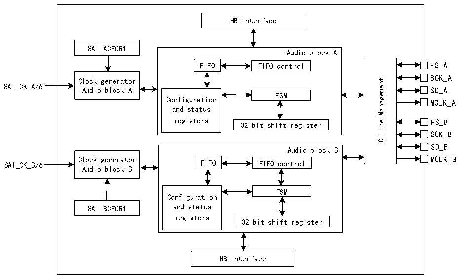

<!-- source-page: 650 -->

[← p.649](0649.md) · [index](../README.md) · [PDF p.650](https://ch32-riscv-ug.github.io/CH32H417/datasheet_zh/CH32H417RM.PDF#page=650) · [p.651 →](0651.md)

<!-- header: CH32H417系列应用手册 https://wch.cn -->

## 36.2 概述

图36-1 SAI的结构框图  
 <!-- rendered from the PDF; verify at https://ch32-riscv-ug.github.io/CH32H417/datasheet_zh/CH32H417RM.PDF#page=650 -->

🖼 Text parsed from the figure above

HB Interface  
SAI_ACFGR1  
Audio block A  
FIFO FIFO control FS_A  
SCK_A  
Management  
Clock generator  
SAI_CK_A/6  
SD_A  
Audio block A  
FSM  
Configuration  
MCLK_A  
and status  
registers 32-bit shift register  
FS_B  
Line  
SCK_B  
IO  
SD_B  
Audio block B  
Clock generator MCLK_B  
FIFO FIFO control  
SAI_CK_B/6  
Audio block B  
FSM  
Configuration  
SAI_BCFGR1 and status  
registers  
32-bit shift register  
HB Interface  

SAI主要由两个独立的音频子模块组成，并通过一个IO管理模块连接到输出，I/O线控制器管理SAI  
中指定音频模块的4个专用引脚（SD、SCK、FS、MCLK）。如果将两个子模块声明为同步模块，则可以  
共用其中某些引脚，从而留出一些引脚用作通用I/O。MCLK引脚是否可用作输出引脚取决于实际应用  
和解码要求以及音频模块是否配置为主模式。  
每个音频模块集成一个32位移位寄存器，该寄存器由模块自身的功能状态机控制。数据存储和读  
取都是通过专用的FIFO来完成。FIFO可通过CPU访问，也可通过DMA访问以减轻CPU的通信负担。  
音频子模块在主模式或从模式下均可用作发送器或接收器。主模式意味着从SAI生成SCK位时钟和  
帧同步信号，而从模式则意味着SCK位时钟和帧同步信号来自另一外部或内部主器件。在特殊情况下，  
FS信号方向与主模式或从模式定义不直接相关。在AC’97协议中，即使SAI（链接控制器）设置为消  
耗SCK时钟，FS信号也会是SAI输出（从模式下也是如此）。  

## 36.3 功能描述

### 36.3.1 时钟发生器

SAI的两个独立的音频子模块都有自己的时钟发生器，但这两个时钟发生器在功能上没有任何差  
异。  
当音频模块被配置为主模式时，时钟发生器将负责提供位时钟（SCK）以及用于外部解码器的主  
时钟（MCLK）。将音频模块定义为从模式时，时钟发生器将关闭。  
SCK 上的位时钟选通边沿可通过 R32_SAI_xCFGR1 寄存器 CKSTR 位配置。该位对主模式和从模式  
均适用。  
建议选择PLL输出295MHz作为SAI的输入时钟。  
音频模块时钟发生器的架构如图36-2所示。  
<!-- image: p650-draw-image-00001 bbox=[504.72, 786.24, 525.24, 796.68] -->
<!-- footer: V1.7 646 -->
