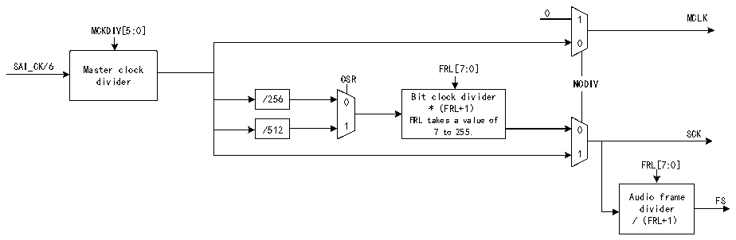

<!-- source-page: 651 -->

[← p.650](0650.md) · [index](../README.md) · [PDF p.651](https://ch32-riscv-ug.github.io/CH32H417/datasheet_zh/CH32H417RM.PDF#page=651) · [p.652 →](0652.md)

<!-- header: CH32H417系列应用手册 https://wch.cn -->

图36-2 音频模块时钟发生器的架构  
 <!-- rendered from the PDF; verify at https://ch32-riscv-ug.github.io/CH32H417/datasheet_zh/CH32H417RM.PDF#page=651 -->

🖼 Text parsed from the figure above

0 1 MCLK  
MCKDIV[5:0]  
0  
SAI_CK/6 Master clock FRL[7:0]  
divider OSR NODIV  
/256 0 Bit clock divider  
*（FRL+1）  
FRL takes a value of  
/512 1 7 to 255. 0 SCK  
1  
FRL[7:0]  
Audio frame FS  
divider  
/（FRL+1）  

注：当NODIV置1时，如果MCLK引脚配置为GPIO外设中的SAI引脚，则其信号电平将置0。  
时钟发生器的时钟源来自乘积时钟控制器。SAI_CK_x时钟等效于主时钟，可通过MCKDIV[5:0]位  
为外部解码器分频：  
如果MCKDIV[5:0]不等于0000b，则MCLK_x = SAI_CK_x/（MCKDIV[5:0] * 2）  
如果MCKDIV[5:0]等于0000b，则MCLK_x = SAI_CK_x  
MCLK信号仅在TDM中使用。  
分频必须均匀，使 MCLK 输出上和 SCK 时钟上都保持 50%的占空比。如果 MCKDIV[5:0]位设置为  
0000b，采用一分频可使MCLK等于SAI_CK_x。  
在SAI中，使用单一比率MCLK/FS = 256。大多数情况下，将遇到三个频率范围，如表36-1所  
示。  

<!-- p651-table-001 (table-36-1@1) -->
<table><caption>表36-1 可能的音频采样范围示例</caption><tr><th>输入SAI_CK_x时钟频率</th><th>可获得的常见音频采样频率</th><th>MCKDIV[5:0]</th></tr><tr><td rowspan="5">192kHz * 256</td><td>192kHz</td><td>000000</td></tr><tr><td>96kHz</td><td>000001</td></tr><tr><td>48kHz</td><td>000010</td></tr><tr><td>16kHz</td><td>000110</td></tr><tr><td>8kHz</td><td>001100</td></tr><tr><td rowspan="3">44.1kHz * 256</td><td>44.1kHz</td><td>000000</td></tr><tr><td>22.05kHz</td><td>000001</td></tr><tr><td>11.025kHz</td><td>000010</td></tr><tr><td>SAI_CK_x = MCLK</td><td>MCLK</td><td>000000</td></tr></table>

注：当乘积时钟控制器选择一个外部时钟源而非PLL时钟时，会出现这种情况。  
如果相应音频模块作为主模块且 R32_SAI_xCFGR1 寄存器 NODIV 位设置为 0，就可通过 I/O 口为  
外部解码器生成主时钟。将音频模块定义为从模式时，时钟发生器将关闭。NODIV、MCKDIV位的值将  
被忽略。此外，MCLK I/O引脚也会被释放，可作为通用I/O使用。  
位时钟通过主时钟导出。位时钟分频器按照以下公式设置位时钟（SCK）和主时钟（SCK）间的分  
频系数：  
SCK = MCLK*（FRL[7:0]+1）/256  
其中：  
256是MCLK和音频采样频率之间的固定比率；  
FRL[7:0]是音频帧中的位时钟周期 - 1，在R32_SAI_xFRCR寄存器中配置。  
主模式下，（FRL[7:0]+1）必须等于 2 的几次幂，以通过位时钟周期获得偶数个 MCLK 脉冲。位  
时钟（SCK）上将保证50%的占空比。  
SAI_CK_x 时钟还可等于位时钟频率。在这种情况下，R32_SAI_xCFGR1 寄存器中的 NODIV 位应置  
<!-- image: p651-draw-image-00001 bbox=[504.72, 786.24, 525.24, 796.68] -->
<!-- footer: V1.7 647 -->
