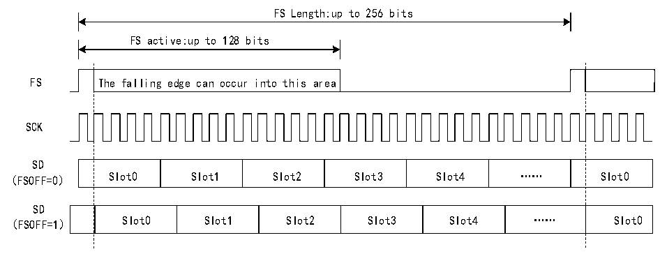

<!-- source-page: 653 -->

[← p.652](0652.md) · [index](../README.md) · [PDF p.653](https://ch32-riscv-ug.github.io/CH32H417/datasheet_zh/CH32H417RM.PDF#page=653) · [p.654 →](0654.md)

<!-- header: CH32H417系列应用手册 https://wch.cn -->
形完全可配置，可在帧同步时，支持各种具有特殊规格的音频协议。下图展示了音频帧的可配置性。  

图36-3 音频帧  
 <!-- rendered from the PDF; verify at https://ch32-riscv-ug.github.io/CH32H417/datasheet_zh/CH32H417RM.PDF#page=653 -->

🖼 Text parsed from the figure above

FS Length:up to 256 bits  
FS active:up to 128 bits  
FS The falling edge can occur into this area  
SCK  
SD  
Slot0  Slot1  Slot2  Slot3  Slot4  ……  Slot0  
SD  
Slot0  Slot1  Slot2  Slot3  Slot4  ……  Slot0  
（FSOFF=1）  

在 AC’97 模式或 SPDIF 模式下（R32_SAI_xCFGR1 寄存器 PRTCFG[1:0]位为 10b 或 01b），帧同  
步信号的波形被强制配置为支持AC’97协议。R32_SAI_xFRCR寄存器值被忽略。  
每个音频模块相互独立，因此均需要特定的配置。  

#### 36.3.4.2 帧长度

主模式  
将R32_SAI_xFRCR寄存器FRL[7:0]字段置1，可将音频帧的长度配置为最长256个位时钟周期。  
如果帧长度大于为该帧声明的Slot数，则要发送的剩余位将用0填充，或者SD线将释放为高组  
态，具体取决于R32_SAI_xCFGR2寄存器TRIS位的状态。在接收模式下，剩余位被忽略。  
如果将NODIV位清零，（FRL+1）必须等于2的几次幂（从8到256）以确保音频帧的每个位时钟  
周期都包含整数个 MCLK 脉冲。如果将 NODIV 位置 1，则（FRL+1）字段可采用从 8 到 256 的任意值。  
从模式  
音频帧的长度主要用于指定由外部主模块向从模块发送的每个音频帧的位时钟周期数。它主要用  
于从主模块中检测音频帧传输期间出现的提前或滞后帧同步信号。这种情况下会出现错误。  
在从模式下，R32_SAI_xFRCR寄存器FRL[7:0]位的配置不受任何限制。  

#### 36.3.4.3 帧同步极性

通过 R32_SAI_xFRCR 寄存器 FSPOL 位设置 FS 引脚的有效极性，通过该极性来启动帧。SOF 信号  
对边沿敏感。  
在从模式下，音频模块属于等待状态，直至接收到一个有效的帧信号来执行发送或接收操作，SOF  
信号与该帧信号同步。仅当在通信过程中未检测到SOF信号并且SOF信号与预期SOF信号一致时，帧  
同步极性才有效。  
在主模式下，每次音频帧完成时，都会发送帧同步信号，直至 R32_SAI_xCTLR1 寄存器 SAIEN 位  
被清零。如果前一个音频帧结束时 FIFO 中没有数据，则将按照 36.3.12.1 小节所述处理下溢情况，  
但音频通信流不会因此中断。  

#### 36.3.4.4 帧同步有效电平长度

R32_SAI_xFRCR寄存器FSALL[6:0]位用于配置帧同步信号的有效电平的长度。该长度可设置为1  
到128个位时钟周期。  
在I2S、LSB或MSB对齐模式下，有效长度设置为帧长的一半；而在PCM/DSP或TDM模式下，有  
效长度设置为1位。  
<!-- image: p653-draw-image-00001 bbox=[504.72, 786.24, 525.24, 796.68] -->
<!-- footer: V1.7 649 -->
