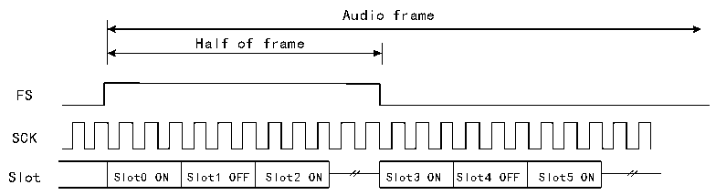

<!-- source-page: 654 -->

[← p.653](0653.md) · [index](../README.md) · [PDF p.654](https://ch32-riscv-ug.github.io/CH32H417/datasheet_zh/CH32H417RM.PDF#page=654) · [p.655 →](0655.md)

<!-- header: CH32H417系列应用手册 https://wch.cn -->

#### 36.3.4.5 帧同步偏移

根据应用中所支持的音频协议（例如I2S标准协议和MSB对齐协议），设置音频帧同步偏移，可  
在发送的最后一位或第一位时，将帧同步信号置为有效。可通过R32_SAI_xFRCR寄存器FSOFF位选择  
两个配置之一。  

#### 36.3.4.6 FS信号的作用

FS 信号的含义因 FS 的功能的不同而异，在 R32_SAI_xFRCR 寄存器 FSDEF 位可配置 FS 信号的含  
义：  
- 当FSDEF位为1时，FS信号同时承载帧内的SOF信号和通道识别信号，适用于I2S、MSB或LSB
对齐协议等音频帧结构；  
- 当FSDEF位为0时，FS信号表现为SOF信号，适用于PCM/DSP、TDM、AC’97以及音频协议。
在将FS信号解释为帧内的SOF信号和通道识别信号时，声明的Slot数量应平均分配给左通道和  
右通道。若半个音频帧上的位时钟周期数大于某个通道的专用 Slot 数，且 TRIS 位设置为 0，则  
R32_SAI_xCFGR2寄存器中剩余的位时钟周期将输出0。反之，若TRIS位设置为1，则SD线将进入高  
阻态。在接收时，只有在通道发生变化时，才会考虑剩余的位时钟周期。  

图36-4 FS的作用是SOF信号+通道识别信号  
 <!-- rendered from the PDF; verify at https://ch32-riscv-ug.github.io/CH32H417/datasheet_zh/CH32H417RM.PDF#page=654 -->

Number of slots not aligned with the audio frame  

🖼 Text parsed from the figure above

Audio frame  
Half of frame  
FS  
SCK  
Slot0 ON  Slot1 OFF  Slot2 ON  
Slot3 ON  Slot4 OFF  Slot5 ON  

Number of slots aligned with the audio frame  
Audio frame  
Half of frame  
FS  
SCK  

<!-- p654-table-003 (table-36-1@1) -->
<table><tr><th>Slot0</th><th>Slot1</th><th>Slot2</th><th>Slot3</th><th>Slot4</th><th>Slot5</th></tr></table>

Slot  
注：帧长度应为偶数。  
如果 R32_SAI_xFRCR 寄存器 FSDEF 位保持清零状态，则 FS 信号等效于 SOF 信号，如果  
R32_SAI_xSLOTR寄存器NBSLOT[3:0]位定义的Slot数乘以R32_SAI_xSLOTR寄存器SLOTSZ[1:0]位配  
置的Slot位数所得的结果小于帧大小（R32_SAI_xFRCR寄存器FRL[7:0]位），则：  
如果R32_SAI_xCFGR2寄存器TRIS位设置为0，则最后一个Slot后的剩余位将强制为0，直至发  
送器的帧结束。  
如果 R32_SAI_xCFGR2 寄存器 TRIS 位设置为 1，则传输这些剩余位时，数据线将释放为高阻态。  
在接收模式下，这些位被丢弃。  
<!-- image: p654-draw-image-00001 bbox=[504.72, 786.24, 525.24, 796.68] -->
<!-- footer: V1.7 650 -->
