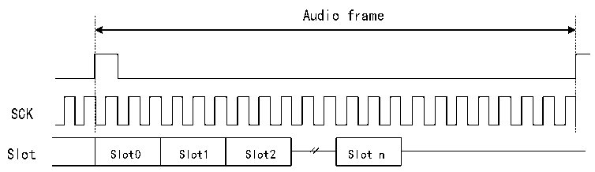
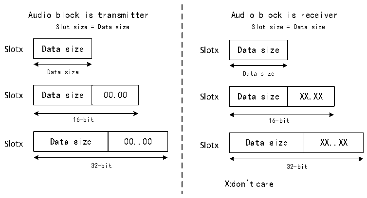

<!-- source-page: 655 -->

[← p.654](0654.md) · [index](../README.md) · [PDF p.655](https://ch32-riscv-ug.github.io/CH32H417/datasheet_zh/CH32H417RM.PDF#page=655) · [p.656 →](0656.md)

<!-- header: CH32H417系列应用手册 https://wch.cn -->

图36-5 FS的作用是SOF信号  
 <!-- rendered from the PDF; verify at https://ch32-riscv-ug.github.io/CH32H417/datasheet_zh/CH32H417RM.PDF#page=655 -->

🖼 Text parsed from the figure above

Audio frame  
SCK  
Slot0  Slot1  Slot2  

Data =0 after slot n if TRIS = 0  
SD output released （HI-Z）after slot n if TRIS =1  
在发送模式下，音频模块被配置为捕获SD线上的SPDIF输出时，将不涉及FS信号的使用。相应  
的FS I/O将被释放，以便于其他用途。  

### 36.3.5 Slot 配置

音频帧的基本单元为 Slot，每个音频帧最多可分为 16 个 Slot。音频帧中的 Slot 的数量由  
NBSLOT[3:0]+1来确定。  
对于AC’97协议或SPDIF协议（当PRTCFG[1:0]位设置为10b或01b时），Slot的数量将自动  
遵循相应的协议规范进行配置，此时NBSLOT[3:0]的值将被忽略。  
通过设置R32_SAI_xSLOTR寄存器SLOTEN[15:0]位，可以将各个Slot设置为有效或无效状态。  
当传输一个无效 Slot 时，SD 数据线将被强制置为 0 或置于高阻态，具体取决于在发送模式下  
TRIS位的配置（详见无效Slot输出数据线管理部分）。在接收模式下，从该无效Slot结束后接收的  
数据将被忽略。因此不会有FIFO访问，也不会有与该无效Slot状态相关的FIFO读/写请求。  
此外，Slot的大小可以通过将R32_SAI_xSLOTR寄存器SLOTSZ[1:0]位置1来选择，如图36-6所  
示。  

图36-6 FBOFF位为0时的Slot大小配置  
 <!-- rendered from the PDF; verify at https://ch32-riscv-ug.github.io/CH32H417/datasheet_zh/CH32H417RM.PDF#page=655 -->

🖼 Text parsed from the figure above

Audio block is transmitter Audio block is receiver  
Slot size = Data size Slot size = Data size  
Slotx Data size Slotx Data size  
Data size Data size  
Data size  00.00  
Data size  XX.XX  
Slotx Data size 00.00 Slotx Data size XX.XX  
16-bit 16-bit  
Data size  0.0  
Data size  X.X  
Slotx Data size 00..00 Slotx Data size XX..XX  
32-bit 32-bit  
X:don’t care  

通过 R32_SAI_xSLOTR 寄存器 FBOFF[4:0]位可配置 Slot 内要传输的第一个数据位的位置，即第  
一个位的偏移值。如图36-7所示，在发送模式下，将从Slot起始位置注入0值，直至达到预设的偏  
移位置；而在接收模式下，位于偏移阶段中的位将被忽略。该特性适用于LSB对齐协议（如果偏移等  
于Slot大小减去数据大小）。  
<!-- image: p655-draw-image-00001 bbox=[504.72, 786.24, 525.24, 796.68] -->
<!-- footer: V1.7 651 -->
