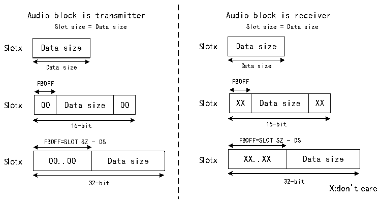

<!-- source-page: 656 -->

[← p.655](0655.md) · [index](../README.md) · [PDF p.656](https://ch32-riscv-ug.github.io/CH32H417/datasheet_zh/CH32H417RM.PDF#page=656) · [p.657 →](0657.md)

<!-- header: CH32H417系列应用手册 https://wch.cn -->

图36-7 第一位偏移  
 <!-- rendered from the PDF; verify at https://ch32-riscv-ug.github.io/CH32H417/datasheet_zh/CH32H417RM.PDF#page=656 -->

🖼 Text parsed from the figure above

Audio block is transmitter Audio block is receiver  
Slot size = Data size Slot size = Data size  
Slotx Data size Slotx Data size  
Data size Data size  
FBOFF FBOFF  
00  Data size  00  
XX  Data size  XX  
Slotx 00 Data size 00 Slotx XX Data size XX  
16-bit 16-bit  
FBOFF=SLOT SZ - DS FBOFF=SLOT SZ - DS  
0.0  Data size  
X.X  Data size  
Slotx 00..00 Data size Slotx XX..XX Data size  
32-bit 32-bit  
X:don’t care  

要避免出现故障SAI行为，必须遵循以下条件：  
FBOFF ≤ （SLOTSZ - DS），  
DS ≤ SLOTSZ，  
NBSLOT x SLOTSZ ≤ FRL（帧长度），  
在R32_SAI_xFRCR寄存器FSDEF位置1时，Slot数必须为偶数。  
在AC’97和SPDIF协议（PRTCFG[1:0]位设置为10b或01b）中，Slot大小按照第36.3.7节：  
AC’97链路控制器中的定义自动设置。  

### 36.3.6 内部 FIFO

在每个SAI音频子模块中都有一个独立的8字宽的同步FIFO，以提高传输效率。这些FIFO可以  
被CPU或是DMA访问，FIFO请求中断机制用于请求CPU和DMA访问。  
根据音频模块被定义为发送器还是接收器，相应地执行对FIFO的读取或写入。无论访问大小为  
何，每次对FIFO进行读写时，均针对1个字的FIFO单元进行操作。每个FIFO字包含一个音频Slot。每  
次访问R32_SAI_xDATAR寄存器后，FIFO指针递增一个字。因此只存在一个FIFO请求与R32_SAI_xSR寄  
存器FREQ位（FIFO请求标志）相关联。  
当 R32_SAI_xINTENR 寄存器 FREQIE 位使能，将产生中断。该中断的触发条件取决于操作模式、  
FIFO阈值、FIFO状态和DMA突发传输大小。  
具体触发中断的机制将在表 36-2 和后续段落“在发送模式下产生中断”和“在接收模式下产生  
中断”中详细阐述。  

<!-- p656-table-005 (table-36-2@1) -->
<table><caption>表36-2 FIFO请求中断的产生条件</caption><tr><th colspan="4">发送：MODE[1:0]=x0</th><th colspan="4">接收：MODE[0]=x1</th></tr><tr><td>FIFO阈值</td><td>FTH[2:0]</td><td>FIFO状态</td><td>FLTH[2:0]</td><td>FIFO阈值</td><td>FTH[2:0]</td><td>FIFO状态</td><td>FLTH[2:0]</td></tr><tr><td>空</td><td>=000</td><td>空</td><td>=000</td><td>空</td><td>=000</td><td>非空</td><td>≥001</td></tr><tr><td>1/4满</td><td>=001</td><td>＜1/4满</td><td>＜010</td><td>1/4满</td><td>=001</td><td>≥1/4满</td><td>≥010</td></tr><tr><td>1/2满</td><td>=010</td><td>＜1/2满</td><td>＜011</td><td>1/2满</td><td>=010</td><td>≥1/2满</td><td>≥011</td></tr><tr><td>3/4满</td><td>=011</td><td>＜3/4满</td><td>＜100</td><td>3/4满</td><td>=011</td><td>≥3/4满</td><td>≥100</td></tr><tr><td>全满</td><td>=100</td><td>非满</td><td>＜101</td><td>全满</td><td>=100</td><td>全满</td><td>＝101</td></tr></table>

注：（1）如果根本条件不满足，则中断请求就会被硬件清除。  
（2）将R32_SAI_xCFGR2寄存器FFLUSH位置1禁止SAI后，可重新初始化FIFO指针。如果FFLUSH  
在SAI使能情况下置1，则FIFO中的数据将自动清除，读写指针复位到0。  
在发送模式下产生中断  
<!-- image: p656-draw-image-00001 bbox=[504.72, 786.24, 525.24, 796.68] -->
<!-- footer: V1.7 652 -->
