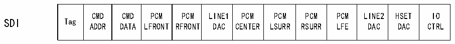
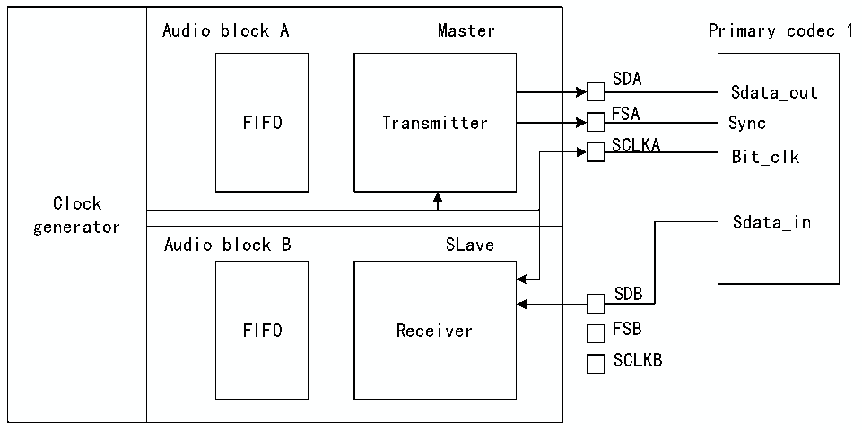

<!-- source-page: 658 -->

[← p.657](0657.md) · [index](../README.md) · [PDF p.658](https://ch32-riscv-ug.github.io/CH32H417/datasheet_zh/CH32H417RM.PDF#page=658) · [p.659 →](0659.md)

<!-- header: CH32H417系列应用手册 https://wch.cn -->

### 36.3.7 AC’97 链路控制器

SAI可用作AC’97链路控制器，该模式是通过R32_SAI_xCFGR1寄存器PRTCFG[1:0]位配置的，  
当选择了此协议，有许多配置字段会被忽略，所以Slot数和Slot大小是固定的，帧同步信号定义完  
善并且波形固定，否则将无法保证SAI运行正常。  
- NBSLOT[3:0]位和SLOTSZ[1:0]位将被忽略；
- Slot数固定为13。第一个Slot为16位宽，所有其它Slot均为20位宽（数据Slot）；
- SAI_xSLOTR寄存器FBOFF[4:0]位被忽略；
- SAI_xFRCR寄存器被忽略；
- 未使用MCLK。
无论采用主配置还是从配置，由于AC’97链路控制器驱动FS信号，异步模块发出的FS信号将  
自动配置为输出。  

图36-8 AC’97音频帧  
 <!-- rendered from the PDF; verify at https://ch32-riscv-ug.github.io/CH32H417/datasheet_zh/CH32H417RM.PDF#page=658 -->

FS  
1 2 3 4 5 6 7 8 9 10 11 12  

🖼 Text parsed from the figure above

Tag  CMDADDR  CMDDATA  PCMLFRONT  PCMRFRONT  LINE1DAC  PCMCENTER  PCMLSURR  PCMRSURR  PCMLFE  LINE2DAC  HSETDAC  IOCTRL  
SDI Tag  

<!-- p658-table-002 (table-36-2@1) -->
<table><tr><th>Tag</th><th style="text-align:left">STATUSADDR</th><th style="text-align:left">STATUSDATA</th><th style="text-align:left">PCMLEFT</th><th style="text-align:left">PCMRIGTH</th><th style="text-align:left">LINE1ADC</th><th style="text-align:left">PCMMIC</th><th style="text-align:left">RSRVD</th><th style="text-align:left">RSRVD</th><th style="text-align:left">RSRLVD</th><th style="text-align:left">LINE2ADC</th><th>HSET</th><th style="text-align:left">IOSTATUS</th></tr></table>

注：在AC’97协议中，TAG的位2将保留（始终为0），因此无论SAI FIFO中写入何值，TAG的位2  
均强制为0。有关TAG表示的详细信息，请参见AC’97协议标准。  
可将一个SAI用于AC’97点对点通信，如图36-9所示。在SAI中，必须将音频模块A声明为异  
步主发送器，而将音频模块B定义为从接收器，并在内部与音频模块A同步。  

图36-9 SAI用于AC’97点对点通信  
 <!-- rendered from the PDF; verify at https://ch32-riscv-ug.github.io/CH32H417/datasheet_zh/CH32H417RM.PDF#page=658 -->

🖼 Text parsed from the figure above

Clock generator  Audio block A Master FIFO Transmitter  Audio block B SLave FIFO Receiver  
SDA  
Sdata_out  
FSA  
SCLKA  
Bit_clk  
SDB  
SCLKB  

在接收器模式下，用作AC’97链路控制器的SAI无需FIFO请求，因此当Slot0中的编码解码器  
就绪位解码为低电平时，FIFO中不存储任何数据。如果R32_SAI_xINTENR寄存器CNRDYIE位使能，则  
R32_SAI_xSR寄存器中的标志CNRDY将置1并会产生一个中断。此标志专用于AC’97协议。  
<!-- image: p658-draw-image-00001 bbox=[504.72, 786.24, 525.24, 796.68] -->
<!-- footer: V1.7 654 -->
