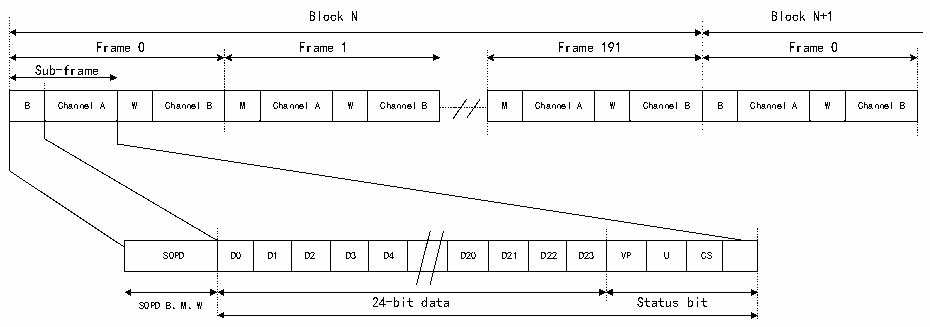

<!-- source-page: 659 -->

[← p.658](0658.md) · [index](../README.md) · [PDF p.659](https://ch32-riscv-ug.github.io/CH32H417/datasheet_zh/CH32H417RM.PDF#page=659) · [p.660 →](0660.md)

<!-- header: CH32H417系列应用手册 https://wch.cn -->
AC’97 模式下的时钟发生器编程  
在AC’97模式下，帧长度固定为256位，其频率应设置为48kHz。第36.3.1节：SAI时钟发生器中  
给出的规则应在FRL=255时使用，以生成适当的帧速率（FFS）。  

### 36.3.8 SPDIF输出

SPDIF（索尼/飞利浦数字接口）是一种用于消费音频设备的数字音频互连，用于在合理的短距  
离内输出音频。SPDIF接口仅在发送模式下可用，它支持IEC 60958标准。可通过将R32_SAI_xCFGR1  
寄存器PRTCFG[1:0]位置为01b，选择SPDIF模式。  
对于SPDIF协议：  
1）仅使能SD数据线；  
2）释放FS、SCK、MCLK I/O引脚；  
3）为使能SAI的时钟发生器并管理SD线上的数据速率，强制将MODE[1]位设置为0，以选择主  
模式；  
4）数据大小强制设置为24位。对R32_SAI_xCFGR1寄存器的DS[2:0]位中所设置的值忽略；  
5）必须配置时钟发生器以定义符号率，已知位时钟应为符号率的两倍。数据采用曼彻斯特协议  
进行编码；  
6）忽略SAI_xFRCR和SAI_xSLOTR寄存器。在内部配置SAI使其符合SPDIF协议要求，如图36-  
0所示。  

图36-10 SPDIF格式  
 <!-- rendered from the PDF; verify at https://ch32-riscv-ug.github.io/CH32H417/datasheet_zh/CH32H417RM.PDF#page=659 -->

🖼 Text parsed from the figure above

Block N Block N+1  
Frame 0 Frame 1 Frame 191 Frame 0  
Sub-frame  
B  Channel A  W  Channel B  M  Channel A  W  Channel B  
M  Channel A  W  Channel  B  Channel A  W  Channel B  
B Channel A W Channel B M Channel A W Channel B M Channel A W Channel B B Channel A W Channel B  
SOPD  D0  D1  D2  D3  D4  D20  D21  D22  D23  VP  U  CS  
SOPD B、M、W 24-bit data Status bit  

SPDIF块包含192个帧。每个帧由两个32位的子帧构成，通常一个子帧用于左通道，一个用于右  
通道。每个子帧由一个 SOPD 模式（4 位）构成，用于指定该子帧是否为块的开始（并用于识别通道  
A），或者是否标识块中某处的通道A，或者是否指代通道B（请参见表36-3）。接下来的28位是通  
道信息，由24个数据位和4个状态位组成。  

<!-- p659-table-004 (table-36-3@1) -->
<table><caption>表36-3 SOPD模式</caption><tr><th rowspan="2">SOPD</th><th colspan="2">报头编码</th><th rowspan="2">描述</th></tr><tr><td>最后一位是0</td><td>最后一位是1</td></tr><tr><td>B</td><td>11101000</td><td>00010111</td><td>通道A数据，且为一个块的起始子帧</td></tr><tr><td>W</td><td>11100100</td><td>00011011</td><td>通道B数据</td></tr><tr><td>M</td><td>11100010</td><td>00011101</td><td>通道A数据</td></tr></table>

SPDIF的数据传输在R32_SAI_xDATAR寄存器的数据填充应遵循：  
- R32_SAI_xDATAR[26:24]包含通道状态位、用户位和有效性位；
- R32_SAI_xDATAR[23:0]包含所考虑通道的24位数据。
注：（1）如果数据大小为20位，应将数据映射到R32_SAI_xDATAR[23:4]上。  
（2）如果数据大小为16位，应将数据映射到R32_SAI_xDATAR[23:8]上。  
<!-- image: p659-draw-image-00001 bbox=[504.72, 786.24, 525.24, 796.68] -->
<!-- footer: V1.7 655 -->
