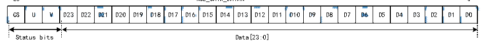

<!-- source-page: 660 -->

[← p.659](0659.md) · [index](../README.md) · [PDF p.660](https://ch32-riscv-ug.github.io/CH32H417/datasheet_zh/CH32H417RM.PDF#page=660) · [p.661 →](0661.md)

<!-- header: CH32H417系列应用手册 https://wch.cn -->

图36-11 R32_SAI_xDATAR寄存器数据示意图  
 <!-- rendered from the PDF; verify at https://ch32-riscv-ug.github.io/CH32H417/datasheet_zh/CH32H417RM.PDF#page=660 -->

26 R32_SAIx_DATAR 0  

🖼 Text parsed from the figure above

<!-- image: p660-draw-image-00054 inside the figure -->
<!-- image: p660-draw-image-00052 inside the figure -->
<!-- image: p660-draw-image-00048 inside the figure -->
<!-- image: p660-draw-image-00050 inside the figure -->
<!-- image: p660-draw-image-00042 inside the figure -->
<!-- image: p660-draw-image-00044 inside the figure -->
<!-- image: p660-draw-image-00046 inside the figure -->
<!-- image: p660-draw-image-00002 inside the figure -->
<!-- image: p660-draw-image-00004 inside the figure -->
<!-- image: p660-draw-image-00006 inside the figure -->
<!-- image: p660-draw-image-00008 inside the figure -->
<!-- image: p660-draw-image-00010 inside the figure -->
<!-- image: p660-draw-image-00012 inside the figure -->
<!-- image: p660-draw-image-00014 inside the figure -->
<!-- image: p660-draw-image-00016 inside the figure -->
<!-- image: p660-draw-image-00018 inside the figure -->
<!-- image: p660-draw-image-00020 inside the figure -->
<!-- image: p660-draw-image-00022 inside the figure -->
<!-- image: p660-draw-image-00024 inside the figure -->
<!-- image: p660-draw-image-00026 inside the figure -->
<!-- image: p660-draw-image-00028 inside the figure -->
<!-- image: p660-draw-image-00030 inside the figure -->
<!-- image: p660-draw-image-00032 inside the figure -->
<!-- image: p660-draw-image-00034 inside the figure -->
<!-- image: p660-draw-image-00036 inside the figure -->
<!-- image: p660-draw-image-00038 inside the figure -->
<!-- image: p660-draw-image-00040 inside the figure -->
CS  U  V  D23  D22  D21  D20  D19  D18  D17  D16  D15  D14  D13  D12  D11  D10  D9  D8  D7  D6  D5  D4  D3  D2  D1  DO  
<!-- image: p660-draw-image-00055 inside the figure -->
<!-- image: p660-draw-image-00053 inside the figure -->
<!-- image: p660-draw-image-00049 inside the figure -->
<!-- image: p660-draw-image-00051 inside the figure -->
<!-- image: p660-draw-image-00043 inside the figure -->
<!-- image: p660-draw-image-00045 inside the figure -->
<!-- image: p660-draw-image-00047 inside the figure -->
<!-- image: p660-draw-image-00003 inside the figure -->
<!-- image: p660-draw-image-00005 inside the figure -->
<!-- image: p660-draw-image-00007 inside the figure -->
<!-- image: p660-draw-image-00009 inside the figure -->
<!-- image: p660-draw-image-00011 inside the figure -->
<!-- image: p660-draw-image-00013 inside the figure -->
<!-- image: p660-draw-image-00015 inside the figure -->
<!-- image: p660-draw-image-00017 inside the figure -->
<!-- image: p660-draw-image-00019 inside the figure -->
<!-- image: p660-draw-image-00021 inside the figure -->
<!-- image: p660-draw-image-00023 inside the figure -->
<!-- image: p660-draw-image-00025 inside the figure -->
<!-- image: p660-draw-image-00027 inside the figure -->
<!-- image: p660-draw-image-00029 inside the figure -->
<!-- image: p660-draw-image-00031 inside the figure -->
<!-- image: p660-draw-image-00033 inside the figure -->
<!-- image: p660-draw-image-00035 inside the figure -->
<!-- image: p660-draw-image-00037 inside the figure -->
<!-- image: p660-draw-image-00039 inside the figure -->
<!-- image: p660-draw-image-00041 inside the figure -->
Status bits Data[23:0]  

注：R32_SAI_xDATAR[23]始终代表MSB。执行传输时，LSB始终优先。  
SAI 首先在块中发送每个子帧的适当报头，随后在 SD 线上发送 R32_SAI_xDATAR（以曼彻斯特协  
议进行编码）。SAI通过传输按表36-4所述计算的奇偶校验位来结束子帧。  

<!-- p660-table-002 (table-36-4@1) -->
<table><caption>表36-4 校验位奇数</caption><tr><th>R32_SAI_xDATAR[26:0]</th><th>传输校验位P的值</th></tr><tr><td>奇数个0</td><td>0</td></tr><tr><td>奇数个1</td><td>1</td></tr></table>

在SPDIF模式下，下溢是在R32_SAI_xSR寄存器唯一个用到的错误标志。因为SAI只能在发送模  
式下工作，所以，要从通过下溢中断或下溢状态位检测到的下溢错误中恢复，应按顺序执行以下步骤：  
1）如果已使用DMA，则需要通过DMA外设禁止DMA流。  
2）禁止SAI操作，并通过轮询R32_SAI_xCFGR1寄存器中的SAIEN位确认已从物理上禁止外设。  
3）通过将R32_SAI_xSR寄存器OVRUDR位写1清除标志位。  
4）通过将R32_SAI_xCFGR2寄存器FFLUSH位置1来刷新FIFO。软件需要指向与新数据块开始（报  
头B的数据）相对应的后续数据地址。如果已使用DMA，应相应地更新DMA源起始地址指针。  
5）如果DMA控制器根据新的源起始地址指针重新开始传输数据，则重新使能DMA流。  
6）通过将R32_SAI_xCFGR1寄存器中的SAIEN位置1，重新使能SAI。  
SPDIF发生器模式下的时钟发生器编程  
对于SPDIF发生器，SAI应提供一个符号率相等的位时钟：  

<!-- p660-table-003 (table-36-5@1) -->
<table><caption>表36-5 音频采样频率与符号率（SHARK）</caption><tr><th style="text-align:left">音频采样频率（F） S</th><th>符号率</th></tr><tr><td>44.1kHz</td><td>2.8224MHz</td></tr><tr><td>48kHz</td><td>3.072MHz</td></tr><tr><td>96kHz</td><td>6.144MHz</td></tr><tr><td>192kHz</td><td>12.288MHz</td></tr></table>

通常，音频采样率（FS）与位时钟速率（FSCK）之间的关系由以下公式给出：  
F-./_01_2  
,- =  
64  

### 36.3.9 立体声/单声道

在发送模式下，如果Slot数等于2（R32_SAI_xSLOTR寄存器NBSLOT[3:0]位设置为0001b），则  
可寻址单声道模式，而无需在存储器中进行任何数据预处理。在这种情况下，由于发送时Slot0的数  
据被复制到数据Slot1中，FIFO的访问时间将减少一半。  
要使能单声道模式，需要：  
1）将R32_SAI_xCFGR1寄存器MONO位置1；  
2）将R32_SAI_xSLOTR寄存器NBSLOT置1，并将SLOTEN位设置为3。  
在接收模式下，仅当Slot数等于2（与发送模式下相同）时，MONO位的置1才有意义。当该位  
<!-- image: p660-draw-image-00001 bbox=[504.72, 786.24, 525.24, 796.68] -->
<!-- footer: V1.7 656 -->
