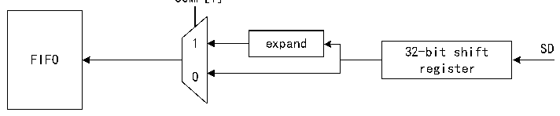

<!-- source-page: 662 -->

[← p.661](0661.md) · [index](../README.md) · [PDF p.662](https://ch32-riscv-ug.github.io/CH32H417/datasheet_zh/CH32H417RM.PDF#page=662) · [p.663 →](0663.md)

<!-- header: CH32H417系列应用手册 https://wch.cn -->

图36-12 SAI的音频模块中的数据压扩硬件  
 <!-- rendered from the PDF; verify at https://ch32-riscv-ug.github.io/CH32H417/datasheet_zh/CH32H417RM.PDF#page=662 -->

Receiver mode（bit MODE[0]=1 in R32_SAI_xCFGR1）  
COMP[1]  

🖼 Text parsed from the figure above

1 expand  
32-bit shift SD  
FIFO  
register  
0  

Transmitter mode（bit MODE[0]=0 in R32_SAI_xCFGR1）  
0  
32-bit shift SD  
FIFO  
register  
FIFO 1  
COMP[1]  
注：选择AC’97时不适用。  
无效Slot上的输出数据线管理  
在发送模式下，当在数据线上发送无效Slot时，可通过TRIS位控制SD线输出的行为。  
- 发送无效Slot时，SAI将SD输出线强制为0。
- 在最后一个数据位传输完毕后，SD 输出线将被置于高阻态，以便释放该数据线供其他连接此
节点的发送器使用。  
必须避免两个发送器同时驱动同一个 SD 输出引脚，以防止短路现象的发生。为确保发送过程中  
的间隙存在，如果数据低于32位，可在R32_SAI_xSLOTR寄存器中设置SLOTSZ[1:0]位为10b，将数  
据扩展到32位。随后，如果下一个Slot被声明为无效，则SD输出引脚将在有效Slot的LSD结束时  
（将数据扩展到32位的填0阶段）被置为三态。  
此外，如果Slot数与Slot大小的乘积小于帧长度，则在通过填0来补充音频帧结束时，SD输出  
线置将被置为三态。  
图36-13说明了这些行为。  
<!-- image: p662-draw-image-00001 bbox=[504.72, 786.24, 525.24, 796.68] -->
<!-- footer: V1.7 658 -->
