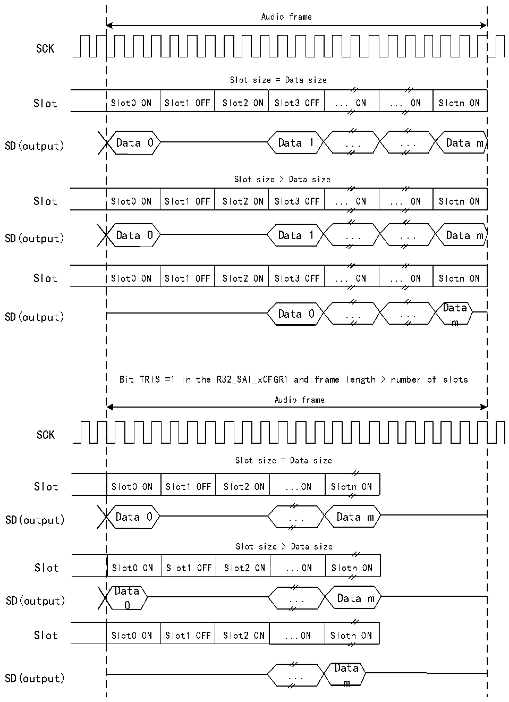

<!-- source-page: 663 -->

[← p.662](0662.md) · [index](../README.md) · [PDF p.663](https://ch32-riscv-ug.github.io/CH32H417/datasheet_zh/CH32H417RM.PDF#page=663) · [p.664 →](0664.md)

<!-- header: CH32H417系列应用手册 https://wch.cn -->

图36-13 发送无效Slot时SD输出线上的三态策略  
 <!-- rendered from the PDF; verify at https://ch32-riscv-ug.github.io/CH32H417/datasheet_zh/CH32H417RM.PDF#page=663 -->

Bit TRIS =1 in the R32_SAI_xCFGR1 and frame length = number of slots  

🖼 Text parsed from the figure above

Audio frame  
SCK  
Slot size = Data size  
Slot0 ON  Slot1 OFF  Slot2 ON  Slot3 OFF  ... ON  ... ON  Slotn ON  
SD(output) Data 0 Data 1 ... ... Data m  
Slot size &gt; Data size  
Slot0 ON  Slot1 OFF  Slot2 ON  Slot3 OFF  ... ON  ... ON  Slotn ON  
SD(output) Data 0 Data 1 ... ... Data m  
Slot0 ON  Slot1 OFF  Slot2 ON  Slot3 OFF  ... ON  ... ON  Slotn ON  
Data  
SD(output) Data 0 ... ...  
m  
Bit TRIS =1 in the R32_SAI_xCFGR1 and frame length &gt; number of slots  
Audio frame  
SCK  
Slot size = Data size  
Slot0 ON  Slot1 OFF  Slot2 ON  ...ON  Slotn ON  
SD(output) Data 0 ... Data m  
Slot size &gt; Data size  
Slot0 ON  Slot1 OFF  Slot2 ON  ...ON  Slotn ON  
Data  
SD(output) ... Data m  
0  
Slot0 ON  Slot1 OFF  Slot2 ON  ...ON  Slotn ON  
Data  
SD(output) ...  
m  

当所选音频协议使用 FS 信号作为 SOF 信号或通道识别信号（R32_SAI_xFRCR 寄存器 FSDEF 位置  
1）时，将按照图36-14管理三态模式（其中，R32_SAI_xCFGR1寄存器TRIS位置1，FSDEF位置1，  
<!-- image: p663-draw-image-00001 bbox=[504.72, 786.24, 525.24, 796.68] -->
<!-- footer: V1.7 659 -->
