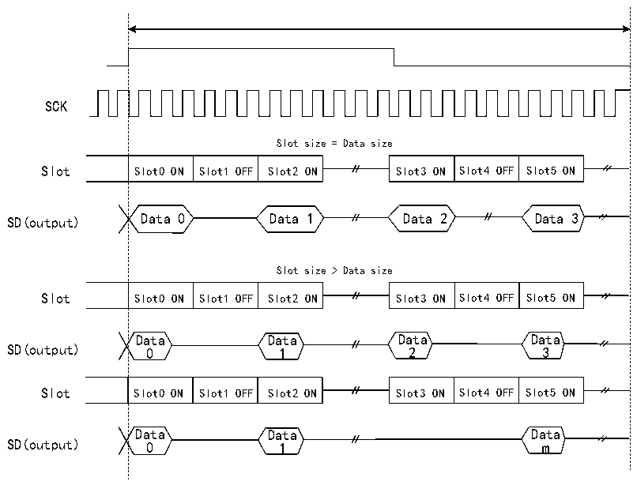

<!-- source-page: 664 -->

[← p.663](0663.md) · [index](../README.md) · [PDF p.664](https://ch32-riscv-ug.github.io/CH32H417/datasheet_zh/CH32H417RM.PDF#page=664) · [p.665 →](0665.md)

<!-- header: CH32H417系列应用手册 https://wch.cn -->
半帧长大于Slot数/2且NBSLOT=6）。  

图36-14 采用I2S等协议时输出数据线上的三态策略  
 <!-- rendered from the PDF; verify at https://ch32-riscv-ug.github.io/CH32H417/datasheet_zh/CH32H417RM.PDF#page=664 -->

🖼 Text parsed from the figure above

SCK  
Slot size = Data size  
Slot0 ON  Slot1 OFF  Slot2 ON  
Slot3 ON  Slot4 OFF  Slot5 ON  
SD(output) Data 0 Data 1 Data 2 Data 3  
Slot size &gt; Data size  
Slot0 ON  Slot1 OFF  Slot2 ON  
Slot3 ON  Slot4 OFF  Slot5 ON  
Data Data Data Data  
SD(output) 0 1 2 3  
Slot0 ON  Slot1 OFF  Slot2 ON  
Slot3 ON  Slot4 OFF  Slot5 ON  
Data Data Data  
SD(output) 0 1 m  

如果R32_SAI_xCFGR2寄存器TRIS位清零，图36-13和图36-14上的SD输出线上的所有高阻态  
将替换为使用值0驱动。  

### 36.3.12 错误标志

SAI使用以下错误标志：  
- FIFO上溢/下溢；
- 帧同步提前检测；
- 帧同步滞后检测；
- 编解码器未就绪（仅限AC’97）；
- 主模式时钟配置错误。

#### 36.3.12.1 FIFO上溢/下溢（OVRUDR）

FIFO上溢/下溢位是R32_SAI_xSR寄存器OVRUDR位。  
由于音频模块既可作为接收器，又可作为发送器，并且指定SAI中的每个音频模块都具有自己的  
R32_SAI_xSR寄存器，因此上溢或下溢错误共用同一位。  
上溢  
若音频模块配置为接收器，则在FIFO已满且无法再存储接收数据的情况下又收到音频帧数据时，  
将出现上溢情况。这种情况下，接收数据将丢失，R32_SAI_xSR 寄存器 OVRUDR 标志置 1；如果  
R32_SAI_xINTENR寄存器OVRUDRIE位置1，还将生成中断。内部将记录发生上溢时的Slot编号。FIFO  
无法再存储更多数据，直至释放出空间存储新数据为止。在FIFO释放了至少一个数据的空间时，SAI  
音频模块接收器将从检测到上溢后内部记录的 Slot 编号开始接收来自新音频帧的新数据，这样可避  
免目标存储器中出现数据Slot不对齐的情况，具体请参见图36-15。  
要清除OVRUDR标志，可将R32_SAI_xSR寄存器OVRUDR位写1即可。  
<!-- image: p664-draw-image-00001 bbox=[504.72, 786.24, 525.24, 796.68] -->
<!-- footer: V1.7 660 -->
