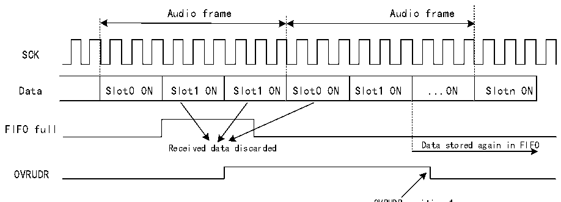
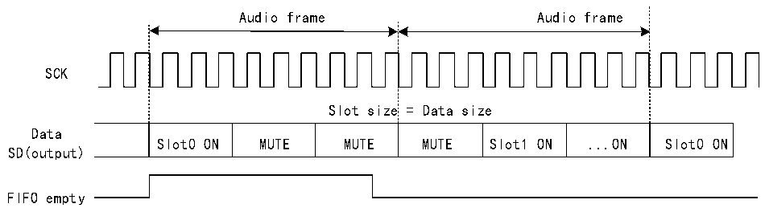

<!-- source-page: 665 -->

[← p.664](0664.md) · [index](../README.md) · [PDF p.665](https://ch32-riscv-ug.github.io/CH32H417/datasheet_zh/CH32H417RM.PDF#page=665) · [p.666 →](0666.md)

<!-- header: CH32H417系列应用手册 https://wch.cn -->

图36-15 上溢错误检测  
 <!-- rendered from the PDF; verify at https://ch32-riscv-ug.github.io/CH32H417/datasheet_zh/CH32H417RM.PDF#page=665 -->

🖼 Text parsed from the figure above

Audio frame Audio frame  
SCK  
Slot0 ON  Slot1 ON  Slot1 ON  Slot0 ON  Slot1 ON  ...ON  Slotn ON  
FIFO full  
Received data discarded Data stored again in FIFO  
OVRUDR  

OVRUDR position 1  
reset  
下溢  
当 SAI 中的音频模块用作发送器时，如果需要发送数据时 FIFO 为空，则可能出现下溢。如果检  
测到下溢，则将存储发生事件的Slot编号并发送MUTE值（00b），直到FIFO准备好发送与检测到下  
溢的Slot对应的数据，具体请参见图36-16。这样可避免存储器指针与音频帧中的Slot之间发生同  
步失效。  
下溢事件会使R32_SAI_xSR寄存器OVRUDR标志置1，如果R32_SAI_xINTENR寄存器OVRUDRIE位  
置1，还将生成中断。要清除该标志，可将R32_SAI_xSR寄存器OVRUDR位写1即可。  
将音频子模块配置为主模式或从模式时，会发生下溢事件。  

图36-16 FIFO下溢事件  
 <!-- rendered from the PDF; verify at https://ch32-riscv-ug.github.io/CH32H417/datasheet_zh/CH32H417RM.PDF#page=665 -->

🖼 Text parsed from the figure above

Audio frame Audio frame  
SCK  
Slot size = Data size  
Slot0 ON  MUTE  MUTE  MUTE  Slot1 ON  ...ON  Slot0 ON  
Data  
SD(output)  
FIFO empty  

OVRUDR  
OVRUDR=1  

#### 36.3.12.2 帧同步提前检测（AFSDET）

AFSDET 标志仅在当 SAI 音频模块用作从模式时使用，在主模式下该标志将被禁用。在  
R32_SAI_xFRCR寄存器中，帧长度、帧极性和帧偏移配置均已知，该标志用于指示是否比预期更早检  
测到帧同步（FS）信号。当发生帧检测提前时，R32_SAI_xSR寄存器AFSDET标志将置1。  
对FS提前不敏感的当前音频帧，次检测不会产生影响。换言之，FS信号的“寄生”事件将被标  
记，但不会干扰当前音频帧的处理。  
如果R32_SAI_xINTENR寄存器AFSDETIE位置1，则会产生中断。清除AFSDET标志需要必须将该  
位写1。  
为在发生帧检测提前错误后重新与主模块同步，必须遵循以下步骤：  
1）通过将 R32_SAI_xCFGR1 寄存器 SAIEN 位复位，禁止 SAI 模块。为确保 SAI 被禁止，需读回  
<!-- image: p665-draw-image-00001 bbox=[504.72, 786.24, 525.24, 796.68] -->
<!-- footer: V1.7 661 -->
