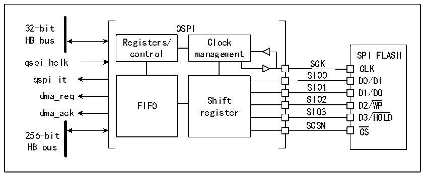

<!-- source-page: 677 -->

[← p.676](0676.md) · [index](../README.md) · [PDF p.677](https://ch32-riscv-ug.github.io/CH32H417/datasheet_zh/CH32H417RM.PDF#page=677) · [p.678 →](0678.md)

<!-- header: CH32H417系列应用手册 https://wch.cn -->

# 第 37 章 QSPI 接口（QuadSPI）

本章模块描述仅适用于CH32H417、CH32H416微控制器产品。  
芯片内置两组专用的QSPI通信接口（QuadSPI），连接单、双或四（条数据线）SPI的FLASH存  
储介质。该接口的工作模式主要包括以下几种：  
● 间接模式：在这种模式下，QSPI接口通过使用QSPI寄存器执行所有操作，该模式适用于需要频  
繁读写操作的应用场景。  
● 状态轮询模式：在这种模式下，系统会周期性地读取外部 FLASH 状态寄存器。当标志位置 1 时  
（如擦除或烧写完成），系统会产生中断。该模式适用于需要实时监控外部Flash状态的应用场  
景。  
内存映射模式：在这种模式下，外部Flash被映射到微控制器的地址空间中，系统将其视为内部  
存储器进行访问。在批号倒数第五位小于3的芯片，该内存映射的地址只能用于数据访问。  
采用双闪存模式时，系统可以同时访问两个Quad-SPI FLASH，吞吐量和容量均可提高二倍。这种  
模式适用于需要大量数据处理的应用场景。  

## 37.1 主要特征

● 三种功能模式：间接模式、状态轮询模式和内存映射模式  
● 双闪存模式，通过并行访问两个FLASH  
● 集成FIFO，用于发送和接收  
● 支持SDR模式  
● 针对间接模式和内存映射模式，完全可编程帧格式  
● 针对间接模式和内存映射模式，完全可编程操作码  
● 在达到FIFO阈值和传输完成时生成DMA触发信号  
● 在达到FIFO阈值、超时、操作完成以及发生访问错误时产生中断  

## 37.2 概述

图37-1 QSPI功能框图（双闪存模式禁止）  
 <!-- rendered from the PDF; verify at https://ch32-riscv-ug.github.io/CH32H417/datasheet_zh/CH32H417RM.PDF#page=677 -->

🖼 Text parsed from the figure above

32-bit QSPI  
HB bus Registers/ Clock  
control management SPI FLASH  
SPI FLASHCLKD0/DI  
qspi_hclk SCK  
SIO0  
Shift register  SIO1SIO2  SIO2SIO3SCSN  
dma_req D1/DO  
dma_ack register SIO3  
D3/HOLD  
CS  
256-bit  
HB bus  

<!-- image: p677-draw-image-00001 bbox=[504.72, 786.24, 525.24, 796.68] -->
<!-- footer: V1.7 673 -->
