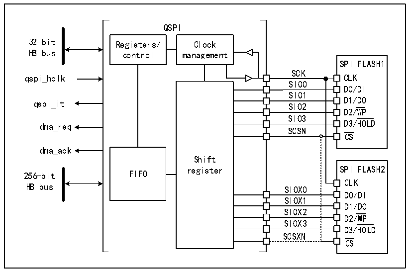
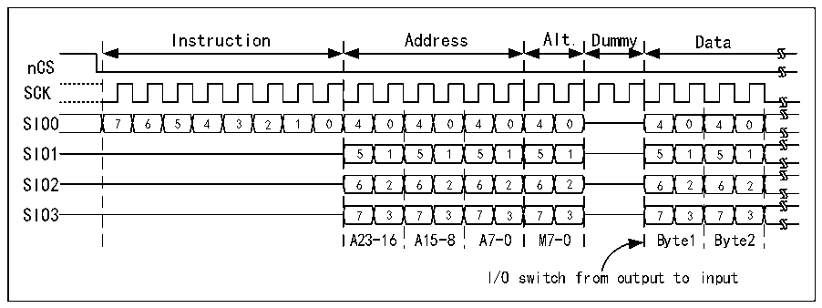

<!-- source-page: 678 -->

[← p.677](0677.md) · [index](../README.md) · [PDF p.678](https://ch32-riscv-ug.github.io/CH32H417/datasheet_zh/CH32H417RM.PDF#page=678) · [p.679 →](0679.md)

<!-- header: CH32H417系列应用手册 https://wch.cn -->

图37-2 QSPI 功能框图（双闪存模式使能）  
 <!-- rendered from the PDF; verify at https://ch32-riscv-ug.github.io/CH32H417/datasheet_zh/CH32H417RM.PDF#page=678 -->

🖼 Text parsed from the figure above

QSPI  
32-bit Registers/ Clock  
HB bus control management  
SPI FLASH1  
SCK  
qspi_hclk CLK  
SIO0  
D0/DI  
SIO1  
D1/DO  
qspi_it SIO2  
SIO2SIO3  SIO3SCSN  SCSN  SIOX1SI0X2  SIOX3  
D2/WP  
dma_req D3/HOLD  
CS  
dma_ack  
Shift  
256-bit FIFO  
CLK  
HB bus SIOX0  
D0/DI  
D1/DO  
D2/WP  
D3/HOLD  
SCSXN  
CS  

## 37.3 功能描述

### 37.3.1 QSPI 命令序列

QSPI通过命令与FLASH通信，每条命令包括五个阶段：指令、地址、交替字节、空指令和数  
据。任一阶段均可跳过，但至少需保留指令、地址、交替字节或数据阶段中的一个。nCS在每条指  
令开始前下降，在每条指令完成后再次上升。  

图37-3 四线模式下的读命令示例  
 <!-- rendered from the PDF; verify at https://ch32-riscv-ug.github.io/CH32H417/datasheet_zh/CH32H417RM.PDF#page=678 -->

🖼 Text parsed from the figure above

Instruction Address Alt. Dummy Data  
nCS  
SCK  
7  6  5  4  3  2  1  0  4  0  4  0  4  0  4  0  5  1  5  1  5  1  5  1  6  2  6  2  6  2  6  2  7  3  7  3  7  3  7  3  
4  0  4  0  5  1  5  1  6  2  6  2  7  3  7  3  
A23-16 A15-8 A7-0 M7-0 Byte1 Byte2  
I/O switch from output to input  

指令阶段  
在指令阶段，通过在 R32_QSPIx_CCR 寄存器的 INSTRUCTION[7:0]字段中配置的一条 8 位指令发  
送到FLASH，实现对待执行操作的类型的指定。大部分FLASH仅能通过SIO0信号（单线SPI模式）以  
每次1位的方式接收指令。然而，通过配置R32_QSPIx_CCR寄存器中的IMODE[1:0]字段，可以实现指  
令阶段的选择性发送，即一次发送2位（在双线SPI模式中通过SIO0/SIO1）或一次发送4位（在四  
线 SPI 模式中通过 SIO0/SIO1/SIO2/SIO3）。若 IMODE=00b，则指令阶段被跳过，命令序列从地址阶  
段（若存在）开始。  
地址阶段  
<!-- image: p678-draw-image-00001 bbox=[504.72, 786.24, 525.24, 796.68] -->
<!-- footer: V1.7 674 -->
