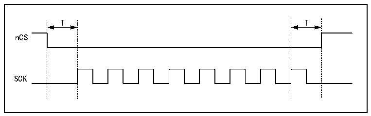
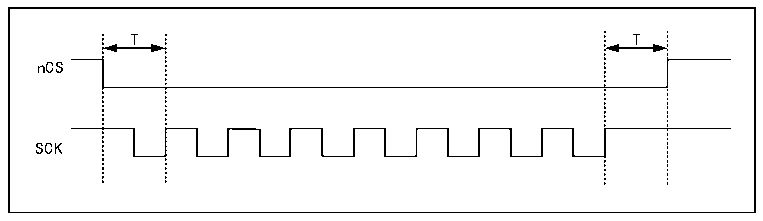
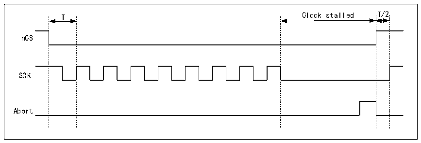

<!-- source-page: 685 -->

[← p.684](0684.md) · [index](../README.md) · [PDF p.685](https://ch32-riscv-ug.github.io/CH32H417/datasheet_zh/CH32H417RM.PDF#page=685) · [p.686 →](0686.md)

<!-- header: CH32H417系列应用手册 https://wch.cn -->
当CKMODE=0（“模式0”，即在没有进行操作时SCK保持低电平），nCS在操作首次升高SCK边  
沿时的一个SCK周期前降至低电平，在操作最后一次升高SCK边沿时的一个SCK周期后升至高电平，  
如下图所示。  

图37-4 CKMODE=0时的nCS（T=SCK周期）  
 <!-- rendered from the PDF; verify at https://ch32-riscv-ug.github.io/CH32H417/datasheet_zh/CH32H417RM.PDF#page=685 -->

🖼 Text parsed from the figure above

T T  
nCS  
SCK  

当CKMODE=1（“模式3”，在未进行任何操作时SCK升至高电平）时，nCS仍在操作首次升高SCK  
边沿时的一个 SCK 周期前降至低电平，在操作最后一次升高 SCK 边沿时的一个 SCK 周期后升至高电  
平，如下图所示。  

图37-5 CKMODE=1时的nCS（T=SCK周期）  
 <!-- rendered from the PDF; verify at https://ch32-riscv-ug.github.io/CH32H417/datasheet_zh/CH32H417RM.PDF#page=685 -->

🖼 Text parsed from the figure above

T T  
nCS  
SCK  

若FIFO在读取操作中保持写满状态或在写入操作中保持为空，则在固件干预FIFO前，操作停止  
并且SCK保持低电平。若操作停止时发生中止，则nCS在请求中止后即升至高电平，SCK则在半个周  
期后升至高电平，如下图所示。  

图37-6 CKMODE=1且发生中止时的nCS（T=SCK周期）  
 <!-- rendered from the PDF; verify at https://ch32-riscv-ug.github.io/CH32H417/datasheet_zh/CH32H417RM.PDF#page=685 -->

🖼 Text parsed from the figure above

T Clock stalled T/2  
nCS  
SCK  
Abort  

当不处于双闪存模式（DFM=0）且FSEL=0（默认值）时，仅访问FLASH1。因此，若FSEL=1，仅访  
问FLASH1，nCS保持高电平。在双闪存模式下，FLASH1和FLASH2的nCS行为完全相同。因此，如果  
存在 FLASH2，并且应用程序始终处于双闪存模式，那么 FLASH1 的 nCS 信号也可以用于 FLASH2，而  
FLASH2的nCS引脚输出可用于其他功能。  

### 37.3.13 中断

<!-- p685-table-001 (table-37-1@1) pages 685-686 -->
<table><caption>表37-1 中断请求</caption><tr><th>中断事件</th><th>事件标志</th><th>使能控制位</th></tr><tr><td>超时</td><td>TOF</td><td>TOIE</td></tr><tr><td>状态匹配</td><td>SMF</td><td>SMIE</td></tr><tr><td>FIFO阈值</td><td>FTF</td><td>FTIE</td></tr><tr><td>传输完成</td><td>TCF</td><td>TCIE</td></tr><tr><td>传输错误</td><td>TEF</td><td>TEIE</td></tr></table>

<!-- image: p685-draw-image-00001 bbox=[504.72, 786.24, 525.24, 796.68] -->
<!-- footer: V1.7 681 -->
