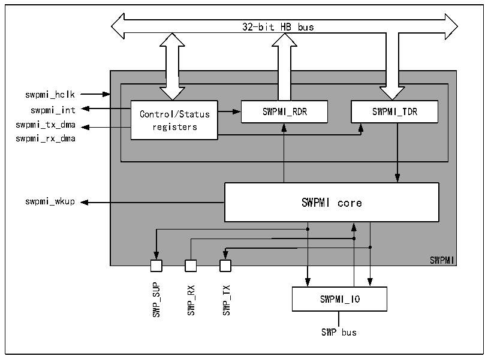

<!-- source-page: 698 -->

[← p.697](0697.md) · [index](../README.md) · [PDF p.698](https://ch32-riscv-ug.github.io/CH32H417/datasheet_zh/CH32H417RM.PDF#page=698) · [p.699 →](0699.md)

<!-- header: CH32H417系列应用手册 https://wch.cn -->

# 第 38 章 单线协议主接口（SWPMI）

单线协议主接口（SWPMI）是一种全双工单线通信的技术，该技术基于ETSI TS 102 613标准规  
范实现单线协议（SWP）通信。  
在SWPMI中，数据可以通过两种物理方式传输：第一种是通过电压域（S1信号）来实现从主设备  
到从设备的数据传输；第二种是通过电流域（S2 信号）来实现从从设备到主设备的数据传输。S1 信  
号使用脉冲宽度调制的数字调制方式传输，而S2信号则从电流变化中传输数据。  

## 38.1 主要特征

● 支持全双工通信模式  
● 支持自动处理填充位  
● 支持自动SWP总线状态管理  
● 提供回送模式用于测试  
● 支持自动处理帧起始（SOF）和自动处理帧结束（EOF）  
● 支持比特率可配置，高达2Mbit/s，支持中断可配置  
● 提供CRC错误、下溢、上溢和从器件恢复监测标志  
● 支持CRC-16的计算、生成与检验  

## 38.2 概述

图38-1单线协议主接口的结构框图  
 <!-- rendered from the PDF; verify at https://ch32-riscv-ug.github.io/CH32H417/datasheet_zh/CH32H417RM.PDF#page=698 -->

🖼 Text parsed from the figure above

32-bit HB bus  
swpmi_hclk  
swpmi_int Control/Status SWPMI_RDR SWPMI_TDR  
swpmi_tx_dma registers  
swpmi_rx_dma  
swpmi_wkup SWPMI core  
SWPMI  
SWP_SUP SWP_RX SWP_TX  
SWPMI_IO  
SWP bus  

## 38.3 功能描述

### 38.3.1 SWP初始化和激活

SWP初始化和激活可实现SWPMI_IO状态从低电平转为高电平。使用内部收发器时，软件操作按以  
<!-- image: p698-draw-image-00001 bbox=[504.72, 786.24, 525.24, 796.68] -->
<!-- footer: V1.7 694 -->
