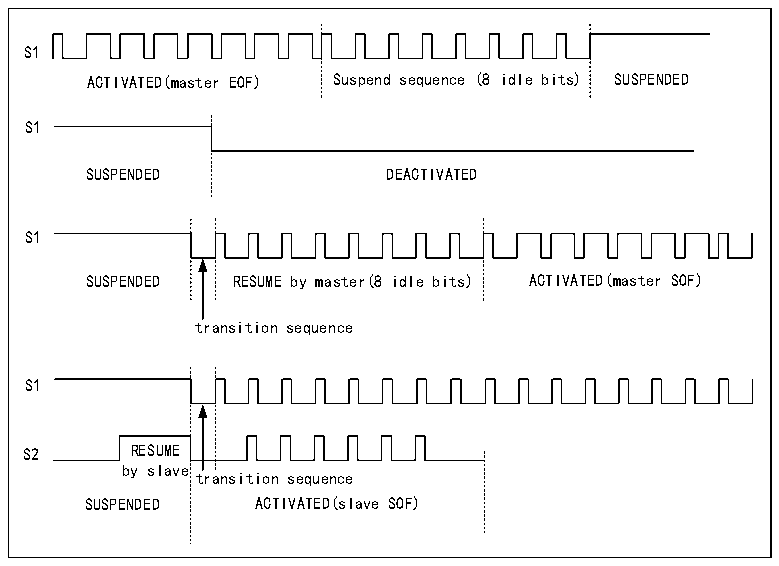

<!-- source-page: 700 -->

[← p.699](0699.md) · [index](../README.md) · [PDF p.700](https://ch32-riscv-ug.github.io/CH32H417/datasheet_zh/CH32H417RM.PDF#page=700) · [p.701 →](0701.md)

<!-- header: CH32H417系列应用手册 https://wch.cn -->

图38-2 SWP总线状态图  
 <!-- rendered from the PDF; verify at https://ch32-riscv-ug.github.io/CH32H417/datasheet_zh/CH32H417RM.PDF#page=700 -->

🖼 Text parsed from the figure above

S1  
ACTIVATED(master EOF) Suspend sequence (8 idle bits) SUSPENDED  
S1  
SUSPENDED DEACTIVATED  
S1  
SUSPENDED RESUME by master(8 idle bits) ACTIVATED(master SOF)  
transition sequence  
S1  
S2 RESUME  
by slave  
transition sequence  
SUSPENDED ACTIVATED(slave SOF)  

从器件恢复  
SWPMI 使能后，若 SWPMI 接收到从器件的恢复状态信号，SWP 会从“已挂起”状态转换到“已激  
活”状态。“从器件恢复”将触发R32_SWPMI_ISR寄存器中的SRF标志位置1。  

### 38.3.3 SWPMI_IO（内部收发器）旁路

微控制器中集成了符合ETSI TS 102 613技术规范的SWPMI_IO（内部收发器）。为实现将该收发  
器旁路，可通过将R32_SWPMI_OR寄存器SWP_TBYP位置1。在旁路模式下，SWPMI_IO被禁止，SWP_RX、  
SWP_TX 和 SWPMI_SUP 信号作为这三个 GPIO 上的复用功能可供使用。此配置可用于连接外部收发器。  
注：在SWPMI_IO旁路模式下，R32_SWPMI_CR寄存器SWPTEN位必须清零。  

### 38.3.4 SWPMI比特率

在R32_SWPMI_BRR寄存器中，根据以下公式设置比特率：  
FSWP= FHCLK/（（BR[7:0]+1）x4）  
注：最大比特率为2Mbit/s。  

### 38.3.5 SWPMI帧处理

SWP帧由以下几个部分组成：帧起始（SOF）、1到30字节的有效负载、16位CRC（循环冗余校  
验）和EOF（帧结束）。如图38-3。  
SWPMI 集成了一个 32 位数据发送寄存器（R32_SWPMI_TDR）和一个 32 位数据接收寄存器  
（R32_SWPMI_RDR）。  
在数据发送模式下，SOF插入、EOF插入、CRC计算和插入均由SWPMI自动管理。用户仅需提供有  
效负载的大小和内容。向R32_SWPMI_TDR寄存器中写入数据后，会立即进行帧发送。将通过特定的标  
志位来指示发送数据寄存器为空、数据帧发送完成事件。  
在数据接收模式下，SOF删除、EOF删除、CRC计算和检查均由SWPMI自动管理。用户仅需读取有  
效负载的大小和内容。将通过特定的标志位来指示接收数据完成帧接收、寄存器为满、可能的CRC错  
误事件。  
<!-- image: p700-draw-image-00001 bbox=[504.72, 786.24, 525.24, 796.68] -->
<!-- footer: V1.7 696 -->
