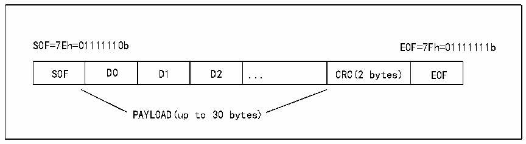

<!-- source-page: 701 -->

[← p.700](0700.md) · [index](../README.md) · [PDF p.701](https://ch32-riscv-ug.github.io/CH32H417/datasheet_zh/CH32H417RM.PDF#page=701) · [p.702 →](0702.md)

<!-- header: CH32H417系列应用手册 https://wch.cn -->

图38-3 SWP帧结构  
 <!-- rendered from the PDF; verify at https://ch32-riscv-ug.github.io/CH32H417/datasheet_zh/CH32H417RM.PDF#page=701 -->

🖼 Text parsed from the figure above

SOF=7Eh=01111110b EOF=7Fh=01111111b  
SOF  D0  D1  D2  ...  CRC(2 bytes)  EOF  
PAYLOAD(up to 30 bytes)  

填充位插入（发送模式下）和删除（接收模式下）均由SWPMI内核自动管理。这些操作对用户是  
透明的。  

### 38.3.6 发送过程

在进行帧发送之前，用户必须先激活SWP，请参考38.3.1。帧传输的软件实现方式有多种，包括  
无软件缓冲区模式、单软件缓冲区模式以及多软件缓冲区模式。在采用软件缓冲区的情况下，数据通  
过DMA通道从RAM存储器的软件缓冲区传输到SWPMI外设发送数据寄存器。  
无软件缓冲区模式  
无软件缓冲区模式下，无需启用DMA。主循环或SWPMI中断程序内轮询状态标志可处理SWP帧发  
送。SWPMI包含一个32位发送数据寄存器（R32_SWPMI_TDR），若向该寄存器进行写操作将触发多达  
4个字节的发送操作。  
通过将R32_SWPMI_CR寄存器TXDMA位清零，可选择无软件缓冲区模式。  
首次向R32_SWPMI_TDR寄存器写入数据时，可触发帧发送。在向R32_SWPMI_TDR寄存器写入的第  
一个字中，位[7:0]表示有效负载中的数据字节数，位[15:8]、位[23:16]、位[31:24]分别包含有效负  
载的前3个字节，其中位[15:8]包含有效负载的第一个字节，位[23:16]包含第二个字节，位[31:24]  
包含第三个字节。随后对R32_SWPMI_TDR寄存器进行的写操作将仅包含后续的有效负载数据字节（每  
次写操作最多4个字节）。  
注：向R32_SWPMI_TDR寄存器写入的第一个32位字的低有效字节用于对有效负载中的数据字节  
数进行编码。该数值范围应介于1～30之间。若最低有效字节中的值超出此范围，将不予考虑，且不  
会触发数据发送。  
对R32_SWPMI_TDR寄存器进行写操作将触发以下一系列操作：  
1）当SWP总线为“已挂起”状态，系统将发送转换序列以及8个空闲位（主器件恢复）。相反，  
若SWP总线为“已激活”状态，则不会触发此操作；  
2）发送帧起始；  
3）根据 R32_SWPMI_TRD 寄存器的内容，发送有效负载。若有效负载中的字节数超过 3，只要  
R32_SWPMI_ISR 寄存器 TXBEF 标志位未置 1，每当 R32_SWPMI_ISR 寄存器的 TXE 标志位置 1 时，  
R32_SWPMI_TDR就需要由软件重新填充；  
4）发送16位CRC（由SWPMI内核自动计算）；  
5）发送帧结束（EOF）。  
软件对R32_SWPMI_TDR寄存器进行写操作时，将自动清零TXE标志。  
完整的帧发送成功后，若尚未请求其他帧发送（即在TXBEF标志置1后未再次对R32_SWPMI_TDR  
进行写操作），那么在EOF发送完成后，再经过7个空闲位，R32_SWFMI_ISR寄存器中的TCF和SUSP  
标志将会置1。此外，如果将R32_SWPMI_IER寄存器中将TCIE位置1，将会触发中断。如图38-4。  
<!-- image: p701-draw-image-00001 bbox=[504.72, 786.24, 525.24, 796.68] -->
<!-- footer: V1.7 697 -->
