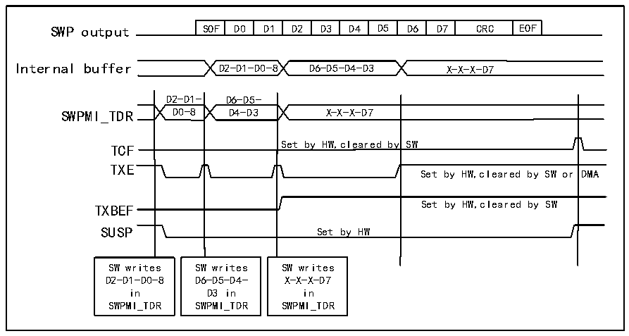
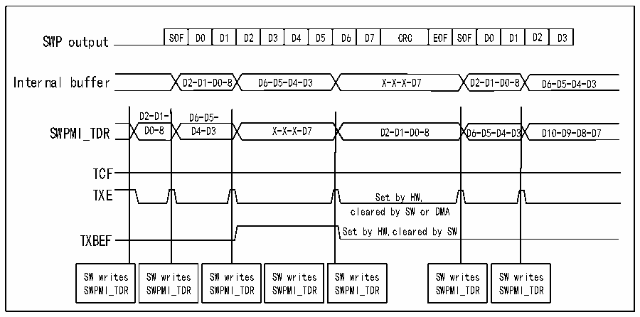

<!-- source-page: 702 -->

[← p.701](0701.md) · [index](../README.md) · [PDF p.702](https://ch32-riscv-ug.github.io/CH32H417/datasheet_zh/CH32H417RM.PDF#page=702) · [p.703 →](0703.md)

<!-- header: CH32H417系列应用手册 https://wch.cn -->

图38-4 SWPMI 无软件缓冲区模式发送  
 <!-- rendered from the PDF; verify at https://ch32-riscv-ug.github.io/CH32H417/datasheet_zh/CH32H417RM.PDF#page=702 -->

🖼 Text parsed from the figure above

SOF  D0  D1  D2  D3  D4  D5  D6  D7  CRC  EOF  
Internal buffer D2-D1-D0-8 D6-D5-D4-D3 X-X-X-D7  
D2-D1- D6-D5-  
y SW  Set by HW,cleared by SW or  Set by HW  
TCF  
TXE  
SW writes SW writes SW writes  
D2-D1-D0-8 D6-D5-D4- X-X-X-D7  
in D3 in in  
SWPMI_TDR SWPMI_TDR SWPMI_TDR  

若在EOF发送结束之前，再次发起帧发送请求，那么TCF标志位不会置1，且该帧将与前一个帧  
衔接（二者之间只有一个空闲位，请参考图38-5）。  

图38-5 SWPMI 无软件缓冲区模式发送，连续帧  
 <!-- rendered from the PDF; verify at https://ch32-riscv-ug.github.io/CH32H417/datasheet_zh/CH32H417RM.PDF#page=702 -->

🖼 Text parsed from the figure above

SOF  D0  D1  D2  D3  D4  D5  D6  D7  CRC  EOF  SOF  D0  D1  D2  D3  
Internal buffer D2-D1-D0-8 D6-D5-D4-D3 X-X-X-D7 D2-D1-D0-8 D6-D5-D4-D3  
D2-D1- D6-D5-  
SWPMI_TDR D0-8 D4-D3 X-X-X-D7 D2-D1-D0-8 D6-D5-D4-D3 D10-D9-D8-D7  
TCF  
cleared by SW or DMA  
Set by HW,cleared by SW  
TXBEF  
SW writes SWPMI_TDR  SW writes SWPMI_TDR  SW writes SWPMI_TDR  SW writes SWPMI_TDR  SW writes SWPMI_TDR  
SW writes SWPMI_TDR  SW writes SWPMI_TDR  

单软件缓冲区模式  
单软件缓冲区模式下可通过 DMA 发送完整 SWP 帧，且不需要 CPU 介入。DMA 将重新填充 32 位  
R32_SWPMI_TDR寄存器，软件可使用SWPMI_TXBEF标志轮询帧发送是否结束。选择单软件缓冲区模式：  
将R32_SWPMI_CR寄存器TXDMA位置1、TXMODE位清零。  
DMA通道或数据流必须配置为以下模式（请参考DMA部分）：  
● 存储器大小设为32位；  
● 外设大小设为32位；  
● 使能存储器递增模式；  
● 禁止循环模式；  
● 禁止外设递增模式；  
● 禁止存储器到存储器模式；  
<!-- image: p702-draw-image-00001 bbox=[504.72, 786.24, 525.24, 796.68] -->
<!-- footer: V1.7 698 -->
