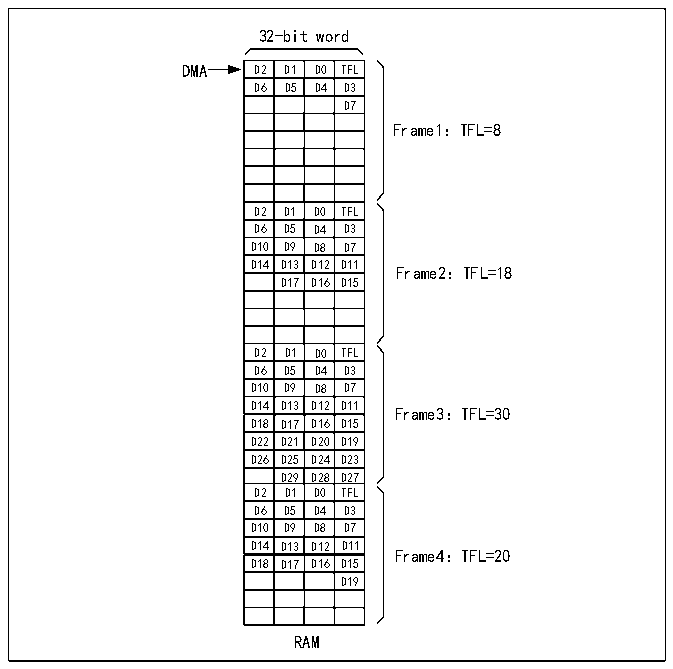

<!-- source-page: 704 -->

[← p.703](0703.md) · [index](../README.md) · [PDF p.704](https://ch32-riscv-ug.github.io/CH32H417/datasheet_zh/CH32H417RM.PDF#page=704) · [p.705 →](0705.md)

<!-- header: CH32H417系列应用手册 https://wch.cn -->

图38-6 SWPMI多软件缓冲区模式发送  
 <!-- rendered from the PDF; verify at https://ch32-riscv-ug.github.io/CH32H417/datasheet_zh/CH32H417RM.PDF#page=704 -->

🖼 Text parsed from the figure above

32-bit word  

<!-- p704-table-001 (table-37-3@1) -->
<table><tr><th>D2</th><th>D1</th><th>D0</th><th>TFL</th></tr><tr><td>D6</td><td>D5</td><td>D4</td><td>D3</td></tr><tr><td></td><td></td><td></td><td>D7</td></tr><tr><td></td><td></td><td></td><td></td></tr><tr><td></td><td></td><td></td><td></td></tr><tr><td></td><td></td><td></td><td></td></tr><tr><td></td><td></td><td></td><td></td></tr><tr><td></td><td></td><td></td><td></td></tr><tr><td>D2</td><td>D1</td><td>D0</td><td>TFL</td></tr><tr><td>D6</td><td>D5</td><td>D4</td><td>D3</td></tr><tr><td>D10</td><td>D9</td><td>D8</td><td>D7</td></tr><tr><td>D14</td><td>D13</td><td>D12</td><td>D11</td></tr><tr><td></td><td>D17</td><td>D16</td><td>D15</td></tr><tr><td></td><td></td><td></td><td></td></tr><tr><td></td><td></td><td></td><td></td></tr><tr><td></td><td></td><td></td><td></td></tr><tr><td>D2</td><td>D1</td><td>D0</td><td>TFL</td></tr><tr><td>D6</td><td>D5</td><td>D4</td><td>D3</td></tr><tr><td>D10</td><td>D9</td><td>D8</td><td>D7</td></tr><tr><td>D14</td><td>D13</td><td>D12</td><td>D11</td></tr><tr><td>D18</td><td>D17</td><td>D16</td><td>D15</td></tr><tr><td>D22</td><td>D21</td><td>D20</td><td>D19</td></tr><tr><td>D26</td><td>D25</td><td>D24</td><td>D23</td></tr><tr><td></td><td>D29</td><td>D28</td><td>D27</td></tr><tr><td>D2</td><td>D1</td><td>D0</td><td>TFL</td></tr><tr><td>D6</td><td>D5</td><td>D4</td><td>D3</td></tr><tr><td>D10</td><td>D9</td><td>D8</td><td>D7</td></tr><tr><td>D14</td><td>D13</td><td>D12</td><td>D11</td></tr><tr><td>D18</td><td>D17</td><td>D16</td><td>D15</td></tr><tr><td></td><td></td><td></td><td>D19</td></tr><tr><td></td><td></td><td></td><td></td></tr><tr><td></td><td></td><td></td><td></td></tr></table>

Frame1：TFL=8  
D14 D13 D12 D11 Frame2：TFL=18  
D14 D13 D12 D11 Frame3：TFL=30  
Frame4：TFL=20  
RAM  

通过将R32_SWPMI_CR寄存器中的TXDMA和TXMODE位置1来选择多软件缓冲区模式。若要使用4  
个发送缓冲区，用户必须如下配置DMA：  
DMA通道或数据流必须配置为以下模式（请参考DMA部分）：  
● 存储器大小设为32位；  
● 外设大小设为32位；  
● 必须将要传输的字数设为32（每个缓冲区8个字）；  
● 数据传输方向设为从存储器读取；  
● 禁止存储器到存储器模式；  
● 禁止外设递增模式；  
● 使能存储器递增模式；  
● 使能循环模式；  
● 源地址是RAM中的缓冲区1；  
● 目标地址为R32_SWPMI_TDR寄存器。  
随后，用户进行以下操作：  
1）将R32_SWPMI_CR寄存器TXDMA位置1；  
2）将R32_SWPMI_IER寄存器TXBEIE位置1；  
3）对RAM存储器中的缓冲区1、缓冲区2、缓冲区3和缓冲区4进行填充（有效负载中的数据字  
节数由第一个字的最低有效字节表示）；  
4）通过使能DMA模块中的数据流或通道，以触发DMA传输和帧发送。  
在 SWPMI 中断例程中，用户必须检查 R32_SWPMI_ISR 寄存器 TXBEF 位。若该位置 1，用户应将  
R32_SWPMI_ICR寄存器CTXBEF位置1，以清零TXBEF标志，并且更新RAM存储器中的缓冲区1。当下  
一次SWPMI中断发生时，用户将更新缓冲区2，如此循环往复。  
软件还可读取DMA寄存器中DMA计数器（待传输的数据量），以检索已从RAM存储器传输并发送  
<!-- image: p704-draw-image-00001 bbox=[504.72, 786.24, 525.24, 796.68] -->
<!-- footer: V1.7 700 -->
