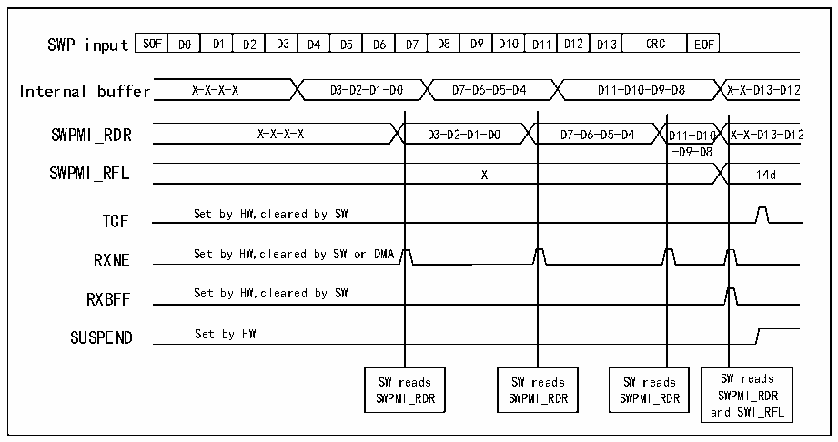

<!-- source-page: 706 -->

[← p.705](0705.md) · [index](../README.md) · [PDF p.706](https://ch32-riscv-ug.github.io/CH32H417/datasheet_zh/CH32H417RM.PDF#page=706) · [p.707 →](0707.md)

<!-- header: CH32H417系列应用手册 https://wch.cn -->

图38-7 SWPMI 无软件缓冲区模式接收  
 <!-- rendered from the PDF; verify at https://ch32-riscv-ug.github.io/CH32H417/datasheet_zh/CH32H417RM.PDF#page=706 -->

🖼 Text parsed from the figure above

SOF  D0  D1  D2  D3  D4  D5  D6  D7  D8  D9  D10  D11  D12  D13  CRC  EOF  
Internal buffer X-X-X-X D3-D2-D1-D0 D7-D6-D5-D4 D11-D10-D9-D8 X-X-D13-D12  
SWPMI_RDR X-X-X-X D3-D2-D1-D0 D7-D6-D5-D4 D11-D10 X-X-D13-D12  
-D9-D8  
X  
TCF Set by HW,cleared by SW  
RXNE Set by HW,cleared by SW or DMA  
RXBFF Set by HW,cleared by SW  
SUSPEND Set by HW  
SW reads SW reads SW reads SW reads  
SWPMI_RDR SWPMI_RDR SWPMI_RDR SWPMI_RDR  
and SWI_RFL  

单软件缓冲区模式  
单软件缓冲区模式下可通过DMA发送完整SWP帧，且不需要CPU介入。DMA将接收到的数据从32  
位R32_SWPMI_RDR寄存器传输到RAM存储器，软件可使用SWPMI_RBFF标志轮询帧接收是否结束。单  
软件缓冲区模式：将R32_SWPMI_CR寄存器RXDMA位置1、RXMODE位清零。  
DMA通道或数据流必须配置为以下模式（请参考DMA部分）：  
● 存储器大小设为32位；  
● 外设大小设为32位；  
● 使能存储器递增模式；  
● 禁止循环模式；  
● 禁止外设递增模式；  
● 禁止存储器到存储器模式；  
● 传输的字数设置为8；  
● 目标地址是RAM中的SWP帧缓冲区；  
● 数据传输方向设为从存储器读取；  
● 源地址是R32_SWPMI_RDR寄存器。  
随后，用户进行以下操作：  
1）将R32_SWPMI_CR寄存器RXDMA位置1；  
2）将R32_SWPMI_IER寄存器RXBEIE位置1；  
3）通过使能DMA模块中的数据流或通道。  
当R32_SWPMI_ISR中的RXNE标志置1时，SWPMI将发起DMA请求。在DMA对R32_SWPMI_RDR寄  
存器进行写操作时，RXNE标志位将被自动清零。  
在SWPMI中断程序中，用户需要查看R32_SWPMI_ISR寄存器RXBEF位。若该位置1，并且还有其  
他帧需要发送，则用户必须进行以下操作：  
1）禁止DMA模块中的数据流或通道；  
2）读取R32_SWPMI_RFL寄存器中已接收的帧有效负载的字节数；  
3）读取RAM缓冲区中的帧有效负载；  
4）使能DMA模块中的数据流或通道；  
5）通过将R32_SWPMI_ICR寄存器CTXBEF位置1，以清零RXBEF标志。详情请参考图38-8。  
<!-- image: p706-draw-image-00001 bbox=[504.72, 786.24, 525.24, 796.68] -->
<!-- footer: V1.7 702 -->
