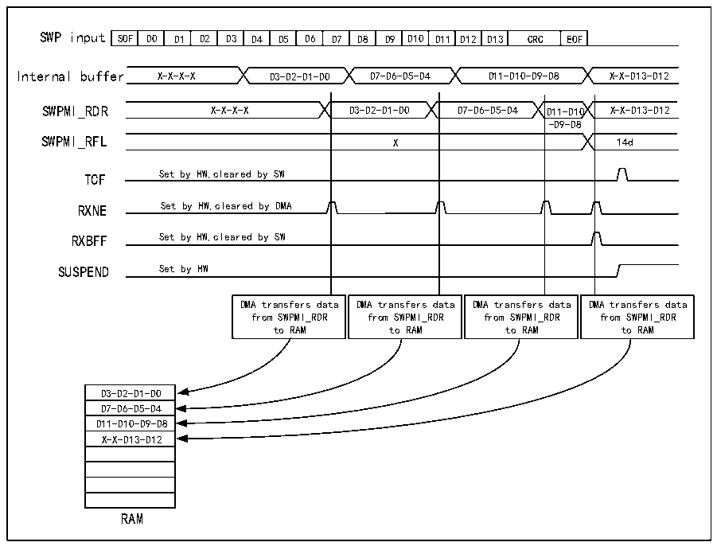

<!-- source-page: 707 -->

[← p.706](0706.md) · [index](../README.md) · [PDF p.707](https://ch32-riscv-ug.github.io/CH32H417/datasheet_zh/CH32H417RM.PDF#page=707) · [p.708 →](0708.md)

<!-- header: CH32H417系列应用手册 https://wch.cn -->

图38-8 SWPMI 单软件缓冲区模式接收  
 <!-- rendered from the PDF; verify at https://ch32-riscv-ug.github.io/CH32H417/datasheet_zh/CH32H417RM.PDF#page=707 -->

🖼 Text parsed from the figure above

SOF  D0  D1  D2  D3  D4  D5  D6  D7  D8  D9  D10  D11  D12  D13  CRC  EOF  
Internal buffer X-X-X-X D3-D2-D1-D0 D7-D6-D5-D4 D11-D10-D9-D8 X-X-D13-D12  
SWPMI_RDR X-X-X-X D3-D2-D1-D0 D7-D6-D5-D4 D11-D10 X-X-D13-D12  
-D9-D8  
X  
SWPMI_RFL X 14d  
TCF Set by HW,cleared by SW  
RXNE Set by HW,cleared by DMA  
RXBFF Set by HW,cleared by SW  
SUSPEND Set by HW  
DMA transfers data from SWPMI_RDR to RAM  DMA transfers data from SWPMI_RDR to RAM  DMA transfers data from SWPMI_RDR to RAM  DMA transfers data from SWPMI_RDR to RAM  
D3-D2-D1-D0  D7-D6-D5-D4  D11-D10-D9-D8  X-X-D13-D12  
RAM  

多软件缓冲区模式  
多软件缓冲区模式支持在 RAM 存储器中配置多个帧缓冲区，以保障数据的连续传输、维持极低  
CPU负载。帧有效负载与帧状态标志一起存储在RAM存储器中。软件可随时检查DMA计数器和状态标  
志，以处理RAM存储器中接收到的SWP帧。  
为实现最佳效果，多软件缓冲区模式应当与循环模式下的DMA结合使用。选择多软件缓冲区模式：  
将R32_SWPMI_CR寄存器中的RXDMA和RXMODE位置1。  
为实现在 RAM 中使用 n 个接收缓冲区，DMA 通道或数据流必须配置为以下模式（请参考 DMA 部  
分）：  
● 存储器大小设为32位；  
● 外设大小设为32位；  
● 必须将要传输的字数设为8*n（每个缓冲区8个字）；  
● 数据传输方向设为从外设读取；  
● 禁止存储器到存储器模式；  
● 禁止外设递增模式；  
● 使能存储器递增模式；  
● 使能循环模式；  
● 源地址是R32_SWPMI_TDR寄存器；  
● 目标地址为RAM中的缓冲区1。  
随后，用户进行以下操作：  
1）将R32_SWPMI_CR寄存器RXDMA位置1；  
2）将R32_SWPMI_IER寄存器RXBEIE位置1；  
3）使能DMA模块中的数据流或通道。  
在 SWPMI 中断例程中，用户必须检查 R32_SWPMI_ISR 寄存器 RXBEF 位。若该位置 1，用户应将  
<!-- image: p707-draw-image-00001 bbox=[504.72, 786.24, 525.24, 796.68] -->
<!-- footer: V1.7 703 -->
