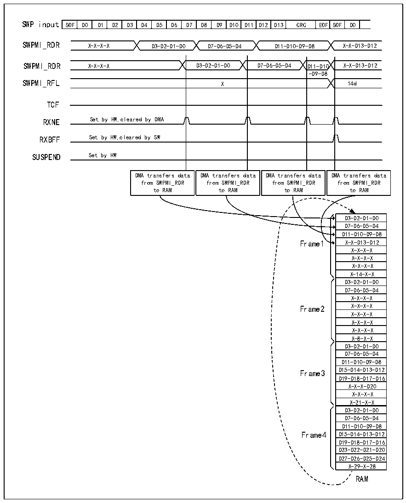

<!-- source-page: 708 -->

[← p.707](0707.md) · [index](../README.md) · [PDF p.708](https://ch32-riscv-ug.github.io/CH32H417/datasheet_zh/CH32H417RM.PDF#page=708) · [p.709 →](0709.md)

<!-- header: CH32H417系列应用手册 https://wch.cn -->
R32_SWPMI_ICR寄存器CTXBEF位置1，以清零RXBEF标志，并且可读取在第一个缓冲区（在DMA2_CMAR1  
中设置的 RAM 地址）中接收到的第一个帧有效负载。有效负载的数据字节数可在倒数第 8 个字的位  
[23:16]中获取。  
在下一个SWPMI中断例程发生时，用户将读取在第二个缓冲区（在DMA2_CMAR1中设置的地址+8）  
中接收到的第二个帧，如此循环往复。如图38-9。  

图38-9 SWPMI多软件缓冲区模式接收  
 <!-- rendered from the PDF; verify at https://ch32-riscv-ug.github.io/CH32H417/datasheet_zh/CH32H417RM.PDF#page=708 -->

🖼 Text parsed from the figure above

SOF  D0  D1  D2  D3  D4  D5  D6  D7  D8  D9  D10  D11  D12  D13  CRC  EOF  SOF  D0  
SWPMI_RDR X-X-X-X D3-D2-D1-D0 D7-D6-D5-D4 D11-D10-D9-D8 X-X-D13-D12  
D11-D10 -D9-D8  X  DMA transfers data from SWPMI_RDR to RAM  DMA transfers data from SWPMI_RDR to RAM  DMA transfers data from SWPMI_RDR to RAM  DMA transfers data from SWPMI_RDR to RAM  
SWPMI_RFL X 14d  
TCF  
RXNE Set by HW,cleared by DMA  
RXBFF Set by HW,cleared by SW  
SUSPEND Set by HW  
D3-D2-D1-D0  
D7-D6-D5-D4  
D11-D10-D9-D8  
Frame1 X-X-D13-D12  
X-X-X-X  
X-X-X-X  
X-X-X-X  
X-14-X-X  
D3-D2-D1-D0  
D7-D6-D5-D4  
X-X-X-X  
Frame2 X-X-X-X  
X-X-X-X  
X-X-X-X  
X-X-X-X  
X-8-X-X  
D3-D2-D1-D0  
D7-D6-D5-D4  
D11-D10-D9-D8  
Frame3 D15-D14-D13-D12  
D19-D18-D17-D16  
X-X-X-D20  
X-X-X-X  
X-21-X-X  
D3-D2-D1-D0  
D7-D6-D5-D4  
D11-D10-D9-D8  
Frame4 D15-D14-D13-D12  
D19-D18-D17-D16  
D23-D22-D21-D20  
D27-D26-D25-D24  
X-29-X-28  
RAM  

若应用软件无法保证在接收到下一次帧之前处理SMPMI中断，那么每个缓冲区状态将在第8个缓  
冲区字的最高有效字节中呈现：  
● 接收上溢标志：R32_SWPMI_ISR寄存器中的RXOVRF标志，由第8个字的位25表示。有关上  
溢错误的说明，请参考第38.3.8节。  
● 接收缓冲区已满标志：R32_SWPMI_ISR寄存器中的RXBFF标志，由第8个字的位26表示。  
<!-- image: p708-draw-image-00001 bbox=[504.72, 786.24, 525.24, 796.68] -->
<!-- footer: V1.7 704 -->
