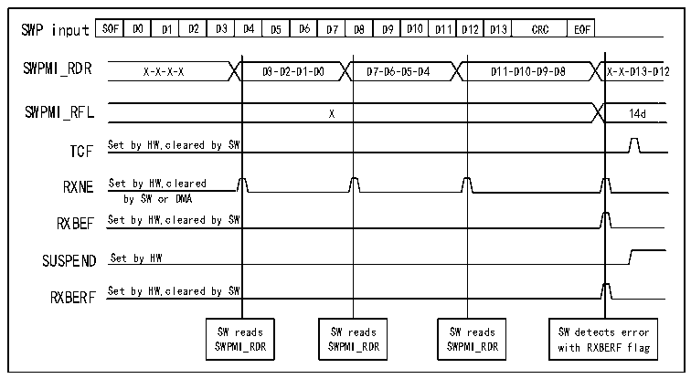

<!-- source-page: 710 -->

[← p.709](0709.md) · [index](../README.md) · [PDF p.710](https://ch32-riscv-ug.github.io/CH32H417/datasheet_zh/CH32H417RM.PDF#page=710) · [p.711 →](0711.md)

<!-- header: CH32H417系列应用手册 https://wch.cn -->

图38-10 SWPMI 单缓冲区模式接收（带CRC错误）  
 <!-- rendered from the PDF; verify at https://ch32-riscv-ug.github.io/CH32H417/datasheet_zh/CH32H417RM.PDF#page=710 -->

🖼 Text parsed from the figure above

SOF  D0  D1  D2  D3  D4  D5  D6  D7  D8  D9  D10  D11  D12  D13  CRC  EOF  
SWPMI_RDR  
D11-D10-D9-D8  
X-X-X-X D3-D2-D1-D0 D7-D6-D5-D4 D11-D10-D9-D8 X-X-D13-D12  
X  
TCF Set by HW,cleared by SW  
RXNE Set by HW,cleared  
by SW or DMA  
RXBEF Set by HW,cleared by SW  
SUSPEND Set by HW  
RXBERF Set by HW,cleared by SW  
SW reads SW reads SW reads SW detects error  
SWPMI_RDR SWPMI_RDR SWPMI_RDR with RXBERF flag  

有效负载接收期间丢失或损坏填充位  
当有效负载中的填充位出现丢失或损坏的情况，在接收到EOF后，R32_SWPMI_ISR中的RXBERF和  
RXBFF标志会置1。  
接收损坏的EOF  
在接收到SOF后，SWPMI将开始累计接收到的字节，直至接收到EOF（忽略任何可能的SOF）。接  
收到EOF后，SWPMI将准备就绪，开始新一轮的帧接收，并等待下一个SOF。若EOF损坏，SWPMI_ISR  
寄存器中的RXBERF和RXBFF标志将在下一个EOF完成接收后置1。  
注：当接收到损坏的EOF时，仍会继续接收有效负载。因此，若接收到的字节数超过30，有效负  
载中的字节数可取值31。有效负载中的字节数在R32_SWPMI_RFL寄存器中读取，或者根据工作模式不  
同，在RAM存储器缓冲区的第8个字的位[23:16]中读取。  

### 38.3.9 回送模式

可以采用回送模式进行测试。用户必须将R32_SWPMI_CR寄存器中的LPBK位置1，以启用回送模  
式。启用回送模式后，SWP_TX 和 SWP_RX 信号将被连接。因此，所有通过 SWPMI 发送的帧将被收回。  

### 38.3.10 SWPMI 中断

所有SWPMI中断均连接至PFIC。要使能SWPMI中断，需按照以下流程操作：  
1）配置PFIC中的SWPMI中断通道并将其使能；  
2）配置SWPMI以生成SWPMI中断（请参考R32_SWPMI_IER寄存器）。  

<!-- p710-table-004 (table-38-2@1) pages 710-711 -->
<table><caption>表38-2 中断请求</caption><tr><th>中断事件</th><th>中断事件标志</th><th>中断使能控制位</th></tr><tr><td>接收缓冲区已满</td><td>RXBFF</td><td>RXBFIE</td></tr><tr><td>发送缓冲区为空</td><td>TXBEF</td><td>TXBEIE</td></tr><tr><td style="text-align:left">接收缓冲区错误 （CRC错误）</td><td>RXBERF</td><td>RXBEIE</td></tr><tr><td>接收缓冲区上溢</td><td>RXOVRF</td><td>RXBOVEREIE</td></tr><tr><td>发送缓冲区下溢</td><td>TXUNRF</td><td>TXBUNREIE</td></tr><tr><td>接收数据寄存器非空</td><td>RXNE</td><td>RIE</td></tr><tr><td>发送数据寄存器已满</td><td>TXE</td><td>TIE</td></tr><tr><td>传输完成标志</td><td>TCF</td><td>TCIE</td></tr><tr><td>从器件恢复标志</td><td>SRF</td><td>SRIE</td></tr><tr><td>收发器就绪标志</td><td>RDYF</td><td>RDYIE</td></tr></table>

<!-- image: p710-draw-image-00001 bbox=[504.72, 786.24, 525.24, 796.68] -->
<!-- footer: V1.7 706 -->
