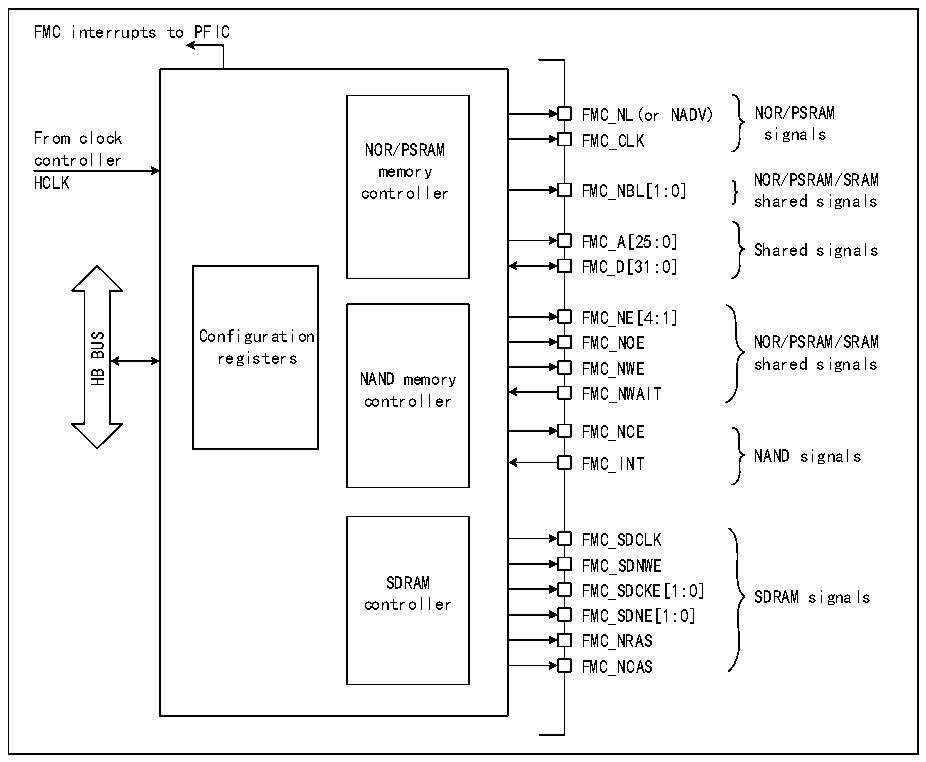

<!-- source-page: 722 -->

[← p.721](0721.md) · [index](../README.md) · [PDF p.722](https://ch32-riscv-ug.github.io/CH32H417/datasheet_zh/CH32H417RM.PDF#page=722) · [p.723 →](0723.md)

<!-- header: CH32H417系列应用手册 https://wch.cn -->

图40-1 FMC的结构框图  
 <!-- rendered from the PDF; verify at https://ch32-riscv-ug.github.io/CH32H417/datasheet_zh/CH32H417RM.PDF#page=722 -->

🖼 Text parsed from the figure above

FMC interrupts to PFIC  
FMC_NL(or NADV) NOR/PSRAM  
From clock FMC_CLK signals  
NOR/PSRAM  
controller  
memory  
HCLK controller FMC_NBL[1:0] } NOR/PSRAM/SRAM  
shared signals  
FMC_A[25:0]  
Shared signals  
FMC_D[31:0]  
FMC_NE[4:1]  
Configuration FMC_NOE NOR/PSRAM/SRAM  
BUS  
registers FMC_NWE shared signals  
HB  
NAND memory  
FMC_NWAIT  
controller  
FMC_NCE  
NAND signals  
FMC_INT  
FMC_SDCLK  
FMC_SDNWE  
SDRAM  
FMC_SDCKE[1:0]  
SDRAM signals  
controller  
FMC_SDNE[1:0]  
FMC_NRAS  
FMC_NCAS  

## 40.3 HB 接口

HB从设备接口允许CPU和其它HB总线主设备访问外部存储器。HB事务会转换为外部器件协议。  
特别是，当所选外部存储器的宽度为16位或8位时，那么在HB中的32位宽事务将被分割成多个连  
续的16或8位访问。连续访问之间，FMC片选（FMC_NEx）不会翻转，除非在启用扩展模式的访问模  
式D情况下。  
FMC在以下情况下会产生HB错误：  
● 读取或写入未使能的FMC存储区域。  
● 违反SDRAM地址范围（访问保留的地址范围）时。  
● 向写保护的SDRAM存储区域（R32_FMC_SDCRx寄存器中WP位置1）写入时。  
● 在R32_FMC_BCRx寄存器中的FACCEN位复位时读取或写入NOR Flash存储区域。  
此HB错误的影响具体取决于尝试进行读、写访问的HB主设备。  
● 如果为DMA控制器，则会生成DMA传输错误，并会自动禁止相应的DMA通道。  
HB时钟（HCLK）是FMC的参考时钟。  

### 40.3.1 支持的存储器和事务

通用事务规则  
所请求的HB事务数据宽度为8、16、32或256位，然而访问的外部器件的数据宽度是固定的。  
这种差异可能会引起数据宽度不匹配的问题。为避免上述问题的发生，需遵循的的事务规则如下：  
● HB事务数据宽度和存储器数据宽度相等：正常运行。  
<!-- image: p722-draw-image-00001 bbox=[504.72, 786.24, 525.24, 796.68] -->
<!-- footer: V1.7 718 -->
