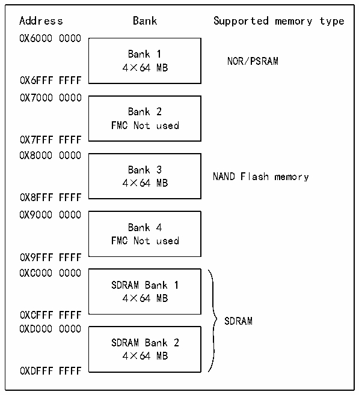

<!-- source-page: 723 -->

[← p.722](0722.md) · [index](../README.md) · [PDF p.723](https://ch32-riscv-ug.github.io/CH32H417/datasheet_zh/CH32H417RM.PDF#page=723) · [p.724 →](0724.md)

<!-- header: CH32H417系列应用手册 https://wch.cn -->
● HB 事务数据宽度大于存储器宽度：FMC 会将 HB 事务拆分成多个较小的连续存储器访问，以匹配  
外部数据宽度。在连续访问之间，FMC片选（FMC_NEx）不会翻转。  
● HB事务数据宽度小于存储器宽度：传输的一致性可能会受到影响，这取决于外部设备的类型。  
- 访问具备字节选择功能的设备（ROM、SRAM、SDRAM、PSRAM）：FMC允许读、写事务，并通过
其字节选择通道 NBL[1:0]访问正确的数据；通过 NBL[1:0]寻址要写入的字节；读取所有存  
储器字节（在读取事务期间NBL[1:0]保持低电平），然后丢弃无效字节。  
- 访问不具有字节选择功能的器件（NOR、NAND Flash）：当需要对16位宽的FLASH存储器进
行字节访问时，会出现这种情况。由于这些器件不支持字节模式访问（只能向Flash读取或  
写入16位字），因此允许读事务而不允许写事务（控制器会读取全部16位存储器字，但只  
使用所需字节）。  
NOR Flash/PSRAM和SDRAM的回卷支持  
由于并非所有主器件都能发出回卷事务，因此同步存储器必须按未定义长度的线性突发模式进行  
配置。如果主器件生成HB回卷事务：  
● 读操作将分为两个线性突发事务。  
● 如果使能写 FIFO，写操作将分为两个线性突发事务；如果禁止写 FIFO，写操作将分为多个线性  
突发事务。  

## 40.4 外部器件地址映射

从FMC角度，外部存储器被划分为每个256MB的固定大小的存储区域，如下图所示：  

图40-2 FMC存储区域  
 <!-- rendered from the PDF; verify at https://ch32-riscv-ug.github.io/CH32H417/datasheet_zh/CH32H417RM.PDF#page=723 -->

🖼 Text parsed from the figure above

Address Bank Supported memory type  
0X6000 0000  
Bank 1  
NOR/PSRAM  
4×64 MB  
0X6FFF FFFF  
0X7000 0000  
Bank 2  
FMC Not used  
0X7FFF FFFF  
0X8000 0000  
Bank 3  
NAND Flash memory  
4×64 MB  
0X8FFF FFFF  
0X9000 0000  
Bank 4  
FMC Not used  
0X9FFF FFFF  
0XC000 0000  
SDRAM Bank 1  
4×64 MB  
0XCFFF FFFF  
SDRAM  
0XD000 0000  
SDRAM Bank 2  
4×64 MB  
0XDFFF FFFF  

存储区域1可连接多达4个NOR Flash或PSRAM器件。此存储区域被划分为4个NOR/PSRAM/SR  
子区域，带 4 个专用片选信号：存储区域 1 NOR/PSRAM1、存储区域 1 NOR/PSRAM2、存储区域 1  
NOR/PSRAM3、存储区域1 NOR/PSRAM4。存储区域3用于连接NAND Flash器件。此空间的MPU存储器  
特性必须由软件重新配置到器件中。存储区域4和5用于连接SDRAM器件（每个存储区域一个器件）。  
<!-- image: p723-draw-image-00001 bbox=[504.72, 786.24, 525.24, 796.68] -->
<!-- footer: V1.7 719 -->
