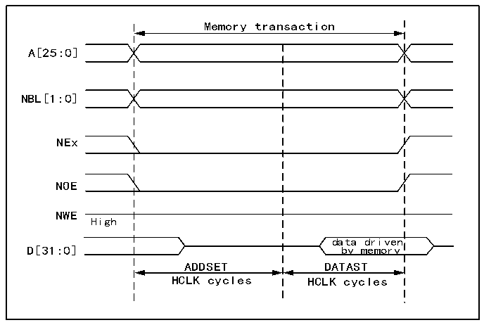

<!-- source-page: 731 -->

[← p.730](0730.md) · [index](../README.md) · [PDF p.731](https://ch32-riscv-ug.github.io/CH32H417/datasheet_zh/CH32H417RM.PDF#page=731) · [p.732 →](0732.md)

<!-- header: CH32H417系列应用手册 https://wch.cn -->

### 40.5.3 通用时序规则

信号同步  
● 所有控制器输出信号在内部时钟（HCLK）的上升沿变化；  
● 在同步模式（读/写）下，所有输出信号在 HCLK 的上升沿变化。无论 CLKDIV 值为何，所有输出  
信号变化如下：  
- NOEL/NWEL/NEL/NADVL/NADVH/NBLL地址有效输出在FMC_CLK时钟的下降沿变化。
- NOEH/NWEH/NEH/NOEH/NBLH地址有效输出在FMC_CLK时钟的上升沿变化。

### 40.5.4 NOR Flash/PSRAM控制器异步事务

异步静态存储器（NOR Flash、PSRAM、SRAM）  
● 信号通过内部时钟HCLK进行同步。此时钟不会发送到存储器；  
● FMC总是会先对数据采样，而后再禁止片选信号NE。这样可以确保符合存储器数据保持时序的要  
求（片选使能为高到数据转换最短时间通常为0nS）。  
● 如果使能扩展模式（R32_FMC_BCRx寄存器中的EXTMOD位置1），则最多可提供四种扩展模式（A、  
B、C、D）。可以混合使用A、B、C和D模式来进行读取和写入操作。例如，可以在模式A下执行读  
取操作，而在模式B下执行写入操作。  
● 如果禁用扩展模式（R32_FMC_BCRx寄存器中的EXTMOD位复位），则FMC可以在模式1或模式2下进  
行运行，如下所述：  
- 当选择SRAM/PSRAM存储器类型时，模式1为默认模式（R32_FMC_BCRx寄存器中MTYP=0x0或
0x01）；  
- 当选择NOR存储器类型时，模式2为默认模式（R32_FMC_BCRx寄存器中MTYP=0x10）。
模式1-SRAM/PSRAM（CRAM）  
如 下 图 所 示 ， 所 支 持 模 式 的 读 取 和 写 入 事 务 以 及 所 需 的 R32_FMC_BCRx 和  
R32_FMC_BTRx/R32_FMC_BWTRx寄存器配置。  

图40-3 模式1读取访问波形  
 <!-- rendered from the PDF; verify at https://ch32-riscv-ug.github.io/CH32H417/datasheet_zh/CH32H417RM.PDF#page=731 -->

🖼 Text parsed from the figure above

Memory transaction  
A[25:0]  
NBL[1:0]  
NEx  
NOE  
NWE  
High  
data driven  
D[31:0] by memory  
ADDSET DATAST  
HCLK cycles HCLK cycles  

<!-- image: p731-draw-image-00001 bbox=[504.72, 786.24, 525.24, 796.68] -->
<!-- footer: V1.7 727 -->
