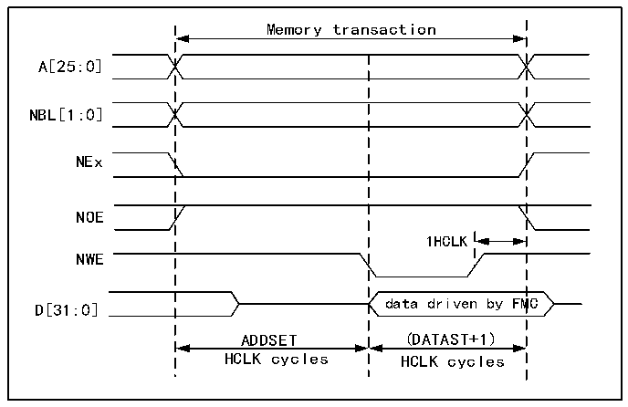

<!-- source-page: 732 -->

[← p.731](0731.md) · [index](../README.md) · [PDF p.732](https://ch32-riscv-ug.github.io/CH32H417/datasheet_zh/CH32H417RM.PDF#page=732) · [p.733 →](0733.md)

<!-- header: CH32H417系列应用手册 https://wch.cn -->

图40-4 模式1写入访问波形  
 <!-- rendered from the PDF; verify at https://ch32-riscv-ug.github.io/CH32H417/datasheet_zh/CH32H417RM.PDF#page=732 -->

🖼 Text parsed from the figure above

Memory transaction  
A[25:0]  
NBL[1:0]  
NEx  
NOE  
1HCLK  
NWE  
data driven by FMC  
D[31:0]  
ADDSET (DATAST+1)  
HCLK cycles HCLK cycles  

写事务结束时的一个 HCLK 周期利于确保 NEW 上升沿之后的地址和数据保持时间。由于存在此  
HCLK周期，DATAST值必须大于0（DATAST&gt;0）。  

<!-- p732-table-001 (table-40-17@1) -->
<table><caption>表40-17 R32_FMC_BCRx位字段</caption><tr><th>位号</th><th>位名</th><th>要设置的值</th></tr><tr><td>31</td><td>FMC_EN</td><td>0x1</td></tr><tr><td>[30:26]</td><td>保留</td><td>0x00</td></tr><tr><td>[25:24]</td><td>BMP</td><td>0x0或0x1</td></tr><tr><td>[23:20]</td><td>保留</td><td>0x0</td></tr><tr><td>19</td><td>CBURSTRW</td><td>0x0（对异步模式没有影响）</td></tr><tr><td>[18:16]</td><td>CPSIZE</td><td>0x0（对异步模式没有影响）</td></tr><tr><td>15</td><td>ASYNCWAIT</td><td>如果存储器支持该特性，则置为1。否则，保持为0。</td></tr><tr><td>14</td><td>EXTMOD</td><td>0x0</td></tr><tr><td>13</td><td>WAITEN</td><td>0x0（对异步模式没有影响）</td></tr><tr><td>12</td><td>WREN</td><td>根据需要进行设置</td></tr><tr><td>11</td><td>保留</td><td>0x0</td></tr><tr><td>10</td><td>WRAPMOD</td><td>0x0</td></tr><tr><td>9</td><td>WAITPOL</td><td>仅当位15为1时才有意义</td></tr><tr><td>8</td><td>BURSTEN</td><td>0x0</td></tr><tr><td>7</td><td>保留</td><td>0x1</td></tr><tr><td>6</td><td>FACCEN</td><td>无关</td></tr><tr><td>[5:4]</td><td>MWID</td><td>根据需要进行设置</td></tr><tr><td>[3:2]</td><td>MTYP</td><td>根据需要进行设置，0x2除外（NOR Flash）</td></tr><tr><td>1</td><td>MUXE</td><td>0x0</td></tr><tr><td>0</td><td>MBKEN</td><td>0x1</td></tr></table>

<!-- p732-table-002 (table-40-18@1) pages 732-733 -->
<table><caption>表40-18 FMC_BTRx位字段</caption><tr><th>位号</th><th>位名</th><th>要设置的值</th></tr><tr><td>[31:30]</td><td>保留</td><td>0x00</td></tr><tr><td>[29:28]</td><td>ACCMOD</td><td>无关</td></tr><tr><td>[27:24]</td><td>DATLAT</td><td>无关</td></tr><tr><td>[23:20]</td><td>CLKDIV</td><td>无关</td></tr><tr><td>[19:16]</td><td>BUSTURN</td><td style="text-align:left">NEx变为高电平到NEx变为低电平之间的时间（BUSTURNHCLK）</td></tr><tr><td>[15:8]</td><td>DATAST</td><td style="text-align:left">第二个访问阶段的持续时间（写入访问为DATAST+1个HCLK周期，读取访问为DATAST个HCLK周期）。</td></tr><tr><td>[7:4]</td><td>ADDHLD</td><td>无关</td></tr><tr><td>[3:0]</td><td>ADDSET</td><td style="text-align:left">第一个访问阶段的持续时间（ADDSET个HCLK周期）。 ADDSET最小值为0。</td></tr></table>

<!-- image: p732-draw-image-00001 bbox=[504.72, 786.24, 525.24, 796.68] -->
<!-- footer: V1.7 728 -->
