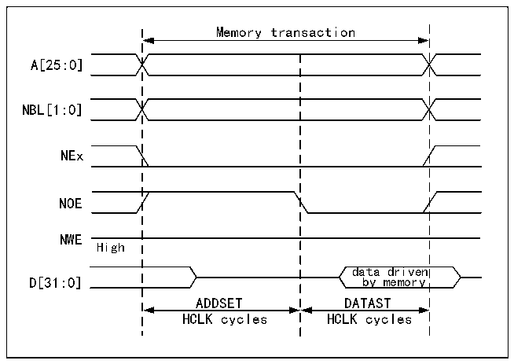
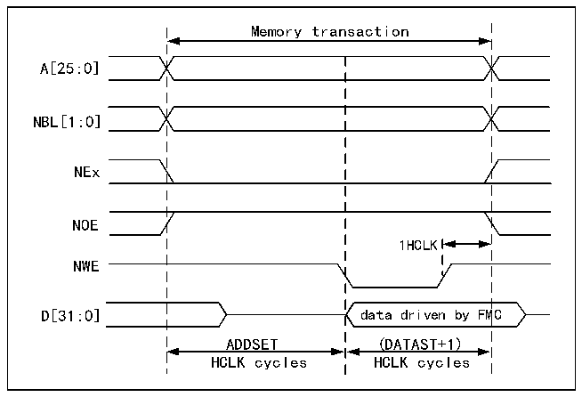

<!-- source-page: 733 -->

[← p.732](0732.md) · [index](../README.md) · [PDF p.733](https://ch32-riscv-ug.github.io/CH32H417/datasheet_zh/CH32H417RM.PDF#page=733) · [p.734 →](0734.md)

<!-- header: CH32H417系列应用手册 https://wch.cn -->

> ⬆ **Table continued** — rendered in full at [page 732](0732.md). <!-- p733-table-001 -->

模式A-SRAM/PSRAM（CRAM）OE切换  

图40-5 模式A读取访问波形  
 <!-- rendered from the PDF; verify at https://ch32-riscv-ug.github.io/CH32H417/datasheet_zh/CH32H417RM.PDF#page=733 -->

🖼 Text parsed from the figure above

Memory transaction  
A[25:0]  
NBL[1:0]  
NEx  
NOE  
NWE  
High  
data driven  
D[31:0] by memory  
ADDSET DATAST  
HCLK cycles HCLK cycles  

注：NBL[1:0]在进行读取访问时为低电平。  

图40-6 模式A写入访问波形  
 <!-- rendered from the PDF; verify at https://ch32-riscv-ug.github.io/CH32H417/datasheet_zh/CH32H417RM.PDF#page=733 -->

🖼 Text parsed from the figure above

Memory transaction  
A[25:0]  
NBL[1:0]  
NEx  
NOE  
1HCLK  
NWE  
D[31:0] data driven by FMC  
ADDSET (DATAST+1)  
HCLK cycles HCLK cycles  

与模式1的不同之处在于NOE的切换与独立的读取和写入时序。  
<!-- image: p733-draw-image-00001 bbox=[504.72, 786.24, 525.24, 796.68] -->
<!-- footer: V1.7 729 -->
