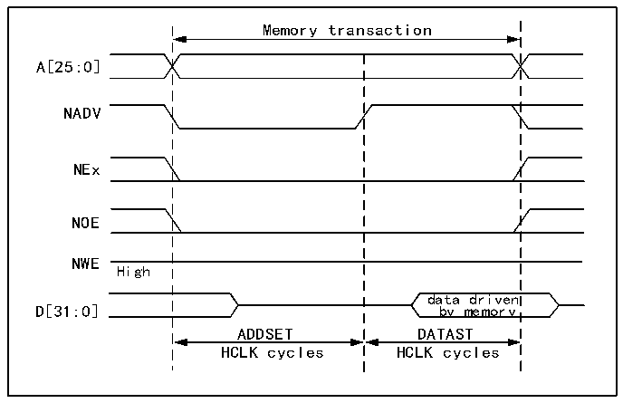
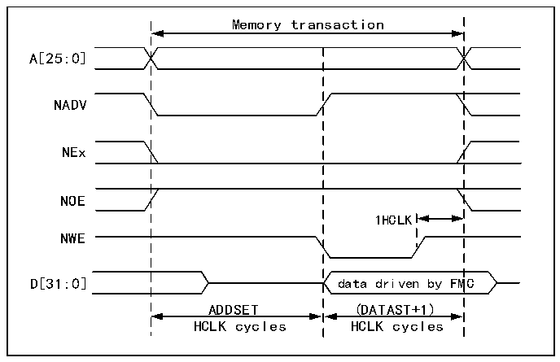

<!-- source-page: 735 -->

[← p.734](0734.md) · [index](../README.md) · [PDF p.735](https://ch32-riscv-ug.github.io/CH32H417/datasheet_zh/CH32H417RM.PDF#page=735) · [p.736 →](0736.md)

<!-- header: CH32H417系列应用手册 https://wch.cn -->

> ⬆ **Table continued** — rendered in full at [page 734](0734.md). <!-- p735-table-001 -->

模式2/B-NOR Flash  

图40-7 模式2和模式B读取访问波形  
 <!-- rendered from the PDF; verify at https://ch32-riscv-ug.github.io/CH32H417/datasheet_zh/CH32H417RM.PDF#page=735 -->

🖼 Text parsed from the figure above

Memory transaction  
A[25:0]  
NADV  
NEx  
NOE  
NWE  
High  
data driven  
D[31:0] by memory  
ADDSET DATAST  
HCLK cycles HCLK cycles  

图40-8 模式2写入访问波形  
 <!-- rendered from the PDF; verify at https://ch32-riscv-ug.github.io/CH32H417/datasheet_zh/CH32H417RM.PDF#page=735 -->

🖼 Text parsed from the figure above

Memory transaction  
A[25:0]  
NADV  
NEx  
NOE  
1HCLK  
NWE  
D[31:0] data driven by FMC  
ADDSET (DATAST+1)  
HCLK cycles HCLK cycles  

<!-- image: p735-draw-image-00001 bbox=[504.72, 786.24, 525.24, 796.68] -->
<!-- footer: V1.7 731 -->
