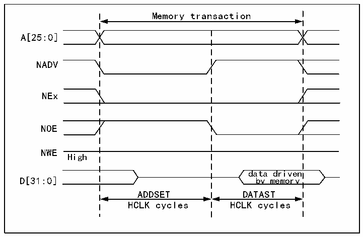

<!-- source-page: 737 -->

[← p.736](0736.md) · [index](../README.md) · [PDF p.737](https://ch32-riscv-ug.github.io/CH32H417/datasheet_zh/CH32H417RM.PDF#page=737) · [p.738 →](0738.md)

<!-- header: CH32H417系列应用手册 https://wch.cn -->

> ⬆ **Table continued** — rendered in full at [page 736](0736.md). <!-- p737-table-001 -->

<!-- p737-table-002 (table-40-24@1) -->
<table><caption>表40-24 R32_FMC_BWTRx位字段</caption><tr><th>位号</th><th>位名</th><th>要设置的值</th></tr><tr><td>[31:30]</td><td>保留</td><td>0x0</td></tr><tr><td>[29:28]</td><td>ACCMOD</td><td>若设置为扩展模式，则为0x1</td></tr><tr><td>[27:24]</td><td>DATLAT</td><td>无关</td></tr><tr><td>[23:20]</td><td>CLKDIV</td><td>无关</td></tr><tr><td>[19:16]</td><td>BUSTURN</td><td style="text-align:left">NEx变为高电平到NEx变为低电平之间的时间（BUSTURNHCLK）</td></tr><tr><td>[15:8]</td><td>DATAST</td><td style="text-align:left">读取访问第二个阶段的持续时间（DATAST 个 HCLK 周期）。</td></tr><tr><td>[7:4]</td><td>ADDHLD</td><td>无关</td></tr><tr><td>[3:0]</td><td>ADDSET</td><td style="text-align:left">读取访问第一个阶段的持续时间（ADDSET 个 HCLK 周期）。ADDSET最小值为0。</td></tr></table>

注：仅当设置了扩展模式（模式B）时，R32_FMC_BWTRx寄存器才有效，否则其内容均为“无关”。  
模式C-NOR Flash-OE切换  

图40-10 模式C读取访问波形  
 <!-- rendered from the PDF; verify at https://ch32-riscv-ug.github.io/CH32H417/datasheet_zh/CH32H417RM.PDF#page=737 -->

🖼 Text parsed from the figure above

Memory transaction  
A[25:0]  
NADV  
NEx  
NOE  
NWE  
High  
data driven  
D[31:0] by memory  
ADDSET DATAST  
HCLK cycles HCLK cycles  

<!-- image: p737-draw-image-00001 bbox=[504.72, 786.24, 525.24, 796.68] -->
<!-- footer: V1.7 733 -->
